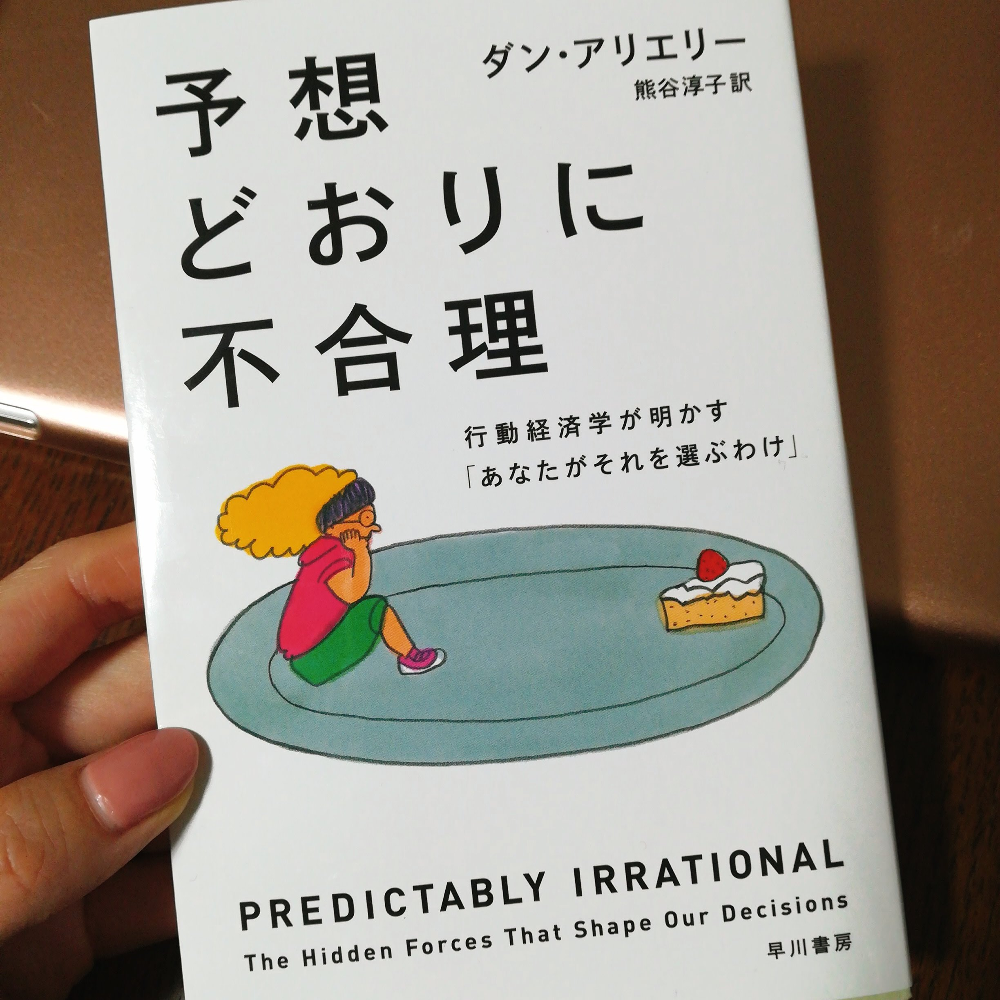

ウグイスの鳴き声を聞かなくなったなあ。

寒さが戻ったから、ウグイスも縮こまっているのかもしれない。

.

出勤の途中でツバメの巣を見つけたよ。

もうそんな時期か。

.

あとチューリップも。

チューリップ飾りたいなあ。かわいいよねえ。

.

昼間は俺流塩ラーメンだよ。

.

儀式だね。

.

.

Air Closetね、洋服のレンタルサービスなんだけれども

自分で選ぶわけではなく

スタイリストさんに、骨格や肌の色味など体型上の悩みや希望を伝えて

それに沿ったものを選んでもらうので

必ずしも気にいるものが来るとは限らないの。

.

返却すると1週間ほどで次の服が届くの。

月額制なので、どのくらいの頻度で送り返すのが

効率的でコスパが良いのかを試算してみたのだけれど

気に入ったら飽きるまで借りれば良いし

気に入らないと判断したら、即返却するのが

最も合理的だよなあとおもった。

.

大学時代に行動経済学について教わったのをおもいだしたよ。

ひとの非合理性、あるあるーってかんじ。

今朝Amazonでポチって夜に帰宅したら届いてた。

速いねえ。

経済学部門のベストセラー本だって。

面白かったらまたここに書くね☺️

読むの楽しみだなあ。

乱読雑多読みマン！
