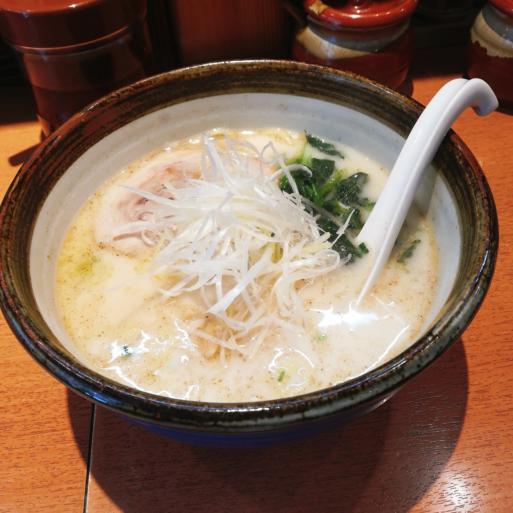

ふと、わたしよりずっと長いあいだ一緒にいて

わたしよりずっと自由がなくて

それで幸せなのかなと考えてしまった。

それでも羨ましいとおもうの、現実を何も知らないしわかってないんだろうなあ。

考えても、本当に仕方の無いことを考えてしまう。

わたしより幸せを感じているかどうかなんて関係なく羨ましいの。

.

時間を戻してやり直せるボタンが

いま目の前にあったとして

いつの時点まで戻れば良いのか考えたけれども

たくさん戻れば戻るほど

いまの自分とはかけ離れた自分になるんだろうなあとおもう。

.

ほんの少しだけむかしの

たとえば半年前や一年前に戻れたとしても

いまみたくならないなら

戻れなくて良いとおもってしまう。

いましか知らないからかなあ。

気持ちだけ考えたら、半年や一年前のこと全部なかったほうが

ずっと楽になれるんだろうなあとおもうよ。

.

どうにもならないつらさも

副作用みたいなもんかとおもえば仕方ない。

.

わたしにはまったく別物の理想があるし

羨ましくはあるけれども

｢あのひとになりたい｣とは、おもわないの。

.

切り替えよう。

蓋して明日もがんばろう。

昨日行けなかったので

今週は木曜日に俺流塩ラーメンだよ。
