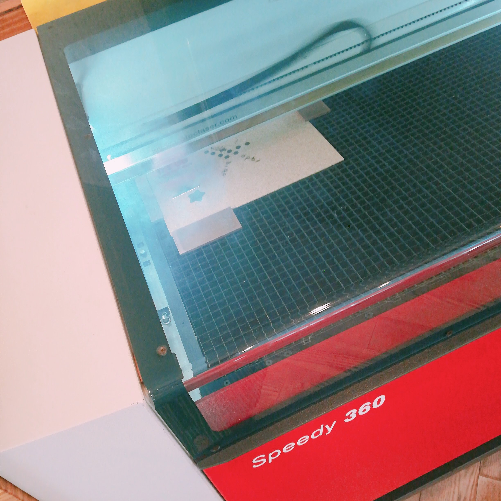
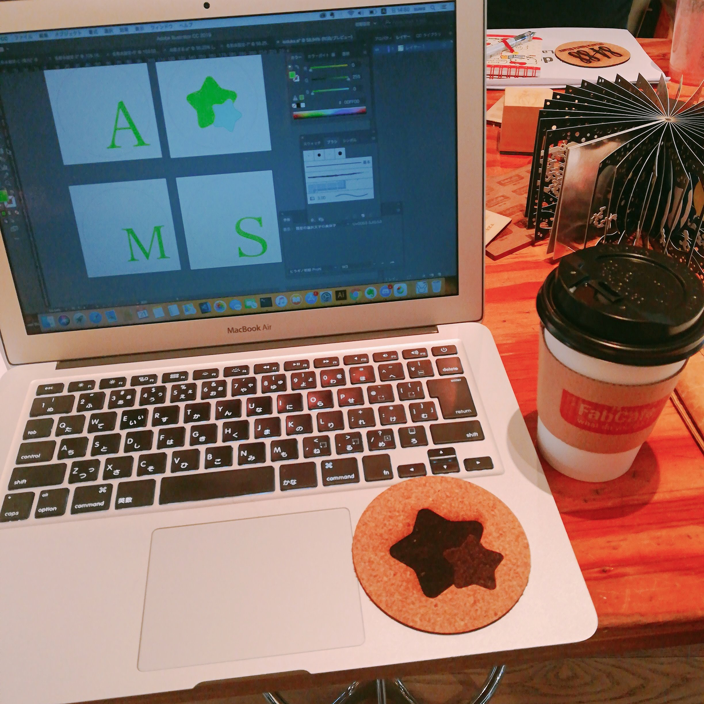
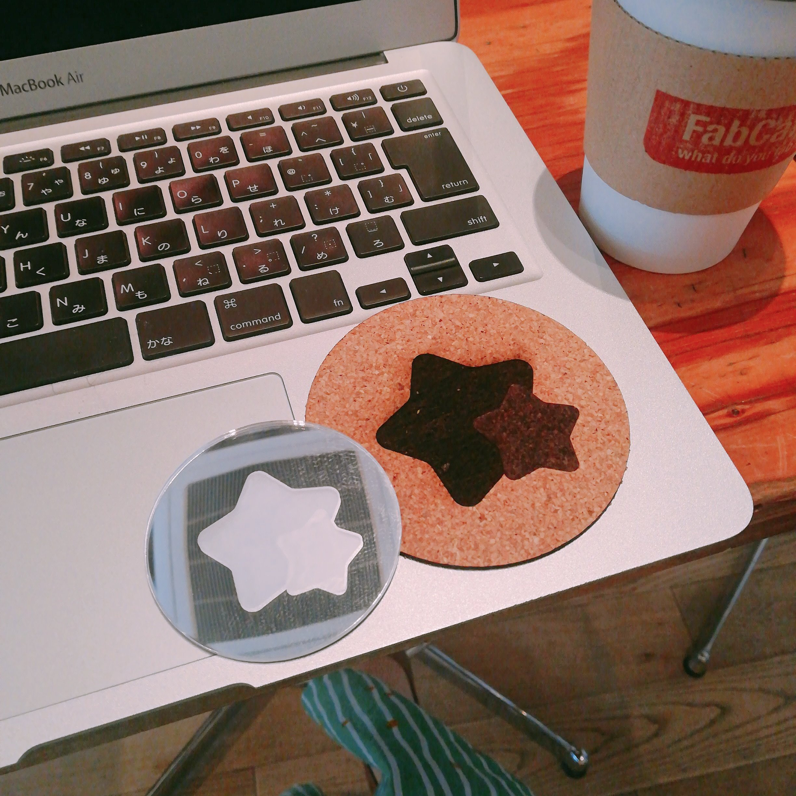
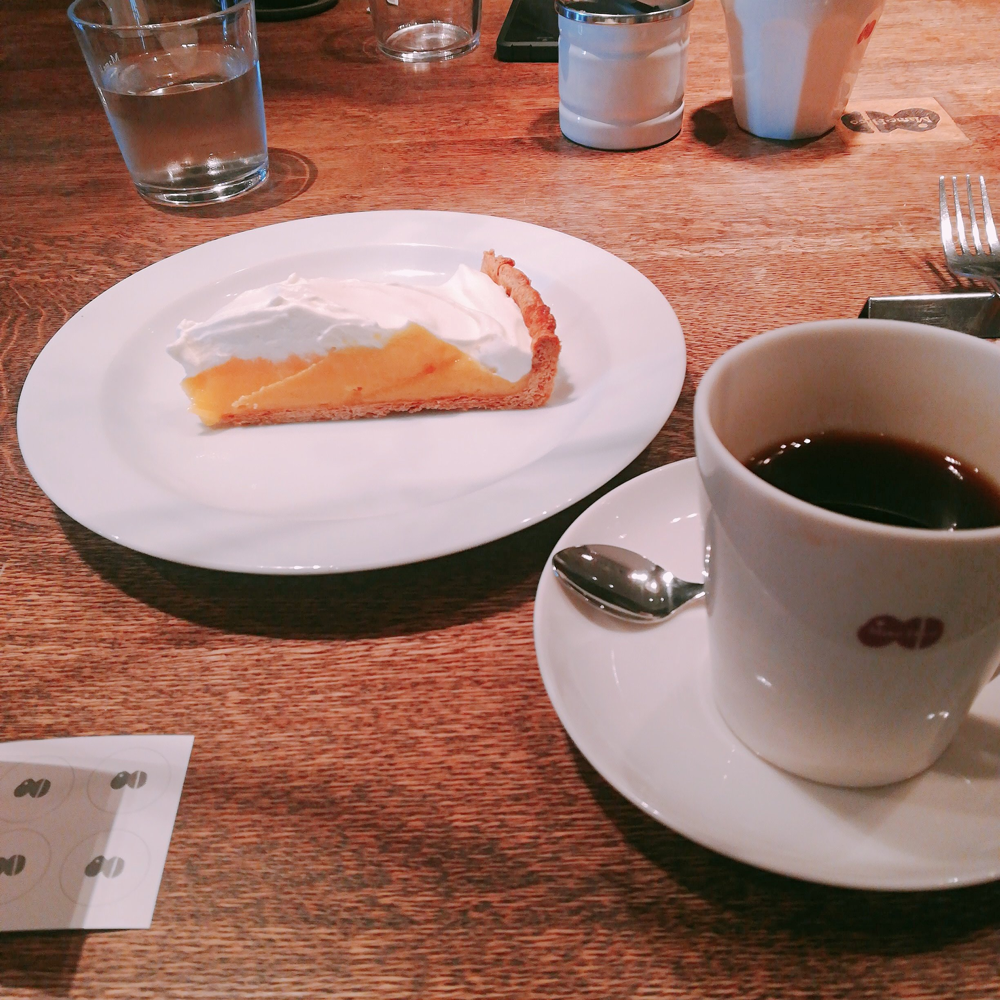

FabCafeのレーザーカッターclassに参加してきました。

参加者は4人で、わたし以外はエンジニアやメーカー勤務の方々だったよ。

完全に｢やってみたい｣の気持ちだけで参加してきました！

えへへ、

でも楽しかった😊

Illustratorちゃんと使えたよ。

基礎だけでも練習しておいて良かった。

リードして教えるひとが1人と

つまずいているひとをフォローするひとが1人で

4人に対して2人体制で教えてくれたので

スムーズだったし質問しやすかった。

おまけで、おなじデザインのミラーもカットしてもらった。

レーザーカッターでもカットできる特別な素材の鏡らしい。

.

渋谷のついでにカフェ・マメヒコ行ったよ。

メニューの説明が面白くて読み込んでしまった。

説明なのに、説明になってない説明おおくて楽しかったです！

.

家に着いたらソファとテーブルが届いていたので解体だよ。

これから組み立てるの。

家具が変わると気分かわるねえ💺
