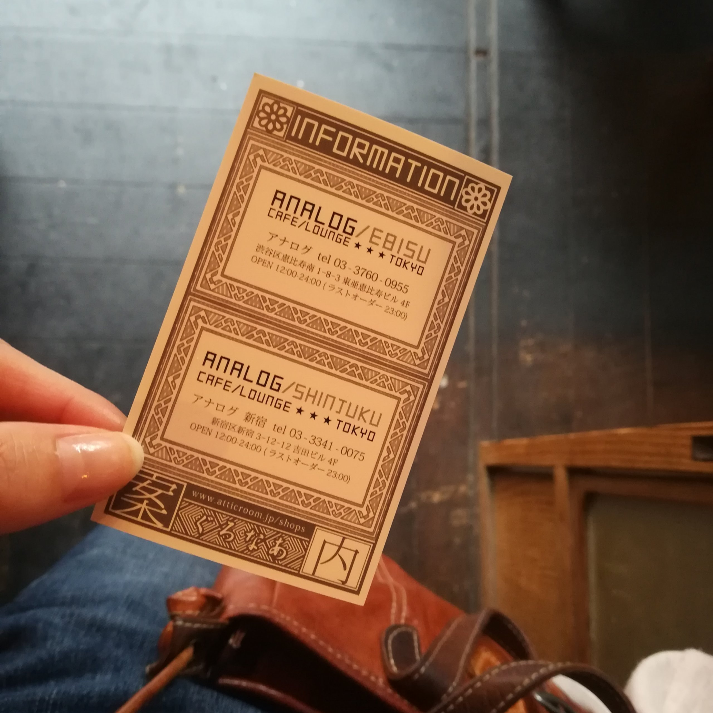

ポケモンの映画を観に行ったの。

名探偵ピカチュウだよ。

.

正直、実写みたいなポケモンは

なんとなく生理的に受け付けなくて

なんだろう、ネタで流れてくるリアルピカチュウみたいなの

わたしが子どもの頃からあって

そういう雑コラ系があまり得意ではなかったので

実写ピカを可愛いとおもえるのか不安だったの。

.

映画とてもよかったあ。

ちゃんとお金かけてCGつくっているなあと感じた。

ポケモンいっぱいいた♡

ピカちゃんと可愛かった♡

.

IMAXで観たの。

数年ぶりの3Dだあ、

そもそも、ここ3年間くらい映画館で観ている映画

ポケモンくらいしかなかった。

うう、GODZILLA観たい。

帰りに寄ったAnalogカフェだよ。

ひっそりしていて好きなかんじでした。

お気に入りカフェin新宿〜

.

きょうはDOMについて調べました。

Virtual DOMについてきちんと調べようと努力しましたが

結局よくわかりませんでした。

DOMの仮想化……

そもそも仮想化がまだよく理解しきれていない。

ふわふわーってしてるう

またがんばります。

.

わかったのはね

やっぱり何か構造を理解しようとするときに

ブロックであったり図であったり

形の方が理解しやすいなあということ。

文章のみだとまじでわからんち。

めも

[MDN Web Docs](https://developer.mozilla.org/ja/docs/Web/API/Document_Object_Model/Introduction)
