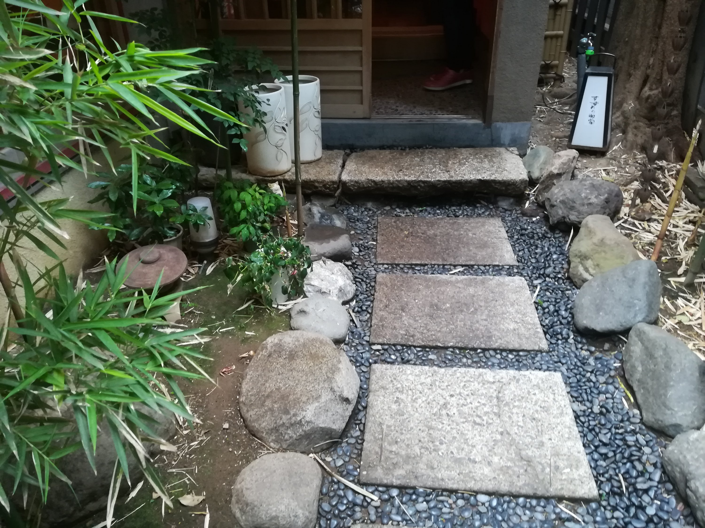

渋谷の円山町にある

すずめのお宿でもんじゃ焼きを食べてきたよ。 芸妓置屋をリノベーションしたらしい。

｢店内のつくりがあまり飲食店らしくないね｣

って話をしたので、納得だった。

.

もんじゃ焼きは人生二度目だったのですが、なかなか上手に焼くの難しいなあとおもった。

次はお好み焼き食べに行きたい。

.

ラブホ街のど真ん中にあるので

｢大丈夫かな？｣

って不安になるけれど

松濤や神泉駅側から行けば、ラブホ街を避けてお店に着くこともできますね。

.

そのままスタバへ行ってきました。

m.toで自鯖たてるの

想像以上にすんなり行けたので拍子抜けだった。

凄いなぁ

ロゴや背景画像つくりたい。

なんとなく、こんな配色と素材とフォントでー

ってイメージは出来ているの

今週末はIllustratorとMediBangでちまちまする事が増えそう。
