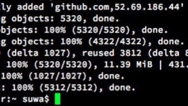

ローカルにマストドンたてるため奮闘しました。

証明書ほんとにわからん。

きちんと調べます。

.

鍵を生成→わかる

サーバー証明書を作成→わかる

Docker image→これをもとにホニャララしている(わからない)

Docker compose→なんか接続するのかしてるのか(わからない)

SQL→よく目にする(わからない)

.

とりあえずレシピ通りにやったら

何とかなったけれども

中身の理解が追いついていないパターンなので

基礎学習しつつ図にまとめる作業を続行します。

.

なんだかんだマストドンのローカルたてていたら

vimそこそこ使う羽目になって

簡単なコマンド覚えておいて良かったなとおもいました。

.

ターミナルのフォント設定いじっていたの。

ゼロの中に点があるフォント可愛いよなあとおもっていて

調べたらHaskligというらしく

探したらGitHubにソースあったので設定してみました。

[Hasklig](https://github.com/i-tu/Hasklig)

可愛い。テンション上がる。

Atomの設定もついでに変えた。  
.

あと、来週から勉強会デビューします。

connpassで検索して

都内で気軽に参加できそうな無料の勉強会に登録した。

発表はしません。

いつかそういった場で発表できるくらいには

きちんとやりたいなあ。

.  
人見知りなので初めての場所、緊張する。
