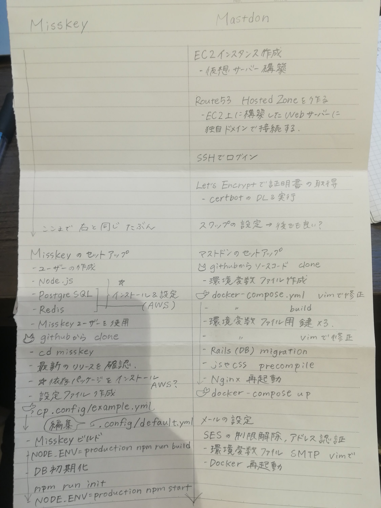

AWSにおける[wordpress](https://aws.amazon.com/jp/getting-started/tutorials/launch-a-wordpress-website/)のチュートリアル読んでいるけれども

ステップ2で

[Linux 仮想マシンの起動](https://aws.amazon.com/getting-started/tutorials/launch-a-virtual-machine/)のステップ 2 d.～2 f. とステップ 3 を参照

って書いてあるの

おそらく参照するのはステップ 3 d.〜3 f.とステップ4のことだし

（そもそも仮想マシン起動のステップ2にfは存在しない）

その上wordpressチュートリアルのステップ3

システムlogにおいて

ssh設定再度試して探してもユーザーpassでてこないの

RDSでデータベースの設定を先にしておかないとダメなんか？

DBの設定について何も言及ないけれども実は必要なのか？

どちらにせよチュートリアルううううてかんじです。

.

謎は深まるけれども、いったんWeb上にwordpressたてられたので

ひとまず部屋のすみに置いておいて

本来の目的を見失いそうになってしまう。

wordpressはAWSに慣れるための練習で

目的はMisskeyの構築です。

.

今日の隙間時間はMisskeyのレシピづくりをすることに決定しました。

.

MastodonをAWSとDocker利用でたてるレシピと

MisskeyのReadMeを横に並べてみて

どこがどこの代替なのか

Mastodonとの違いは何なのかをきちんと整理したいとおもいます。

ふわっとだけど書いてみたの。

答え合わせがこわいけど楽しみだにゃ( •ω•ฅ)

Dockerわからんちなので後乗せクジラするかもしれない。

.

そしていつのまにかKnzkLiveの配信権限が付与されていた。

やったねえ

作業キャスもできちゃう。

8割うまくいかないひとなので

舌打ちしかしなさそう。

ツイキャスよりも気軽に配信できて

勝手に延長されていくの良さげ。

週末にでもKnzkLive試してみたいなあ。
