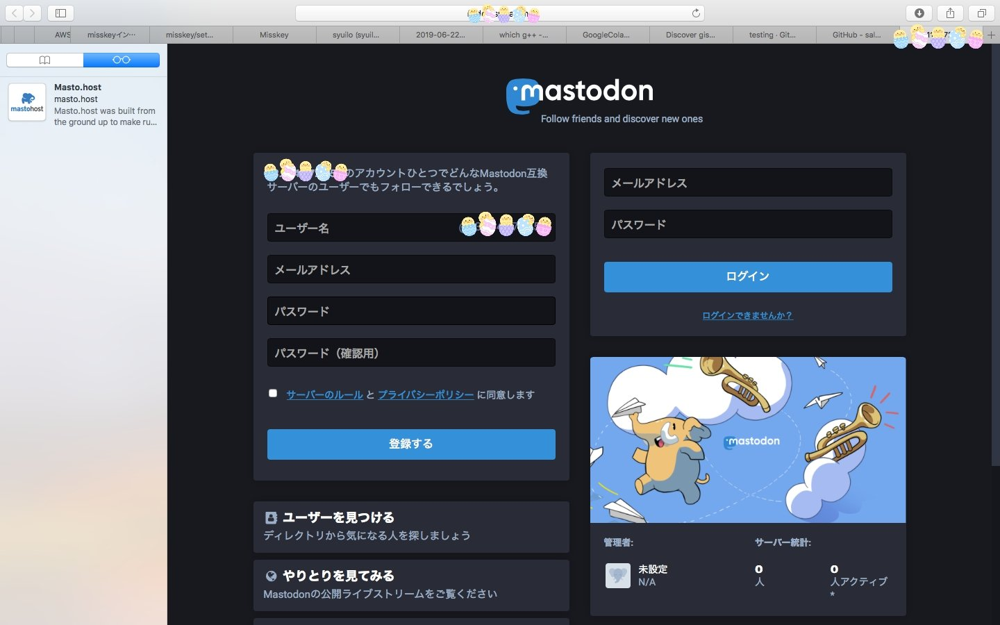

設定が諸々残っていますが

なんとか鯖立て成功しました。

.

メールサーバーとメディアストレージを

なんとかしなきゃなの。

まず、どこのものを使おうか悩んで

猿毛さんからSend Gridを教えてもらったり

Mail gunってサービス名も

マストドンの設定で使っている鯖多いよーだとか

なんとなく聞いていたりしたので

比較や登録、チュートリアル検索して調べた。

.

おそらく無料系サービスは、無料枠をこえると

こえた時点で一度ストッパーが働いてしまうみたいで

おひとり様なら全然良いのだけれども

ひとが増えた際にパスワード変更が出来ないだとかの

不具合がおこる可能性を考えると

AWSのSESで自動的にスケールアップしてくれる方が良いのかなあ

とおもったり。

.

機能面だけなら、門戸を開くときや必要に迫られたタイミングでSESへ設定し直せば良いじゃない？

って話になるのだけれども

自分の勉強のためにあえてAWSを選択したので

(オーバースペックでは？と言われる)

おひとり様で気楽なときに無料枠内でSESに慣れることができるのは、それならそれで良いかなあとおもうの。

多少の授業料なら全然払います！ってきもち。

.

そしてメールサーバーの設定をしたのですが、メール来ないので明日なんとかします。

まとめて、整理して、切り分け作業だよ。

お昼休みに少し触って無理そうならメディアストレージの設定進めとこ。

これも良さそうなチュートリアルが見つかればAWSのS3で進めるとおもいます。

.

あと全然話が変わるんだけれども、ラズパイ欲しい。

うちにデスクトップのWindowsが2台あって

まあまあ年季の入ってるものと

それ以上に年季の入っているものの2台なので

MacBookを買ってからは、なかなか使わなくなってしまった。

.

しかしOSがWindowsだと開発するにしてもあまり使い道がなさそうなのがネック

むしろ物理サーバーにしてしまえば？

って案も出ているけれども、住んでいる地域バレが少し怖いかも。

単純に目的が

｢パソコンの中身や仕組みもっと知りたい！｣

なので、せっかくなら楽しいおもちゃにしたいなあってきもちで

ラズパイの使い道アイディアゆるぼです。
