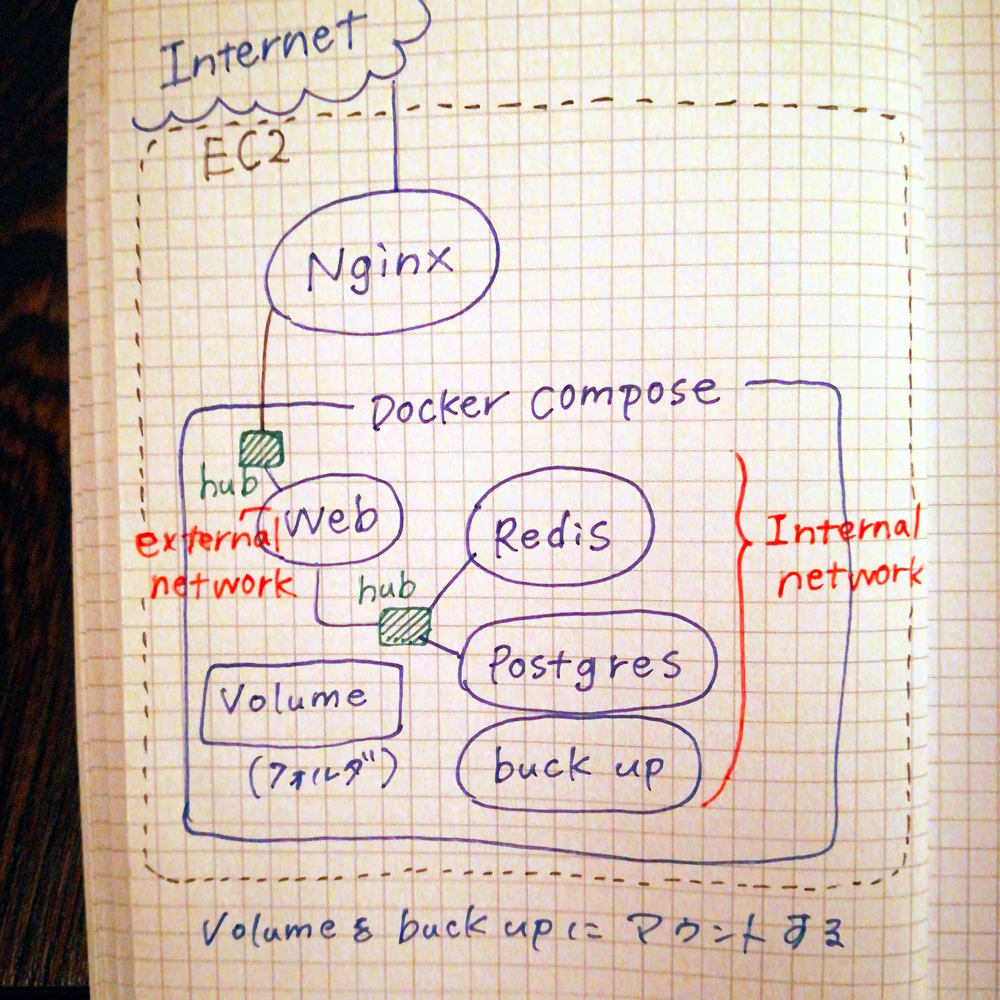
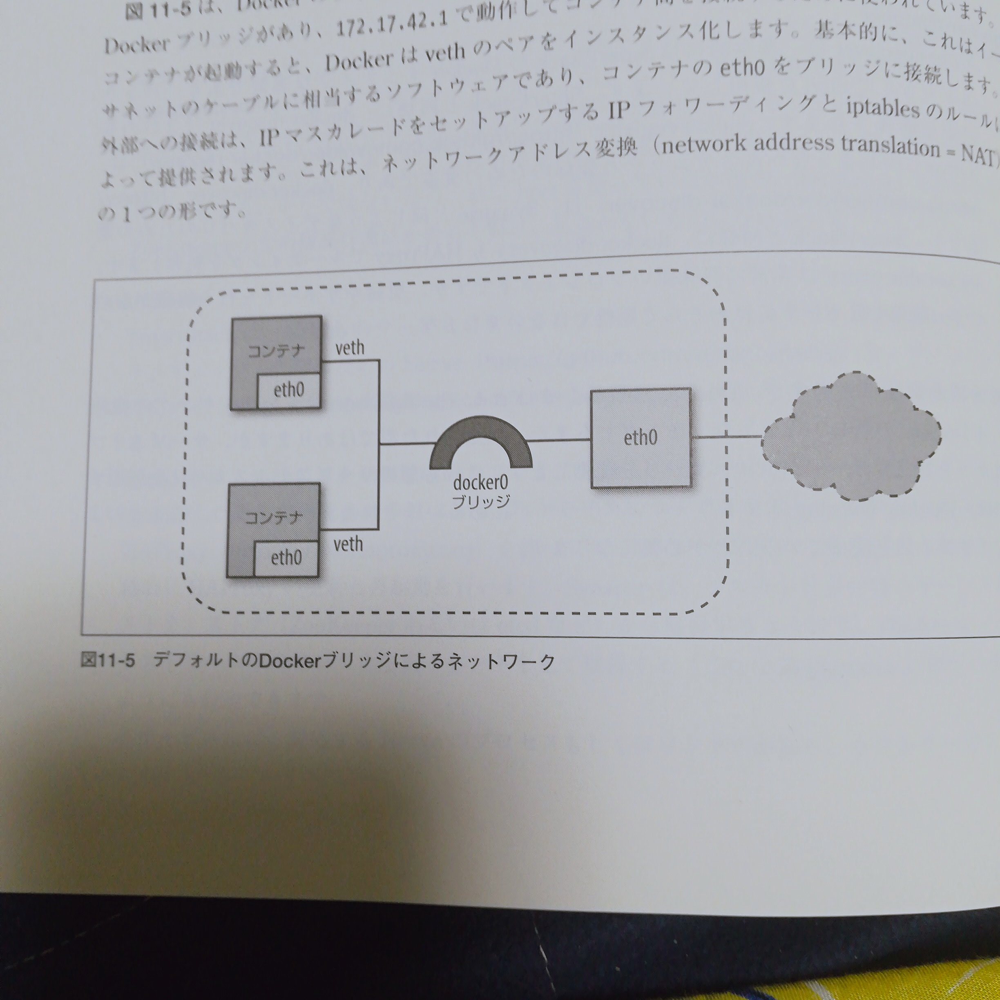

マストドン構築における

Dockerのネットワークについて、書いてまとめた。

言葉だけだと理解しがたいね。

結局、本の方も読んでみたのだけれども

今の時点でおそらくネットワークの細かなところまで知識必要ないなと判断して

マストドン構築のうえで必要最低限なものだけ覚えようとおもいました。

.

issueのひとつに｢バックアップをとる｣があったので

それを片付けたの。

まだ途中なので明日がんばる。

.

マイグレーション失敗しても

｢でもバックアップあるから大丈夫！｣

って言えたら、100てへぺろが

10てへぺろくらいで済むもんね。
