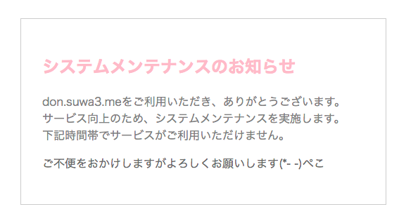
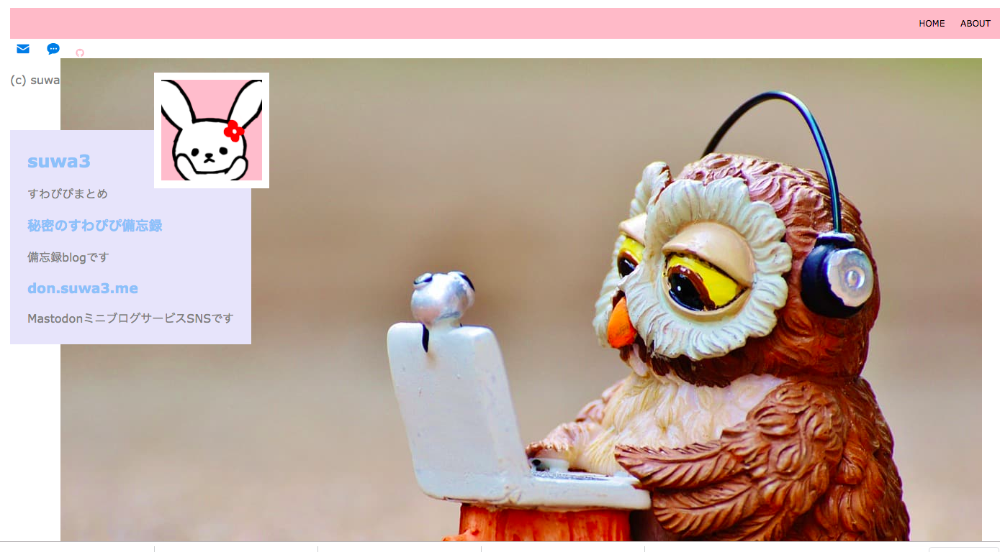
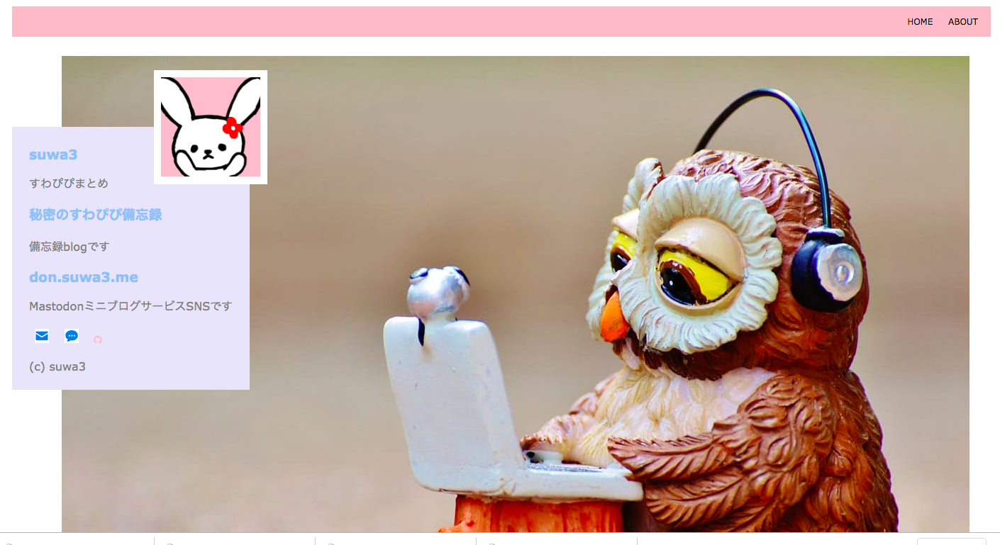

メンテナンスページつくったの。

適当なサイトの例をコピペして

色とか文とかいじってみた。

Hpをつくっていて

構造ガン無視し過ぎてfooterが一番上にきてしまっている図です。

動画のチュートリアルを粛々と観ていたのだけれども

｢自分のつくりたいようにつくりたーい｣

って自分でデザインしたらこのザマです。

最終的な解決法

footer要素も全て突っ込む。

GitHubのほうは明日反映させる〜
