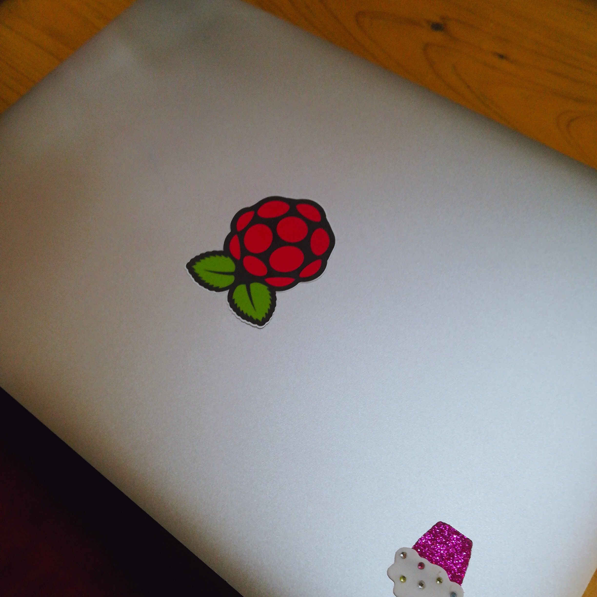

オープンソースカンファレンス名古屋に行ってきました。

オープンソースのお祭りだったよ。

企業ブースや個人のブースがあって

エンジニア向け同人イベントみたいだなあという印象でした。

.

Raspberry Piのセミナーと、gitのセミナーを受講したの。

Raspberry Piの講師は年配の方で

｢最近のひとはPythonとかで制御するみたいですが、わたしはPythonよく分からないので全てshell scriptで書きました｣

と言っていて、すごいなあとおもったよ。

.

あと面白いなとおもったのが

ポーチライトを外の照度で管理するの

“外が明るかったらポーチライトの灯りを消す、暗かったら点ける”

という仕組みをつくるのに

太陽光電池つきの100均電卓を分解して

照度が高いと電圧も高くなるのを利用していたの。

閾値処理である電圧以上になったら消す/以下になったら点ける

という設定をしたらしい。

アイディアだなあとおもった。

.

講師の方はスマホに音声で指示を出していたんだけど

スマートウォッチで指示が出せたらラクよね。

海外ではスマートウォッチでIoTの遠隔操作をすることが増えてきているらしく

それがスマートウォッチ普及の一翼を担っていると知って

自動制御や遠隔操作の開発

今後も活発化しそうだし、たのしそうだなあとおもいました。

.

Raspberry PiのステッカーをgetしたのでMacBookに貼った♡

可愛い。

.

gitのセミナーは

最近GitHubを使い始めて

shellコマンドでのgit操作を記事にまとめたし

https://qiita.com/suwa3/items/0a180e9833c0146e36b5

初歩的な仕組みについては知っているつもりだったの。

前半はわたしにとって復習的な要素が大きくて

｢んー、たしかに｣

とおもいながら聞いていたけれども

後半の重複(コンフリクト)対策の仕組みはなるほどとおもった。

https://www.slideshare.net/mobile/ToruMiyahara/git-osc2018

帰宅してスライドもう一度復習しました。

図解がわかりやすくて良いなあ。

.

その後ポケマス管理者のナツキさんと合流して

WordPressのはなしや

マストドンについて

お互いに今日受講したセミナーの感想を話しつつ

ナツキさんが最近ハマっているたまごっちの話や

星ドラの話も聞いたよ。

解散後はダッシュで会場に戻って

ギリギリLT（発表）を聞くことができた。

.

新幹線で地元の静岡に寄り道して

地元の、昔からの知人が働いているダイニングバーで夕食をとったよ。

元SEのひとでWindows 3.1を使っていたはなしから

当時はPCが扱えてもオタクに人権がなかった

というはなしに、歴史を感じました〜。

.

今日盛りだくさんᐠ( ᐛ )ᐟ♡ᐠ( ᐖ )ᐟ
