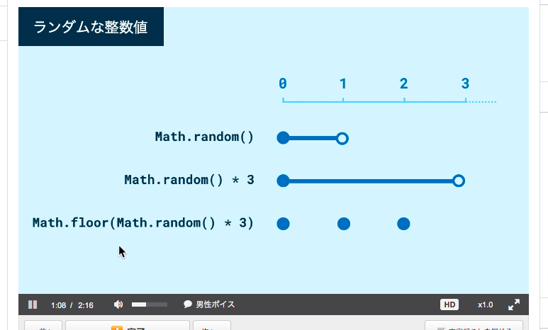
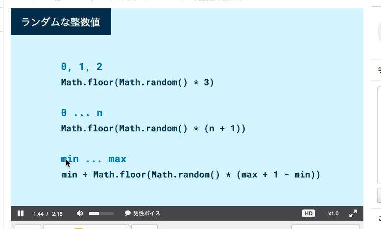
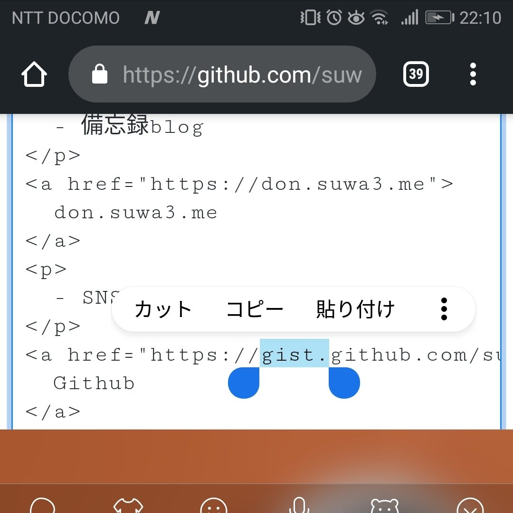
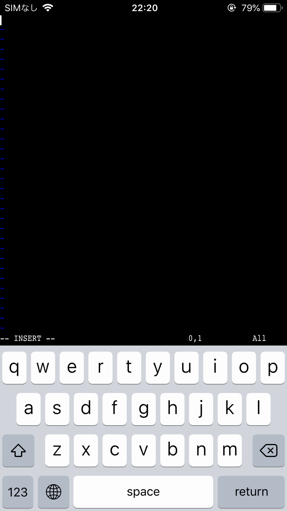
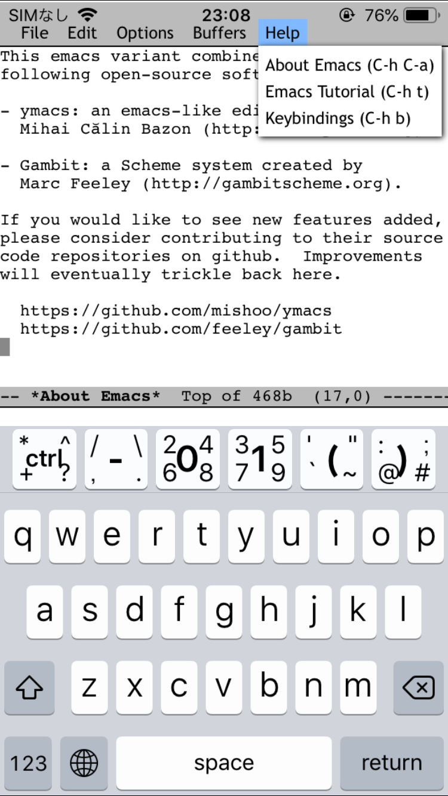

JSの練習していたの。  
だいぶ触っていなかったので・・  
図で説明されるとわかりやすいなあとおもう。  
Vue.js練習したいなあとおもいます。

.

Github、スマホからissueのClosedができたので  
もしやとおもって試してみたら、スマホから編集/反映できた。  
そしてgit cloneできるのか調べたらTermuxというアプリをいれることで  
Android上でLinuxのようなshellをつかえるようになるらしい。

shellとgitコマンドが使えるならgit clone可能なんだねえ  
https://qiita.com/0uts1de/items/7eb13fea6ac5f02da44b

ついでに、iPhoneにVimが入っていたのおもいだして  
iでinsert modeに入れたけれども  
どうやって抜けるのかわからず  
まさかの脱出ゲームだった。

emacsも入れていたので開いたよ。  
iPhoneのアプリはnot emacsだけれども

Androidアプリはemacsだったよ。なぞい  
ちなみにAtomのスマホ用エディタは見つけられず  
VSCodeはありました。
