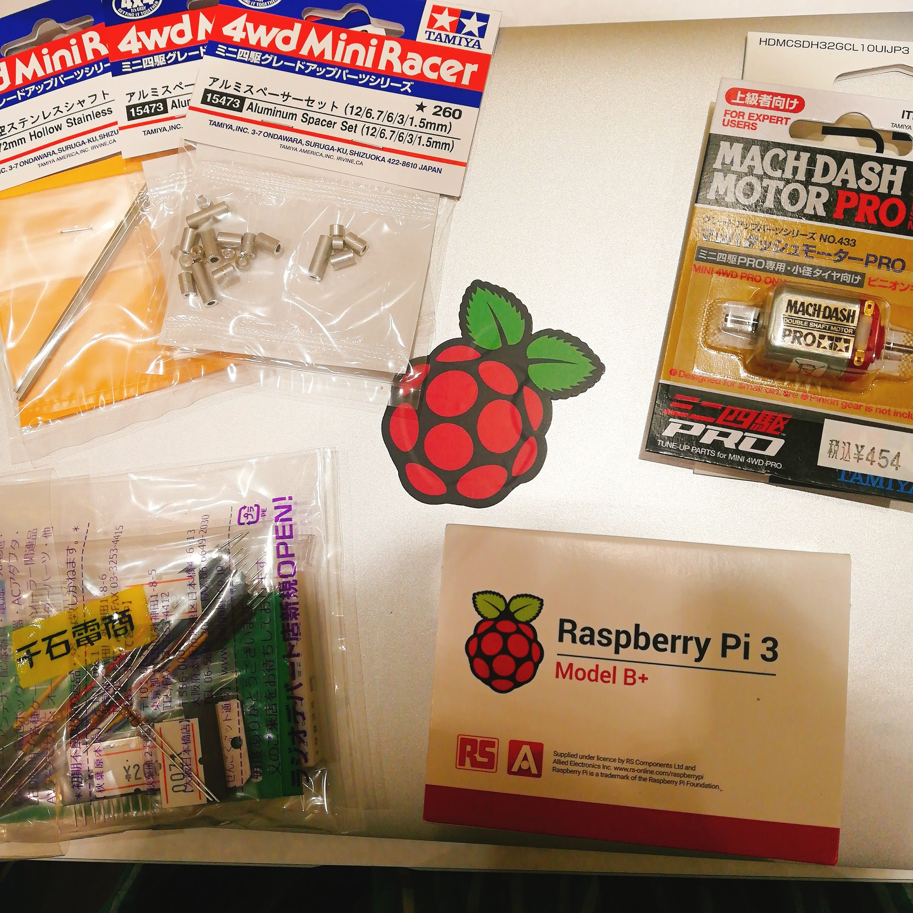

昼間は引き続きJSのお勉強をして

きちんと一つ一つ

手でも、頭でも慣れて

まとめたいなあとおもいました。

.

夜は秋葉原でお買い物したよ。

Raspberry Piかわいいなあ。

ミニ四駆は、上にボードやラズパイのせるので

72mmのシャフトとアルミスペーサーでトレッド幅を広げます。

.

わからないこと沢山あるけれども

とりあえず仮説をたてて組み立ててみて

わからーん！ってなったら

Raspberry Piの勉強会に参加して

有識者にお話を伺おうとおもいました。
