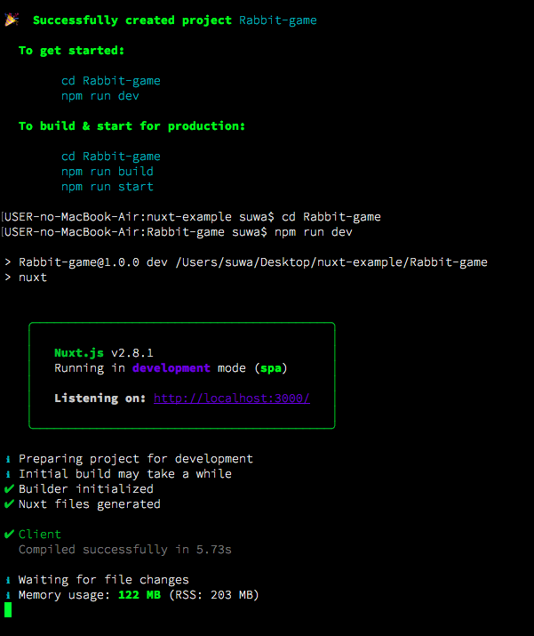
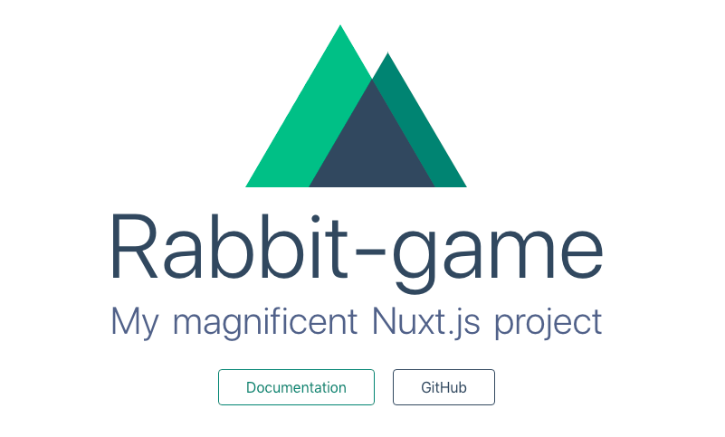
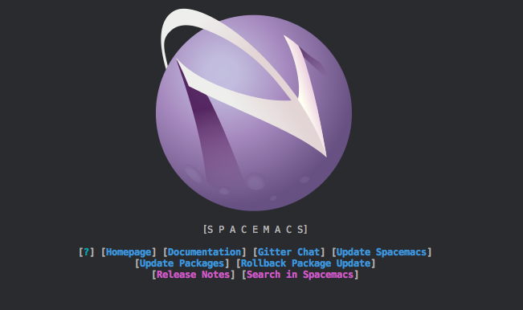

Nuxt.jsを導入する練習をするために

Rabbit gameをexampleとして

GitHubにリポジトリを作成しました。

開発サーバーかわいい

色々と機能があるのね。

https://ja.nuxtjs.org/guide

サーバーサイドレンダリングはやらなかった。

あとGitHubの使い方少しずつ慣れてきたんだけれども

GitHub上にpushしたあとshellで修正するの慣れないので

もう少し復習したいなあってきもちです。

.

$ rm -rf .git

\-rfは-rと-fくっつけたもの

\-rディレクトリを消す、ファイルの場合は不要

\-fはforce、無理やり

.

$ git commit -m 'scaffolding'

\-mはcommit messes

.

$ mv \* ../

\*ワイルドカードで全部

../を指定して上の階層にmv移動させる

.

$ cd ..

じぶんも上の階層に移動

.

$ mv .editorconfig ../

$ mv .gitignore ../

$ mv .nuxt/ ../

.がつく隠しファイルは\*で指定できないので手動で移動

.

このblogドット.だらけで意味わからんくなっているな。

できたあ、かわいい。

そしてspacemacsをいれました。

Evilモードではない方にしました。

Evilって名称にemacsの悪意のようなものをやんわりと感じつつ

調べたら建前上きちんとした意味はあるぽい。

真実は謎のまま。

これから色々と設定を加えていけたら良いなあとおもいました。

.

現在AtomユーザーなのでAtomの使い方も復習しながら

WebのコーディングはVSCode使いこなせたら良いなあって目標です。
