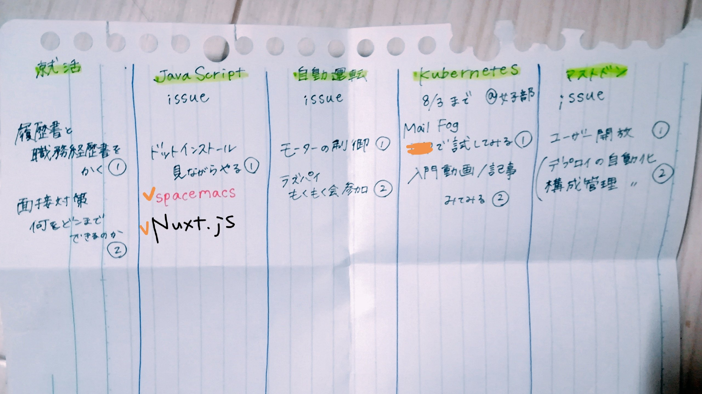
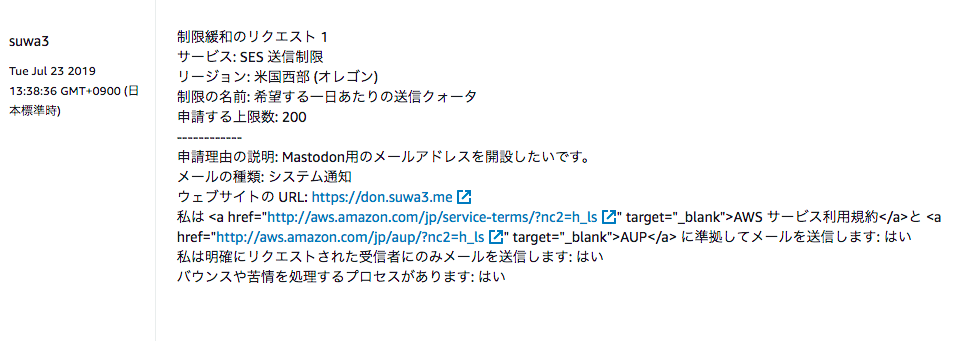
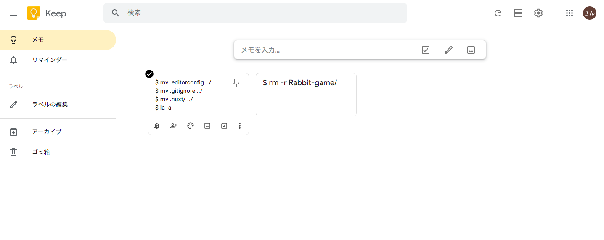
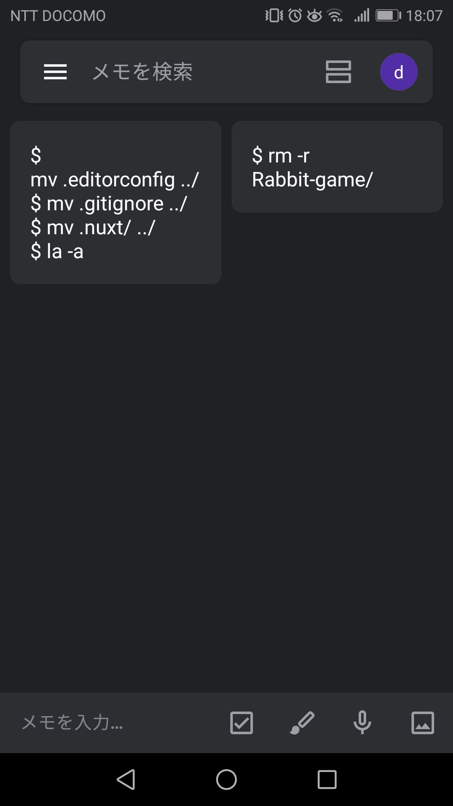
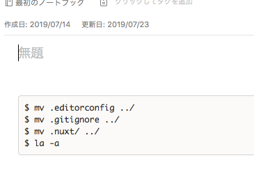

やること増えてきたので

まとめたのがこちらです。

issueと書かれたものはGitHubでissue管理されているもの。

最優先は就活と、期限の決まっているKubernetesかなあ。

.

Kubernetesは勉強会@女子部に登録したので

その予習をできるだけやっていきたい。

.

最近気づいたのは、入門系の講習やセミナーに

本気で予習無しや前提知識ゼロでいくと

ただただ｢訳分からん｣な時間を過ごす羽目になるので

できる限りじぶんで予習しておくべきだなとおもった。

入門系の勉強会はむしろ復習なのね。

.

最優先の就活だけれども、焦りたくはないの。

きちんと何がしたいのか見極めたいし

特に急いでいないので慎重に進められたら良いなあとおもいます。

.

AWSサポートにSESの送信制限解除の申請をした。

この申請が通れば、don.suwa3.meのメール登録開放ができるの。  
無事申請が通ると良いなあ。

.

blogにコードを書く際に

イケてるメモ帳が欲しいなあとおもって探したよ。

.

Evernoteはターミナルの内容をコピペすると

背景の黒も一緒にコピーしてしまうの。

優秀なんだけれどもwordpressにコピペするときにジャマなので

純粋にテキストのみで書けるメモ帳がないか

お勧めを片っ端から試しました。

Google keepのメモ帳がシンプルで

クラウド対応しているの。

PCから入力後すぐにスマホに反映されるのも良い。

ダークテーマ

良いじゃんとおもって使っていたら

Evernoteがコードブロック可能なことを知った。

.

バッククオートでコードブロックしてあげれば

背景の黒も取れて全て解決することに気づいてしまった。

.

メモ帳難民した1日でしたあ。
