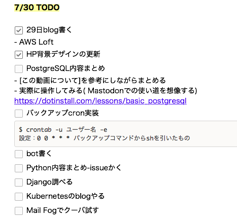
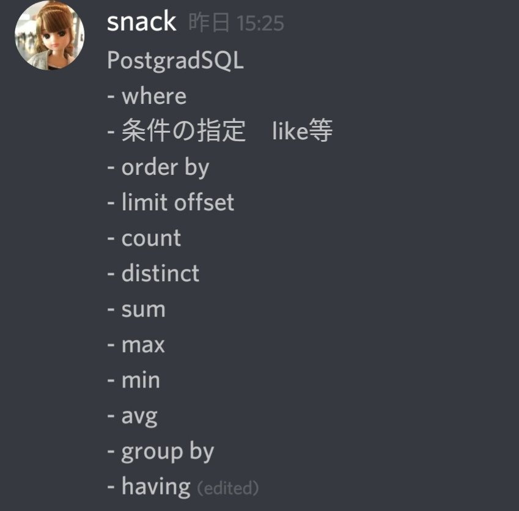
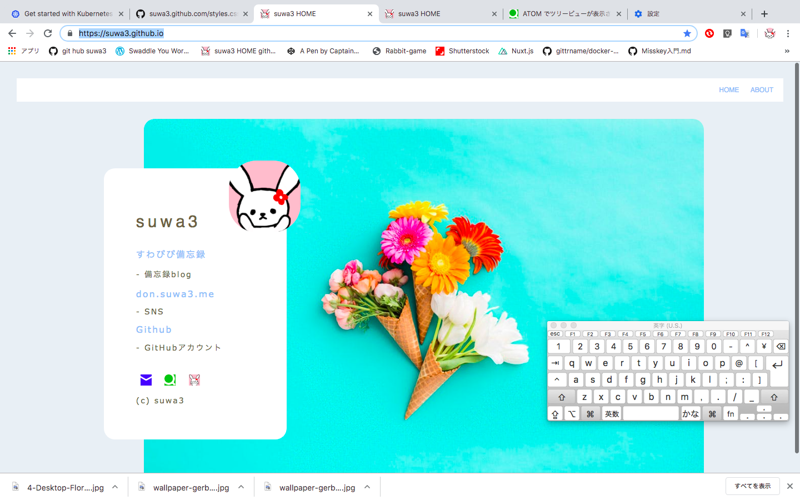

To-Doリストつくるの習慣化出来たらいいな。

うさぎのデザインでピンズを発注しました。

出来上がるの楽しみ😊

.

postgreSQLの内容は、まとめて自分用メモつくりつつ

実際に書いてみて動くのか確認したい。

HPの背景を変更しました。

夏ぽい、スマホページも夏らしくしたいなあ。

今日のblogは画像いっぱい。

.

職場のお姉様が明日までの出勤で

記念品を渡しました。

CAFÉ de CRIÉのレシートを沢山くれて

コースターgetに協力してくれた方だよ。

寂しいねえ
