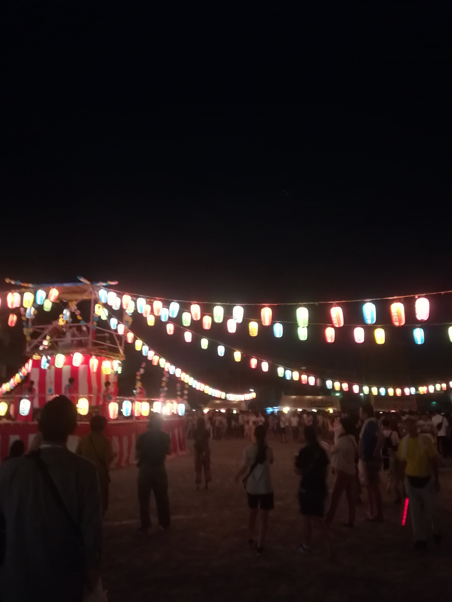
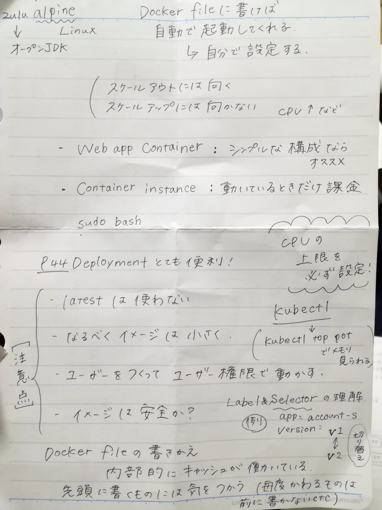
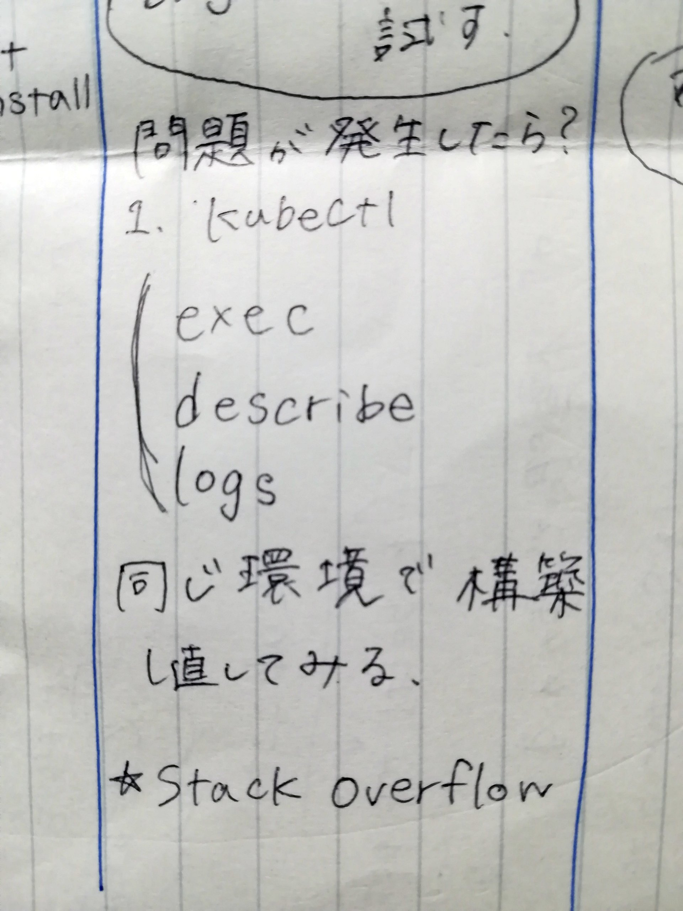
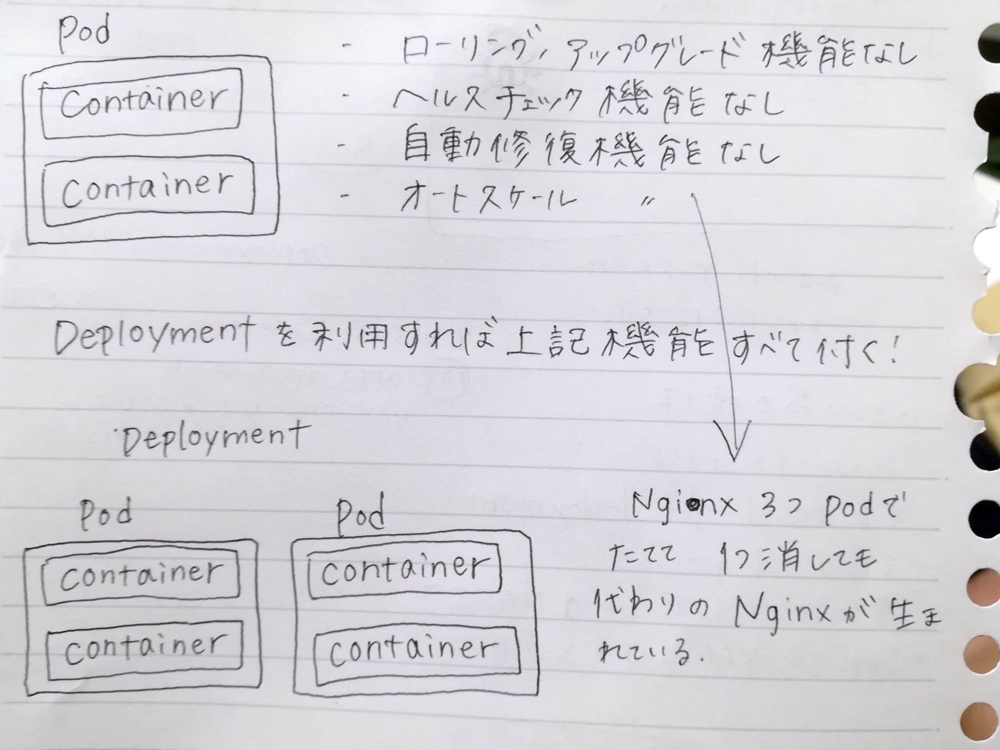
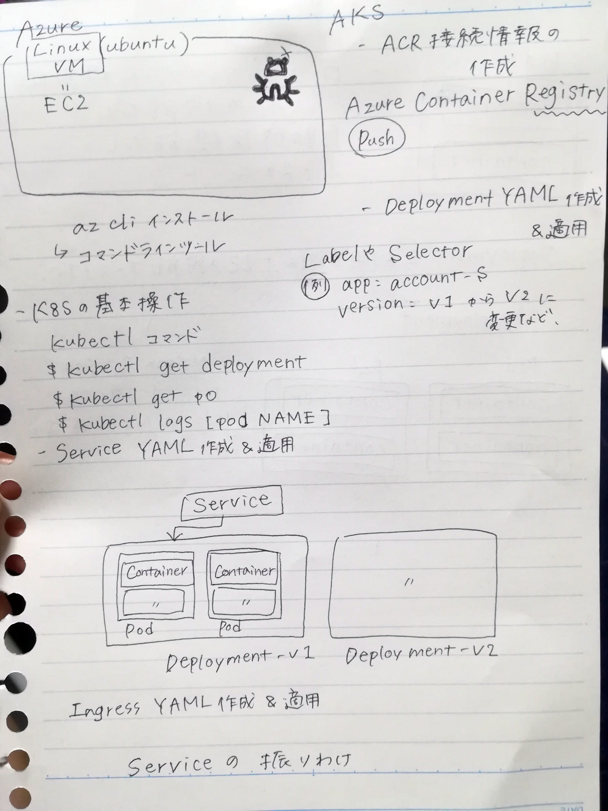
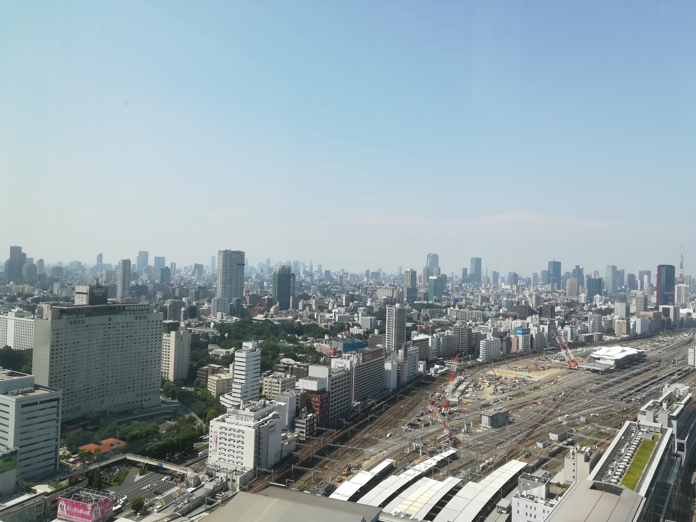

朝起きてKubernetesの女子限定ハンズオンに行ってきました。

会場に辿り着くまでに一時間近く迷って

まあまあ遅刻しました。

30分くらい余裕もって出たんだけどなあ。

.

Kubernetes

Dockerってコンテナ(仮想環境)の機能を利用して

それらをより複雑に組み合わせることができるの

.

5〜6人のチームに別れて

それぞれ課題に取り組む形で行われたのだけれども

今までチームで何か開発や作業をした経験ってなかったので

かなり新鮮でした。

.

Azureやインフラ未経験の方々もいて

それでも何とかなったし、楽しかったの。

ランチもチームメンバーと食べて

わちゃわちゃ話せたの良かった。

.

後半助っ人で来てくれた方が

問題解決能力とても高い方で

頼りになるなあ、凄いなあとおもった。

わたしも問題解決能力の高い

最強のエンジニアになりたいとおもいました。

.

講師の方は寺田さん (@yoshioterada) https://twitter.com/yoshioterada?s=09

でした。

https://github.com/yoshioterada/k8s-Azure-Container-Service-AKS--on-Azure

教材は上記GitHub

https://yoshio3.com/2018/12/06/kubernetes-tips-for-production/

後半はこちらのスライドも利用していた。

.

帰り道すがらお祭りにふらっと寄りました。

提灯が綺麗。

.

帰宅して復習したよ。

とりあえずババーっと書いたものを貼ります。

30階以上の階だったので

窓からの眺めが良かったの。
