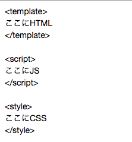

Nuxt.jsへの移植作業二日目です。

[Nuxt.js ディレクトリ構造](https://ja.nuxtjs.org/guide/directory-structure/)

ディレクトリ構造について書かれていて

「それぞれこういった役割を振り分けられているのね」

と、ふむふむしました。

USER-no-MacBook-Air:nuxt.Rabbit-game suwa$ tree
 .
 ├── README.md
 ├── assets
 │   └── README.md
 ├── components
 │   ├── Logo.vue
 │   └── README.md
 ├── layouts
 │   ├── README.md
 │   └── default.vue
 ├── middleware
 │   └── README.md
 ├── nuxt.config.js
 ├── package-lock.json
 ├── package.json
 ├── pages
 │   ├── README.md
 │   └── index.vue
 ├── plugins
 │   └── README.md
 ├── static
 │   ├── README.md
 │   └── favicon.ico
 └── store
     └── README.md
 8 directories, 16 files

↑の、pagesの下にあるindex.vueをエディタで編集したの。

何故画像なのかというと、コードブロックで書こうとしたらスラッシュが何かに作用してうまく表示されなかったからです！そんなんばっか！

.

index.vue内は上記画像のようなHTML/JS/CSSの三部構成になっているので

それぞれ指定されたものをコピペしていくのですが

Nuxt.js語的な独自ルールがあって、その翻訳がいまだにわかりません。

うさぎでもわからないblog

.

土日は作業できるカフェを探すのだけでも苦労するの。

WiFiか電源、どちらかを譲歩できるだけでもかなりラクになるなあ

とおもった。

Dockerなどを使わなければ、ほどほどに電池もつので

むしろダラダラ作業しないためにも

電源なしの作業場所を選ぶのアリかもしれないとおもいました。
