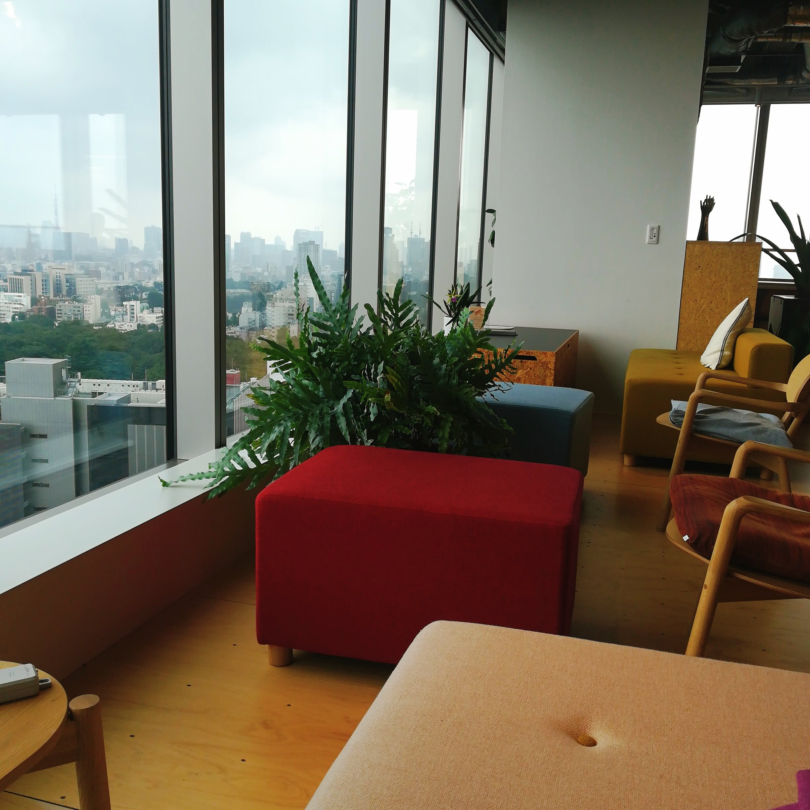

早起きして朝Tully'sしました。

主にAnsible化について調べたよ。

[Ansibleをはじめる人に。](https://qiita.com/t_nakayama0714/items/fe55ee56d6446f67113c)

ここでAnsibleの名付けのもとになった小説が紹介されていて

[Ansibleが登場するSF小説「エンダーのゲーム」読んだ](https://open-groove.net/science-fiction/ansible-enders-game/)

絶対に面白そうなので読みたいとおもいました。

SFすき。

Ansibleって自動化させるための機能なんだとおもっていたけれども

構成管理ツールと呼ばれているらしく

Ansibleの他にも色々とあるのね。

最近のトレンドがAnsibleらしい。

シンプルで使いやすいとのこと。

とりあえず調べるだけ調べて

AWSのコワーキングスペースLoftに移動しました。

AWSのアカウントを持っているだけで

平日ここのスペースを無料で使えるの、かなり大きい。

あまり時間もなかったので

とりあえずメッセージの返信やスケジュールの調整など雑務を片付けて

軽くお昼を食べて出ました。

SNSがDockerふわふわタイムに突入して重くなったの。

簡易的な監視ツール入れたいなとおもって登録だけしました。

[uptime robot](https://uptimerobot.com/)

.

美容院で前髪カットして部分パーマかけて

根元リタッチして

髪の毛のメンテナンスしたよ。
