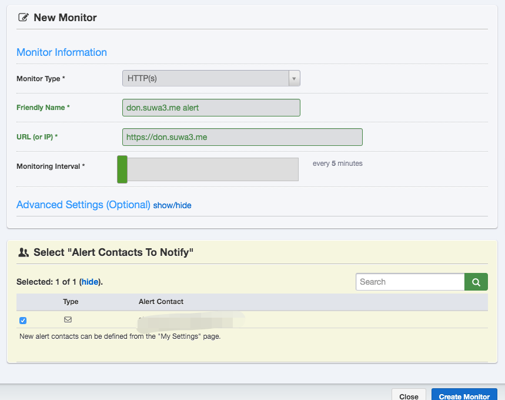
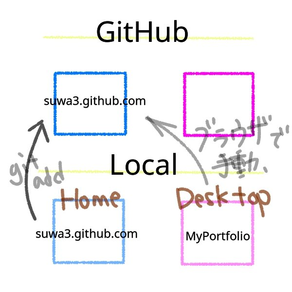

夏バテ過ぎる。

ぴぴお花屋さんだけど今日はコードも少し書いたよ。

システムのお仕事したいなあ。

.

お昼はdon.suwa3.meに簡易的な監視ツールを入れるため

Uptime Robotの設定をしていました。

監視対象のURLと通知先のメールアドレスを登録するだけなので

2分で完了した。

念の為Slackにも届くようにしてみた。

.

don.suwa3.meをメンテナンスモードに切り替えて

Uptime Robotから通知がくるか試したの。

5分毎にcheckしているはずなのに

なかなか通知が来なくて

｢おかしいなー？｣

とおもったんだけど

よくよく考えたらメンテナンスページは

通常と同様に200を返すので

Uptime Robot的には問題なしと判断されるのだった。

.

ということで

設定したURLをhttps://don.suwa3.me/about

にして

メンテナンスモードに切り替えて404を返すようにしてみたら

しばらくして期待値通り

Uptime Robotから通知がきたので

これでdon.suwa3.meに異常が起きたら即通知くるようになったᐠ( ᐛ )ᐟ♡ᐠ( ᐖ )ᐟ

わーいわーい

そしてそのまましばらくメンテナンスモード戻し忘れて

don.suwa3.meはロングラビットチャンス到来していました。

.

夜はHPの編集をしていた。

背景画像を変えていたの。

相対パスが未だによくわからんちで

なんだか血縁関係の

｢従兄弟は何親等か？｣

みたいなかんじやんね。

.

とりあえずディレクトリのドット一つが

｢今いる場所ここのディレクトリのこと｣

ドット二つが

｢今いる場所の一つ上のディレクトリのこと｣

というのは覚えた。

.

../←これに慣れよう。

あとね

何故かHPのindex.html等が入ったディレクトリがローカルのhomeとdesktopそれぞれにあって

ほぼ同じファイルなんだけれども

.

homeのディレクトリはgit管理されていて

ターミナルからgit addとかしているのはhomeの方なの。

.

desktopのディレクトリはgit管理されていないんだけれども

Atomから編集するのはdesktopのディレクトリにあるindex.html等で

ブラウザから手作業でgit pushしているのは

いつもdesktopのindex.htmlなの。

｢ん？？？？｣

ってかんじなので

desktopのディレクトリは封印して

homeのgit管理されているものを

Atomで編集するようにしました。

.

何故こうなったのかというと

GitHubのhttps化機能を使うために

suwa3.github.comとかいうふうに

リポジトリ名を変更する必要があって

ローカルdesktopにあるindex.html等をGitHubにあげて

https化するためにリポジトリ名を変えて

そのままローカルhomeにgit cloneしたんですね。

そっちにcloneしちゃったかー的な。

.

そして慣習的に

desktopにあるディレクトリを

GitHubにブラウザ経由して手動で上げていました。

desktopの方は不要かもね。

.

自分で説明を書きながら

図まで描いたのに、訳分からな過ぎてウケるな。

3回読み直したけど分からない。

まるでGoogle翻訳したAWSの機能説明レベル。

.

とりあえず

ゴチャゴチャ過ぎて訳分からなくなっていた

ってことが伝われば本望です。

.

こういう

｢どうしてこうなった？？？｣

的な状況、まだまだありそう。

PC内のディレクトリやファイル

git管理されているものなど

きちんと整理します！
