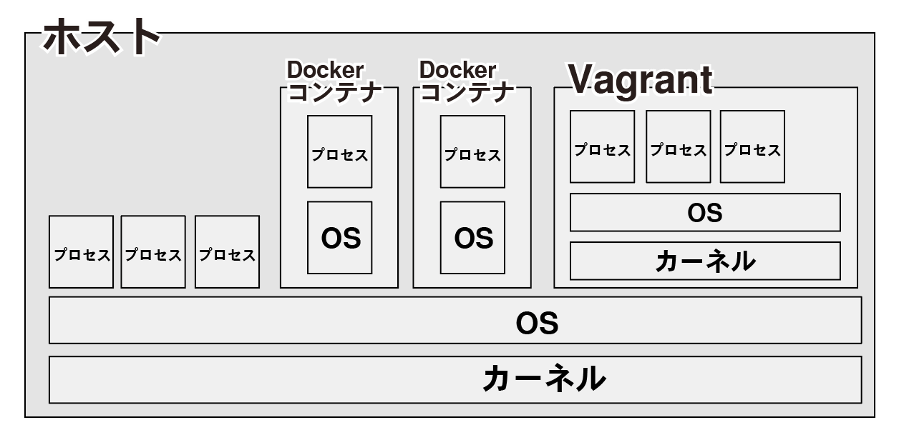

朝と午前中はuser scriptについて調べていました。

参考に見たQiita記事が軒並みjQueryで [UserScriptで楽しくJavaScriptを覚えよう](https://qiita.com/i_completely_understand/items/acf3e5efe0db848989d9)

むぢゅい

JSわからない。

Chromeの拡張機能はとりあえず追加しました。

なかなか新しい記事を見つけられなかった。

type scriptも調べてみたい。

.

お昼は主にDockerとVagrantの違いについて調べていました。

[Web系のDocker民から見たVagrantについて](https://qiita.com/Hibikine_Kage/items/77a32b8c715fb698d5a7)

(上記サイトから引用)

この画像を見て

Dockerコンテナ同士を結びつけるのがdocker-composeかなとおもったけれども

これOSが独立しているので

Kubernetesで結びつけるのが正確かな。

違いを以下にまとめました。

.

> Docker
> 
> \- OS以上を仮想化
> 
> \- 軽い
> 
> \- カーネル部分はホストマシンに依存するため、Windowsだと正常に作動しない場合がある
> 
> Vagrant
> 
> \- カーネル以上を仮想化
> 
> \- 重い
> 
> \- カーネルから仮想化するため、そのぶんシミュレーションの精度がDockerよりも高い。
> 
> \- Vagrant上にDocker構築も可能

実際にVagrantの構築も試したい。

[VagrantとDockerについて名前しか知らなかったので試した](https://qiita.com/hidekuro/items/fc12344d36d996198e96)

Qiita記事を参考にしつつ

動画を観ながら進めてみよう。

.

[18のプログラミング言語をポケモンに例えてみた！](https://techacademy.jp/magazine/10770)

Rubyはヒトカゲで

Pythonはゼニガメっぽいなあ

ってイメージはあったの。

でも、ここではPythonをカイリューだと言っていて

確かにミニリュウ青いしカイリュー黄色くて

ロゴの色味的にも合っているし

育てるとまあまあ強い準伝なの納得感ある。

Lispよく知らないけれども

ラプラスの偉大で神聖な感じなのかあっておもった。

しかし、アローラではラプラス大量発生していてレア感薄いけれども。

.

ポケモンとプログラミングについて

知識の習得、コレクション

環境が変わると一から育成をし直す必要があって

ポケモンが成長するのと共にトレーナーも成長して強くなれるの

プログラミングとポケモン

親和性高いのでは、と感じた。

とりあえずRuby使えるようになりたい。

Rubyはリザードンらしいけれども

まだわたしは弱小なのでヒトカゲGETするところからです。
