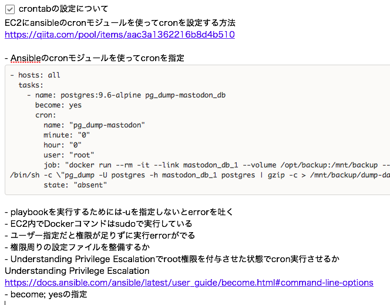
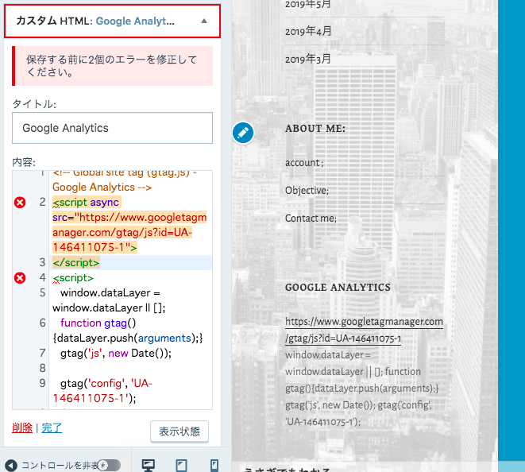

朝からすっかり疲れていました。

本日は完全に甘えモードで、Ansibleのcronモジュールでcrontabの設定です。

自分用の備忘録です。

もともとUbuntu内の権限周りの設定がわけわかめだったのですが

今回Ansibleでcronの設定をやろうということで、権限周り問題が複雑化したように感じます。

ただ、本日は甘えモードのため

「よくわからないけど、動いた設定内容を備忘録としてまとめればOK」

を、目標としたので

本日の目標は完全に達成しました！

.

WordPressにGoogle Analytics導入も試しました。

結論、断念したのですが

scriptタグが許可されていないっぽい。

[WordPress.orgとWordPress.com、どっちのワードプレスを選ぶ？](https://communityserver.org/contents/3194/)

WordPress.orgであれば、自前サーバーでの管理になるので

自由度が高いためプラグインを使って解決できるのだけれども

WordPress.comは有料プランでないとプラグインを使えず、月々3000円ほどのビジネスプランに登録必要があるの。

.

EC2使えるのであればWordPress.orgに移行して自分で運用すれば？

って感じなんですが

don.suwa3.meの運用ですら保守にあっぷあっぷしているので

もう少し慣れてからかなあってかんじです。

具体的には、セキュリティの設定面やアプデに追従できるのかが不安なので

そのあたり慣れたらぜひやりたいです🙋‍♀️

.

vimに慣れたいので、カンペ貼ったよ。

©️はコマンドモードのcです。

便利なショートカット覚えたらどんどん追記したい。
