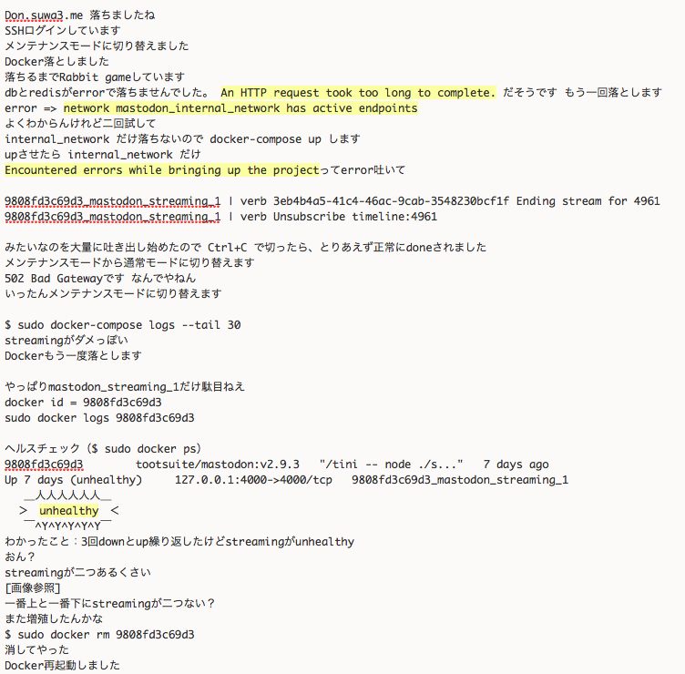
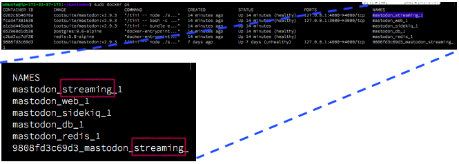

朝から活動的でした。

デプロイの自動化は最優先で取得したい技術だなあとおもいました。

初対面のひとと沢山はなした！

本日も疲れる１日でしたが

厳しめモードでDockerです。

監視ツールからガンガンアラート来ていました。

以下、奮闘記。

**streamingが二つあった証拠画像あります！**

証拠を残せて満足です。

.

Docker再起動で糞重たいのが起動できたの

重すぎるのでsidekiqを止めた状態で再起動かけて、後から追加する作戦しました。

が、結局重くて全部落ちました。

Dockerふわふわどころじゃない。

.

**結論：t2.microでdocker運用、そろそろきつい**
