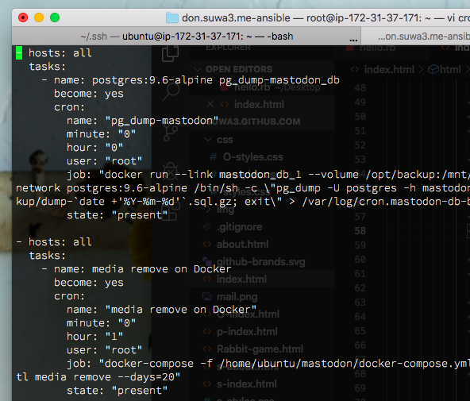

はあい、本日のTODOです。

### ~/.ssh/configの設定

先日Docker沈黙タイムがやたら長くて帰れない事態に陥ったので

~/.ssh/configに、サーバーへ60秒毎に生きている報告をする設定を書きました。

[~/.ssh/configについて - Qiita](https://qiita.com/passol78/items/2ad123e39efeb1a5286b)

ラズパイにログインするのも簡単になった。

やったねえ

* * *

### 

cronをAnsibleに追加

そしてメディア削除のDockerコマンドをcronで実行したもの。

（参照）[usermod/cronでdocker-compose – うさぎでもわかる](https://suwa.home.blog/2019/09/03/usermod-cron%e3%81%a7docker-compose/)

これを構成管理に組み込むためAnsibleに設定しました。

9ddで一気に9行消せた、わーい

そしてdd連打していたら関係ないところも消してしまい

ひーん😢となって調べたらuで元に戻せました。

### viコマンド

\*dd

カーソルがあるところから\*行削除 ex.3dd（3行削除）

\*yy

カーソルがあるところから\*行コピー

p

ペースト

u

操作を一つ戻す

Ctrl+r

戻すのを戻す

※ dd,yyでそれぞれ1行削除/コピー

* * *

### 

デスクトップのゴミ箱化どうにかする

デスクトップがゴミ箱代わりになっていて

スクリーンの設定で見えないようにしていたの。

きちんと整理したいとおもい

スクショの保存先がデスクトップなのが諸悪の根源だと考え

保存先を指定できるか調べました。

[Macのスクリーンショットの保存先を変更する｜MacFan](https://book.mynavi.jp/macfan/detail_summary/id=90165)

ホームにSSディレクトリを作成して以下のコマンドを実行

 $ defaults write com.apple.screencapture location ~/SS/;killall SystemUIServer 

変更できた。わーい

むかしスクショしたものが出てきたよ。

たぶんvenvで仮想環境つくり、Pythonで春って単語を含むものをホニャララしたやつ。（忘れた）

このころはコンテナもクラウドもなんでもかんでも仮想っていうから

仮想わけわからんっておもっていた。懐かしい
