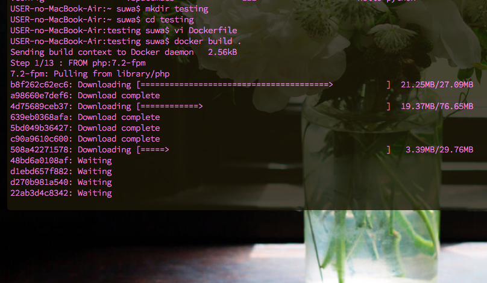

Dockerfileは管理しているリポジトリの.gitと同じ階層につくる 。

  
[Dockerfileを書いてみる - Qiita](https://qiita.com/nl0_blu/items/1de829288db2670276e8)

（上記サイトから引用）

Dockerfileの具体的な書き方をふむふむした 。

[Dockerを使ってLaravel開発環境構築 - Qiita](https://qiita.com/A-Kira/items/1c55ef689c0f91420e81#3-dockerfile作成)

Laravel開発環境構築につかえそうなDockerfileを探したの 。

FROM php:7.2-fpm 
COPY php.ini /usr/local/etc/php/ 

RUN apt-get update \\ 
  && apt-get install -y zlib1g-dev mysql-client \\ 
  && docker-php-ext-install zip pdo\_mysql 

#Composer install 
RUN php -r "copy('https://getcomposer.org/installer', 'composer-setup.php');" 
RUN php -r "if (hash\_file('sha384', 'composer-setup.php') === 'a5c698ffe4b8e849a443b120cd5ba38043260d5c4023dbf93e1558871f1f07f58274fc6f4c93bcfd858c6bd0775cd8d1') { echo 'Installer verified'; } else { echo 'Installer corrupt'; unlink('composer-setup.php'); } echo PHP\_EOL;" 
RUN php composer-setup.php 
RUN php -r "unlink('composer-setup.php');" 
RUN mv composer.phar /usr/local/bin/composer 

ENV COMPOSER\_ALLOW\_SUPERUSER 1 

ENV COMPOSER\_HOME /composer 

ENV PATH $PATH:/composer/vendor/bin 

WORKDIR /var/www 

RUN composer global require "laravel/installer" 

実際にやってみた

$ mkdir testing 

$ cd testing 

$ vi Dockerfile 　　# viで上のDockerfileの中身をコピペ 

$ docker build -t \[name\]:\[tag\] . 　　# Docker imageのビルド
Sending build context to Docker daemon 3.072kB
Step 1/14 : FROM php:7.3-alpine
7.3-alpine: Pulling from library/php
9d48c3bd43c5: Pull complete
4bf02c0a37c8: Pull complete
9ce49f939c6f: Pull complete
2fa33c09831c: Pull complete
〜省略〜

※ タグを指定しないとlatestってタグがついちゃう

[Docker ドキュメント](http://docs.docker.jp/index.html)

↑公式ドキュメントの日本語訳サイト

  
もうDockerをbuildしたの記憶の彼方で

K8Sのハンズオンも参加はしたけれども、なかなか構築厳しそうだなとおもうの。

AWSのEKSというK8Sのマネージドサービスも

最近までベータ版だったとのことなので、とりあえずDockerfileの復習していました。

初めて

\[========> \]

って見たときは、矢印かわいい！って感動したなあ。

ちょっぴりなつかしいの
