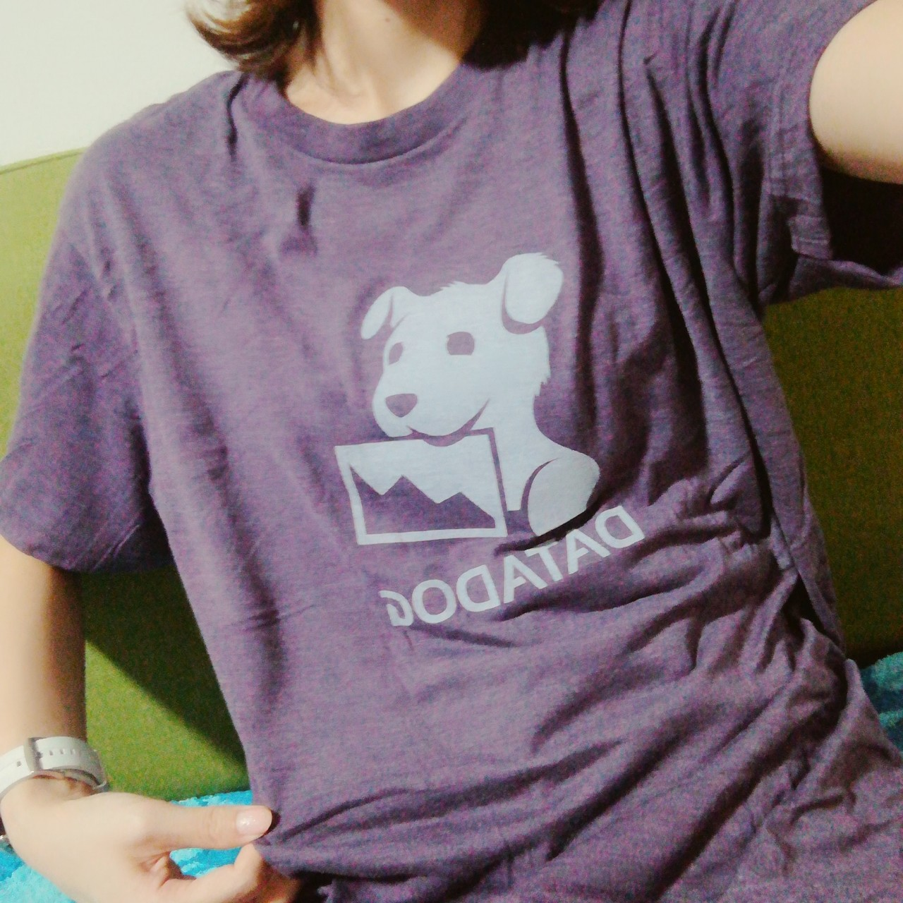

DATADOG🐶Tシャツもらったあ  
ちょうかわいい  
これはかわいい  
わーいわーい😃♡

三連休は台風だし衣替えして  
どんすわのDockerfile読むやつやって  
Laravelやりたあい

[平成生まれのためのUNIX&IT歴史講座 〜jus黎明期編/UNIX Fair編〜](https://jus.connpass.com/event/146395/)

[\[秋葉原\] 初心者向けPython入門会 スクレイピング編 (初心者大歓迎！)](https://weeyble-beginner.connpass.com/event/150386/)

14日勉強会ハシゴするんかい〜  
って、ノリで申し込みをしてしまったので  
むりそうだったらキャンセルするかんじかなあ。  
台風は去っているとおもうのだけれども。

というか、IT関連会社の代表や顧問の名前  
「みたことあるなあ」  
ってことがおおいの、  
花の手配していたときに見ることがおおかったからだと気づいたの。

慶弔関係の花をWEBから依頼するような会社って  
都内の大きな企業だったり、業務を効率化したりしている会社がおおくて  
IT系の大きめな企業の社長、役職のひとの名前を  
申し込みのたびに、間違いのないよう念入りに確認するので  
覚えたんだなあってかんじです。

花とITまさかの共通点（？）みつけてしまった。

「花屋さんからインフラ屋さんっていみわからん、共通点なくない？毎日お世話しなきゃとかの水やり的な？」  
って言われたことあったの。  
サーバーに水やり。。。。  
難易度高いけれども、上手に効率よく水やりできるようになりたいなあ。

そういえば中華ランチに誘われて行ったの。  
「AWS触ったことないけど有資格者です」  
ってひとがいてびびった。  
LPICとかAWSの資格系の参考書  
Linux覚えたての頃に少し読んだけど秒でねむくなったの。  
先日少し読んだら  
「わかるかもー！もう少しがんばれば面白いかも」  
「たぶん手で動かしながら覚えて、ある程度身についてから勉強しないと眠いなあ」  
と感じたので、触ったことないのに暗記できるのすごい。

なんか他の資格もほしいとか言っていたけれども  
他の資格とる前に、AWSさわった方が良いのでは！  
と、おもいました🙋

しかし  
「サーバーをたててもセキュリティ面が不安」  
と話していて  
確かに、わたしも最初のころ  
乗っ取られからのAWS破産の話をいろいろと聞いて  
セキュリティのことひたすら調べたなとおもいだしました。

マイニングに使われて高額な請求がくるだけなら  
まだ被害者側だし  
AWSに経緯を説明すれば支払わなくても良いになるけれど

国の主要施設などへの攻撃や  
不正アクセスの踏み台に利用されたら  
それらの行為に加担したということで、自宅に警察がくるの  
怖すぎるし、きちんと調べようっておもったの。

たてたらすぐ落とせば良いのだけれども  
継続してサービスを展開するのであれば  
セキュリティは避けて通れないなあとおもいました。
