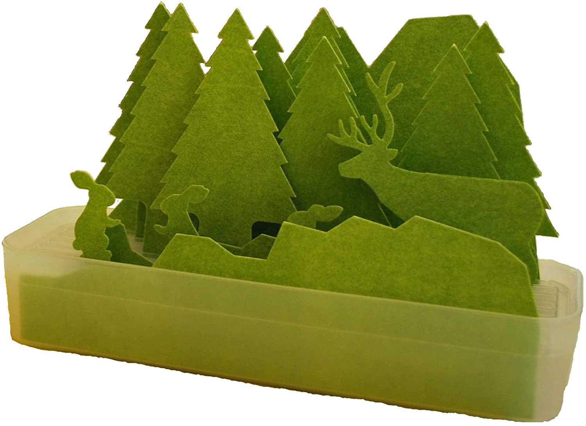

今日は概ね平和な感じでした。  
朝からせっせと加湿器を組み立てたの。

こんな感じのやつです。  
好評だったので良かったぁ。  
見た目が可愛いし、電気を使わなくて手軽そうだったので買いました。  
使っているとカルキでだんだん白くなるらしく  
クリスマスには雪が積もるかもと言われて  
なんて気の利いてオシャレな言い回しなんだろう  
と、プチ感動しました。キザとも言う

お昼は上司と学食です。  
学食、安くて野菜摂れるコスパの良さが好きで  
頻繁に通っているのだけれども  
学食ありえない派の人もいると知って驚いた。  
いろいろな価値観の人がいるなぁ。

来週に迫ったAWSハンズオン  
TAとして頼む予定だった先輩が出来なくなってしまったので  
急遽、同僚にTAできないかお願いしてみたのだけれども  
いろいろ立て込んでいて大変そうなタイミングでお願いしてしまったの  
申し訳なかった😣

知人にTAできないかあたってみたけれども  
難しそうなかんじなので  
週末に準備をがんばりたいです。

ハンズオンが終わったら、PORTでのLT資料作りと  
AWS認定資格の勉強を始めたいと思います。
