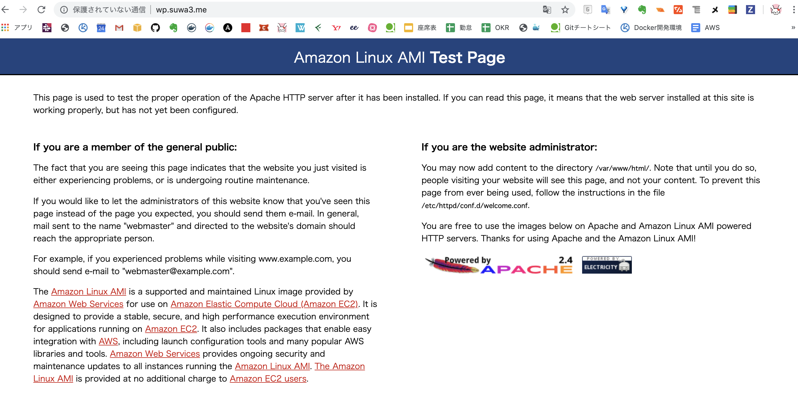
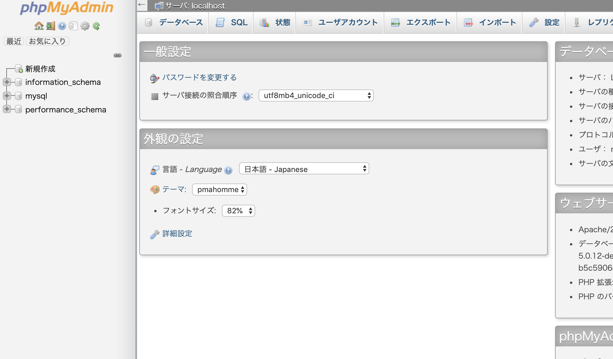
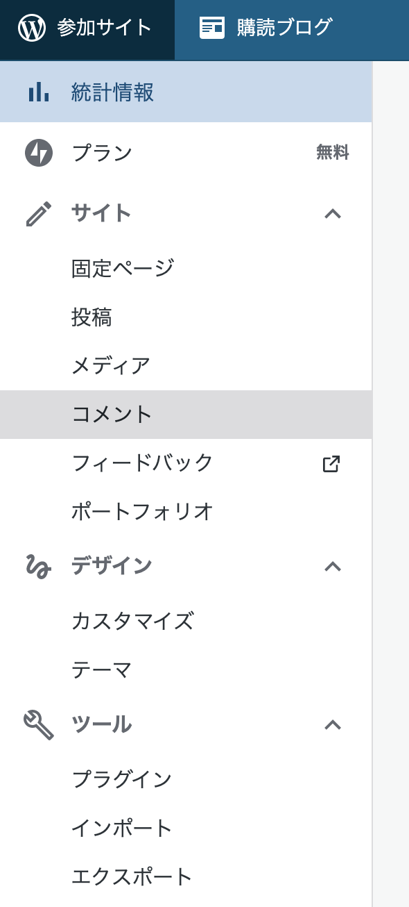
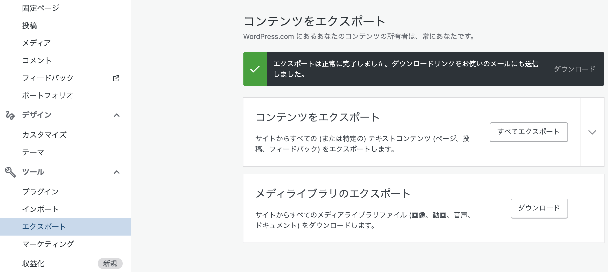
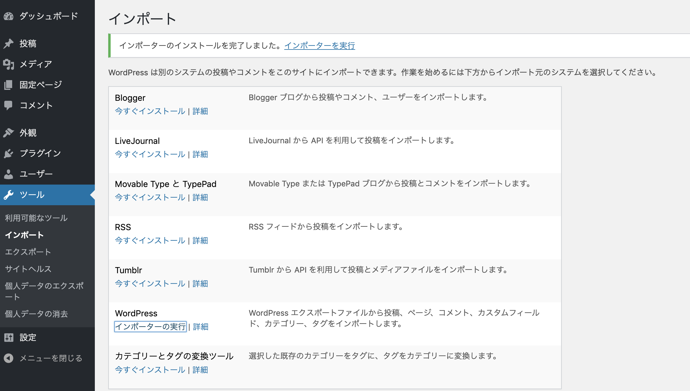
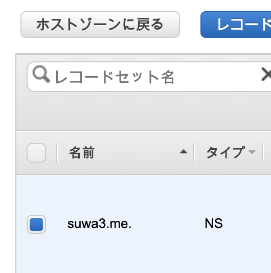
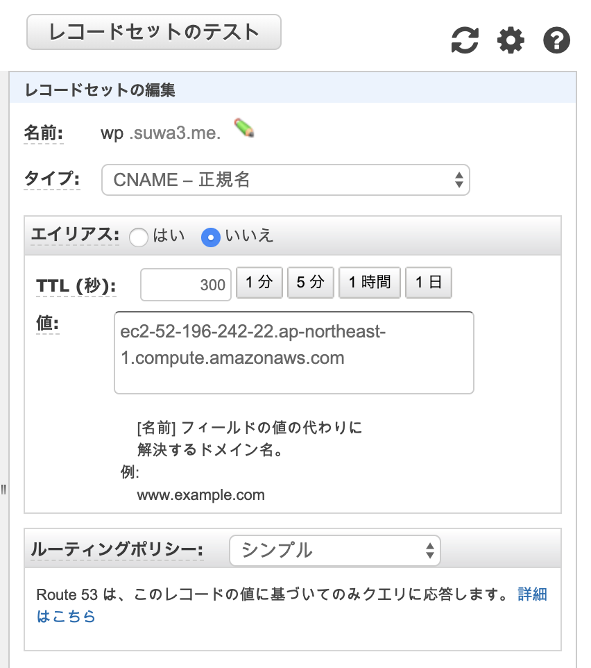

備忘録としてまとめます。  
ざっくりとやった内容です。

1. AWSでEC2インスタンスをたてる
2. EC2内にLAMP環境を構築
3. EC2内にWordPressをインストール
4. 旧WordPressからデータをエクスポート
5. 新WordPressへデータをインポート
6. Route53でサブドメインを切る
7. Let’s Encryptで証明書発行
8. 諸々の設定ファイルを書く

## AWSでEC2インスタンスをたてる

主に参考にした記事です。  
[Amazon EC2 Linux インスタンスの開始方法 - Amazon Elastic Compute Cloud](https://docs.aws.amazon.com/ja_jp/AWSEC2/latest/UserGuide/EC2_GetStarted.html#ec2-launch-instance)

注意するポイントとして  
**Amazon Linux 2ではなくAmazon Linux AMIを使用します。**  
好みの問題かもしれないですが

**Amazon Linux 2**

$ sudo amazon-linux-extras install -y lamp-mariadb10.2-php7.2 php7.2

**Amazon Linux AMI**

$ sudo yum install -y httpd24 php70 mysql56-server php70-mysqlnd

この違いです。  
amazon-linux-extrasではなくyumを使いたかったので  
Amazon Linux AMIを使用しました。

セキュリティグループは下記のとおりです。  
SSH: ポート範囲22  
HTTP: ポート範囲80  
HTTPS: ポート範囲443

鍵を作成したら.ssh配下に移動します。

$ mv ~/.Downloads/HogeKeyName.pem ~/.ssh/

権限の変更をします。

$ chmod 600 HogeKeyName.pem

主に参考にした記事です。  
[チュートリアル: Amazon Linux AMI を使用して LAMP ウェブサーバーをインストールする - Amazon Elastic Compute Cloud](https://docs.aws.amazon.com/ja_jp/AWSEC2/latest/UserGuide/install-LAMP.html)

### **インスタンスにログイン**

_52.196.242.22_の部分は  
たてたインスタンスのパブリックIPを入力して下さい。

$ ssh ec2-user@52.196.242.22 ~/.ssh/HogeKeyName.pem

OSを更新します。

$ sudo yum update -y

### Apache,MySQL,phpをインストール

$ sudo yum install -y httpd24 php70 mysql56-server php70-mysqlnd

Apacheを起動します。

$ sudo service httpd start

OS再起動時に、Apacheも起動するように設定します。

$ sudo chkconfig httpd on

ブラウザを開いて、_52.196.242.22_などのドメインを入力すると



このような画面が表示されます。

### ec2-userなどをapacheグループに追加

$ sudo usermod -a -G apache ec2-user

/var/wwwのグループ所有権をapacheに変更します。

$ sudo chown -R ec2-user:apache /var/www

グループの書き込みを許可するため  
/var/wwwと、その下にあるディレクトリの権限を変更します。

$ sudo chmod 2775 /var/www
$ find /var/www -type d -exec sudo chmod 2775 {} \\;

ファイルの権限も同様に変更していきます。

$ find /var/www -type f -exec sudo chmod 0664 {} \\;

### MySQLを起動

$ sudo service mysqld start

$ sudo mysql\_secure\_installation

最初はNo Passwdのため空欄でEnterです。  
Y: ルートパスワードを2回設定します。  
\- 匿名ユーザーアカウントを削除  
\- リモートルートログインを無効  
\- テストデータベースを削除  
\- 権限テーブルを再ロードし、変更を保存  
すべてYesのため「Y」と入力します。

### phpMyAdminをインストール

phpMyAdmin: GUIでMySQLを編集できるDB接続クライアントです。

依存パッケージをインストールします。

$ sudo yum install php70-mbstring.x86\_64 php70-zip.x86\_64 -y

Apacheを再起動します。

$ sudo service httpd restart

Apacheのドキュメントルートに移動します。

cd /var/www/html

最新のパッケージをDLします。

$ wget https://www.phpmyadmin.net/downloads/phpMyAdmin-latest-all-languages.tar.gz

ディレクトリを作成してパッケージを展開します。

$ mkdir phpMyAdmin && tar -xvzf phpMyAdmin-latest-all-languages.tar.gz -C phpMyAdmin --strip-components 1

不要なファイルを削除します。

$ rm phpMyAdmin-latest-all-languages.tar.gz

ブラウザで以下にアクセスしてみます。

http://パブリックIP or ドメイン/phpMyAdmin

Username: root  
Password: MySQLのルートパスワード

で、ログインします。



表示されました👏

## EC2内にWordPressをインストール

主に参考にした記事です。  
[チュートリアル: Amazon Linux を使った WordPress ブログのホスティング - Amazon Elastic Compute Cloud](https://docs.aws.amazon.com/ja_jp/AWSEC2/latest/UserGuide/hosting-wordpress.html)

WordPressインストールパッケージをDLします。

$ wget https://wordpress.org/latest.tar.gz

解凍します。

$ tar -xzf latest.tar.gz

DBの設定をします。  
そのため、まずDBを起動します。

$ sudo service mysqld start

DBにログインをします。MySQLのルートパスワードを入力します。

$ mysql -u root -p

MySQLにユーザー名/パスワードを設定することが出来ます。  
WordPressインストール時のDB接続設定に使用します。

CREATE USER 'wordpress-user'@'localhost' IDENTIFIED BY 'your\_strong\_password';

DBを作成します。

```
CREATE DATABASE wordpress-db;
```

作成したDBにユーザー権限の設定を行います。  
`wordpress-db`はバッククオート\`で囲ってください。

GRANT ALL PRIVILEGES ON `wordpress-db`.\* TO "wordpress-user"@"localhost";

設定を反映させます。

FLUSH PRIVILEGES;

MySQLから抜けます。

exit

### wp-config.phpの設定

デフォルトであるwp-config-sample.phpをwp-config.phpという名前で複製します。

$ cp wordpress/wp-config-sample.php wordpress/wp-config.php

wp-config.phpを編集します。

$ vi wordpress/wp-config.php
define('DB\_NAME', '_`wordpress-db`_');
define('DB\_USER', '_`wordpress-user`_');
define('DB\_PASSWORD', '_`your_strong_password`_');

## WordPressをウェブサーバーのドキュメントルート配下に移動

今のままだとドキュメントルートである/var/www/html下にWordPressというディレクトリがワンクッションとしてあり、blogを表示する際にURLが長ったらしく感じるのでWordPressディレクトリの中身をドキュメントルート配下に移動させます。（好みの問題なのでスキップしても構いません）

WordPress配下にあるものすべてをカレントに移動します。

$ mv WordPress/\* . 

WordPressディレクトリは重複してしまうため削除します。

$ rm -rf WordPress

### **WordPress がパーマリンクを使用できるように**する

httpd.conf内にあるAllowOverRideの設定を変更します。

AllowOverRide: .htaccessで使用できるディレクティブを指定する為のディレクティブ  
\- None  
.htaccess では何も設定できません。  
\- All  
.htaccess で設定可能なものは全て有効になります。

$ sudo vim /etc/httpd/conf/httpd.conf
~~~~~~~~~~~~~~~~~
<Directory "/var/www/html">
     #
     # Possible values for the Options directive are "None", "All",
     # or any combination of:
     #   Indexes Includes FollowSymLinks SymLinksifOwnerMatch ExecCGI MultiViews
     #
     # Note that "MultiViews" must be named \*explicitly\* --- "Options All"
     # doesn't give it to you.
     #
     # The Options directive is both complicated and important.  Please see
     # http://httpd.apache.org/docs/2.4/mod/core.html#options
     # for more information.
     #     Options Indexes FollowSymLinks
     #
     # AllowOverride controls what directives may be placed in .htaccess files.
     # It can be "All", "None", or any combination of the keywords:
     #   Options FileInfo AuthConfig Limit
     #     **AllowOverride _`None`_**
     #
     # Controls who can get stuff from this server.
     #     Require all granted </Directory>
~~~~~~~~~~~~~~~~

`AllowOverride None` 行を ``AllowOverride _`All`_`` に変更します。

### **Apache ウェブサーバーのファイル許可を修正**

Apacheにドキュメントルートへの書き込み権限を与えていきます。

ファイル所有権を付与します。

＄ sudo chown -R apache /var/www

グループ所有権を付与します。

$ sudo chgrp -R apache /var/www

グループの書き込みを許可するため  
/var/www配下ディレクトリの権限変更は、既にしてあるので省きます。

## 旧WordPressからデータをエクスポート

主に参考にした記事です。  
[Export / Import Content | Move to Self-Hosted WordPress](https://move.wordpress.com/exportimport-content/)

WordPress.comダッシュボードから



画像一番下のエクスポートを選択します。  
ダウンロードリンクがメールで送られてくるため、保存します。



## 新WordPressへデータをインポート

ブラウザで新しくたてたWordPressのドメインを指定して  
DB接続を行ったあと、ダッシュボードにログインをします。



ツールからインポートを選択して、WordPressの「今すぐインストール」より、[WordPress Importerプラグイン](https://wordpress.org/plugins/wordpress-importer/)をインストール後にインポーターを実行します。  
zipファイルを解凍するとディレクトリ内に.xmlファイルがあるため、選択してインポートします。  
データ量が多い場合、かなり時間がかかるのでコーヒーなどを飲みながら気長に待ちます。

## Route53でサブドメインを切る

独自ドメインのサブドメインで運用をしたかったので  
Route53で設定を行いました。  
NSを指定して「レコードセットの作成」を選択します。



切りたいサブドメインを指定して  
CNAMEで名前をつけます。  
値にはEC2インスタンスのエンドポイントを指定します。



レコードセットの保存をして、完了です。

## Let’s Encryptで証明書発行

今のままではhttps://での接続ができないため  
証明書を発行します。  
主に参考にした記事です。  
[AWS EC2のAmazon LinuxでLet's Encryptのサーバ証明書を取得する - Qiita](https://qiita.com/kanehara/items/a2c322acc3d2a96ff42d)

root権限でLet's EncryptのクライアントソフトCertbotをインストール

$ sudo su -l

\# wget https://dl.eff.org/certbot-auto

\# chmod +x certbot-auto

certbot-autoコマンドを実行します。

\# ./certbot-auto --debug

ホスト名を指定して、証明書を取得します。

\# ./certbot-auto certonly --webroot -w /var/www/html -d wp.suwa3.me --no-bootstrap 

## 諸々の設定ファイルを書く

Apacheに証明書を設定します。  
以下、参考としてhttpd.conf設定ファイルを置きます。

\# vim /etc/httpd/conf/httpd.conf 
~~~~~~~~~~~~~~~~~~~
#
# Listen: Allows you to bind Apache to specific IP addresses and/or
# ports, instead of the default. See also the <VirtualHost>
# directive.
#
# Change this to Listen on specific IP addresses as shown below to
# prevent Apache from glomming onto all bound IP addresses.
#
# Listen 12.34.56.78:80
<VirtualHost wp.suwa3.me:80> 
   DocumentRoot /var/www/html/
   ServerName wp.suwa3.me
   RewriteEngine On
   RewriteCond %{HTTPS} off
   RewriteRule ^(.\*)$ https://%{HTTP\_HOST}%{REQUEST\_URI} \[R=301,L\] 
</VirtualHost>

<Virtualhost wp.suwa3.me:443>
   DocumentRoot /var/www/html/
   ServerName wp.suwa3.me

   SSLEngine On
   SSLProtocol all -SSLv2

   SSLCertificateFile /etc/letsencrypt/live/wp.suwa3.me/cert.pem
   SSLCertificateKeyFile /etc/letsencrypt/live/wp.suwa3.me/privkey.pem
   SSLCertificateChainFile /etc/letsencrypt/live/wp.suwa3.me/chain.pem
</VirtualHost>

 Listen 80
 Listen 443
~~~~~~~~~~~~~~~~~~~
