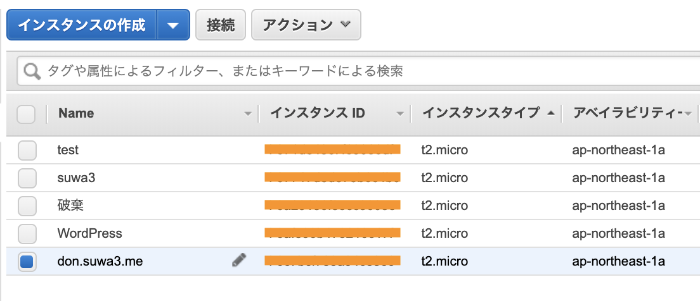
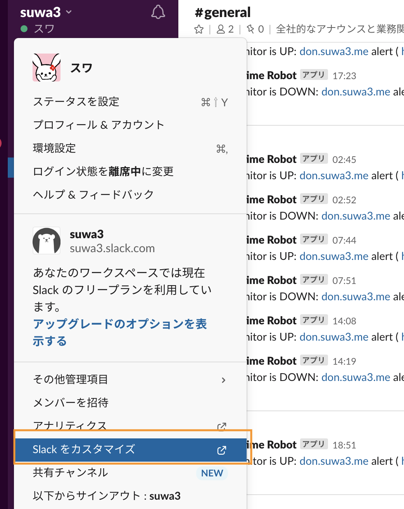
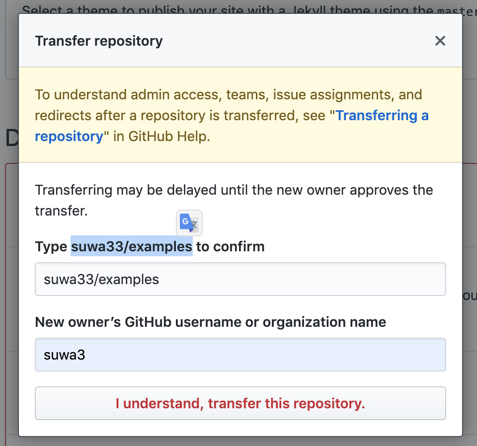
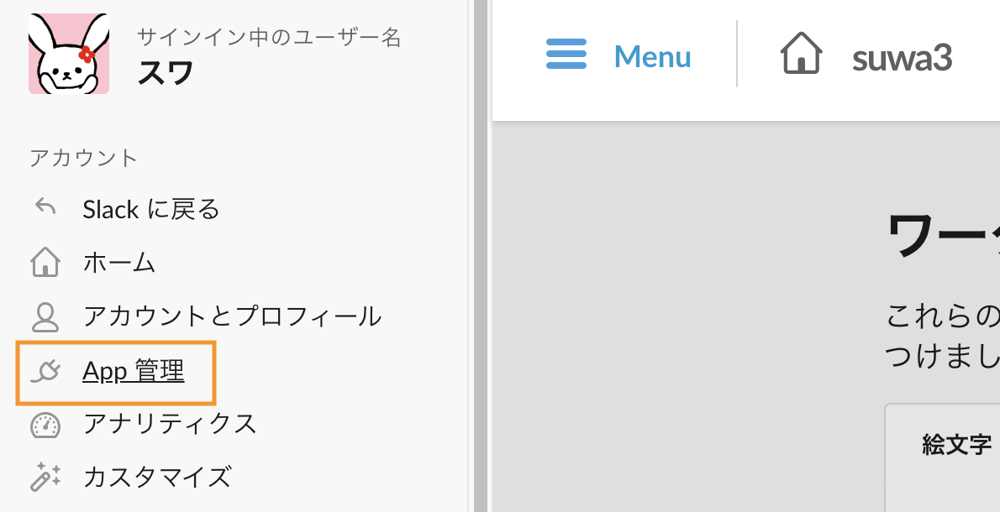
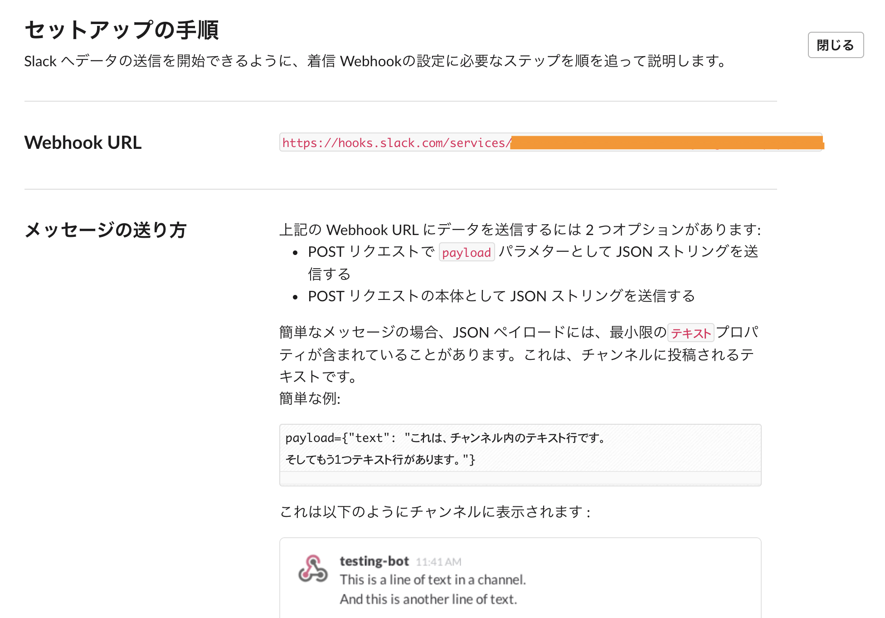
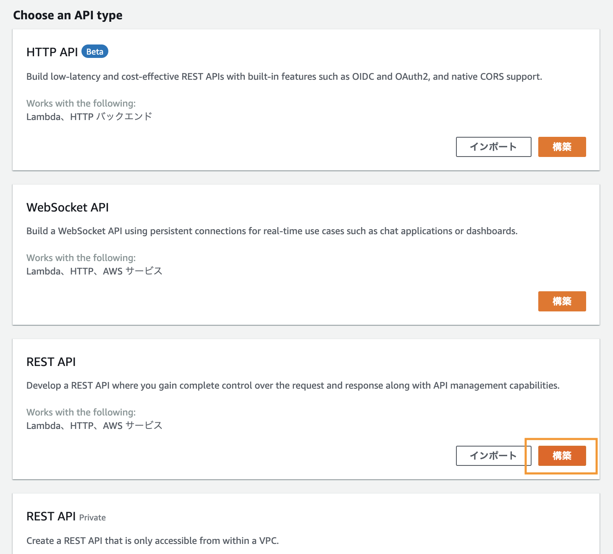
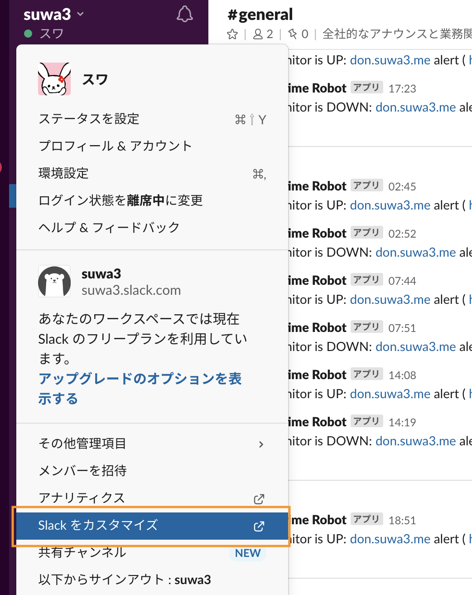
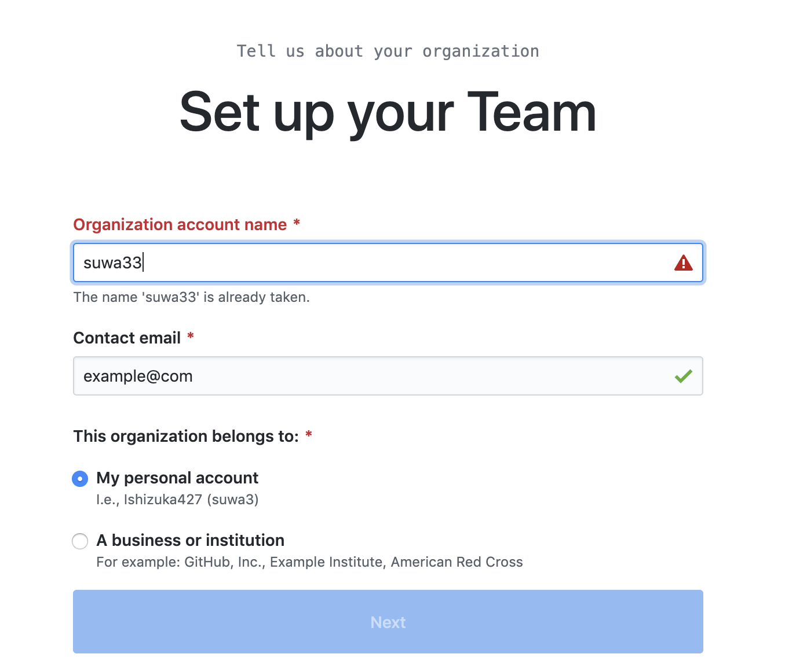

**GitHubの問題解消する  
**\- 旧アカウント(suwa33)からメインアカウント(suwa3)にオーナー移管  
方法: リポジトリのSettings => Danger Zone => Transfer ownerhip  
\- suwa33の方はexampleeeeにする  
\- Organizationsをsuwa33で作成してHP(GitHubPages)移管  
\- GitのCommit AuthorとCommiterを変更する(草移管)  
\- GitHubPages死回避

今日の目標である、GitHubの整備は完全クリアです！

GitHubのアカウントを統合させました。  
理由は  
プライベート用のGitHubアカウントと  
仕事用のアカウントがそれぞれあって  
２つの鍵を管理していくのが大変だったのと  
MacBookAirが死にかけていたので  
なんとかGitHubの内容だけでも脱出させておきたかったからです。

## リポジトリの避難

まずsuwa33アカウントからsuwa3アカウントへリポジトリを避難させます。  
実際にはリポジトリのオーナーを変更する設定になります。  
避難させたいリポジトリのSettingsを開いて

一番下のDanger Zoneまでスクロールし、Transferをクリック

Typeするよう言われた内容をコピペして  
引越し先のアカウント名を入力します。

しばらくすると  
引越し先のアカウントで登録してあるメールアドレスにメールが届きます。  
メール内に

To accept the transfer, visit this link:

と書かれた先にリンクが続くのでクリックします。

このときの注意点で  
旧アカウント(ここではsuwa33)からログアウトをして  
引越し先のアカウント(ここではsuwa3) にSign Inしてから  
メール内のリンクを踏んでください。

成功すると、リポジトリが移行してきています。

## GitHub pagesが死ぬのを回避

オーナー名が変更になるため  
GitHubの静的サイトのホスティングが適用されなくなりページが死にます

暫定的な対処として以下を行います。

1. 旧アカウントのオーナー名(username)を適当に変更
2. 引越し先のアカウントでOrganizationを作成
3. Organizationに旧アカウントのオーナー名をつける
4. GitHub静的サイトのリポジトリを移管  
    ↑主な流れは記事上の「リポジトリの避難」と同様

具体的な方法を書いていきます。

GitHubの静的サイトがかつてあった旧アカウント(suwa33)のSettingsから  
AccountのChange usernameを選択して  
オーナー名の変更をします。

色々聞かれます。

なんでも良いのでusernameを変更します。

一度旧アカウントからログアウトして(user名は控えておくと安心)  
引越し先のアカウント(suwa3)にサインインしたあと  
Organizationsを選択してNew organizationを選択します。

左のフリープランで作成します。

Organizationのアカウント名は旧アカウントのオーナー名を設定します。  
これは先程適当に決めた(exampleeeeなどの)アカウント名ではなく  
GitHub Pagesをこちらに移管して生き延びさせるためのものなので  
ここではsuwa33と入力します。

そして、引っ越し作業はこのページ上部に記載した  
「リポジトリの避難」の方法と同様に行います。

反映まで数分かかりましたが、GitHub Pagesを移管することに成功しました。

## 草移管

最後に、草の引っ越し方法も記載します。  
suwa3などの部分は適宜変えてください。

引っ越しが終わったら、git cloneしてローカルにソースを落とします。

$ git clone git@github.com:suwa3/hello-world.git

.gitのある場所で以下を実行します。

$ git filter-branch -f --env-filter "GIT\_AUTHOR\_NAME='suwa3'; GIT\_AUTHOR\_EMAIL='example@com'; GIT\_COMMITTER\_NAME='suwa3'; GIT\_COMMITTER\_EMAIL='example@com';" HEAD  

↑例  
username: suwa3  
メールアドレス: example@com  
の場合です。

forceでgit pushをして反映させます。

$ git push -f

草の引っ越しも完了です。
