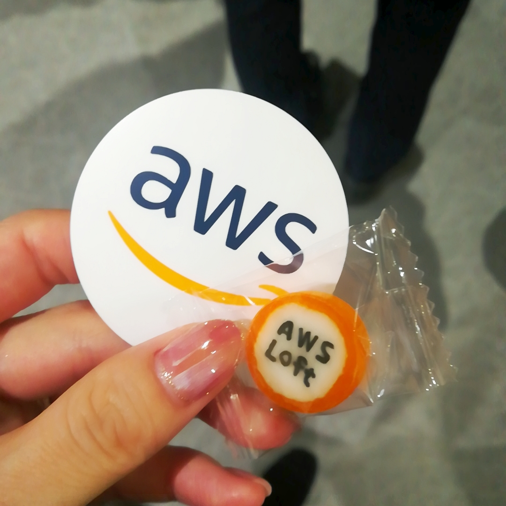

AWS re:Invent 2019 Containers re:Capに行ってきました。  
re:Inventは毎年ラスベガスで開催されるAWSの新機能発表イベントです。  
今回のセミナーは、そのイベントで発表された内容の中でも  
コンテナ技術に限定して解説するセミナーでした。  
特に中盤以降から  
「難解だなぁ」  
と感じたけれども、このセミナーを聴講したことで  
ECSやEKSのサービスを実際にさわってみたいな  
と、思えたので  
参加してよかったのかもしれない。

[個人用のメモ](https://www.evernote.com/shard/s451/client/snv?noteGuid=cce23db3-da2e-4459-a66f-666ee0930aeb&noteKey=c8a62096f747b969&sn=https%3A%2F%2Fwww.evernote.com%2Fshard%2Fs451%2Fsh%2Fcce23db3-da2e-4459-a66f-666ee0930aeb%2Fc8a62096f747b969&title=AWS%2Bre%253AInvent%2B2019%2BContainers%2Bre%253ACap)です。  
あとAWSLoftのキャンディを貰ったの。

かわいい〜
