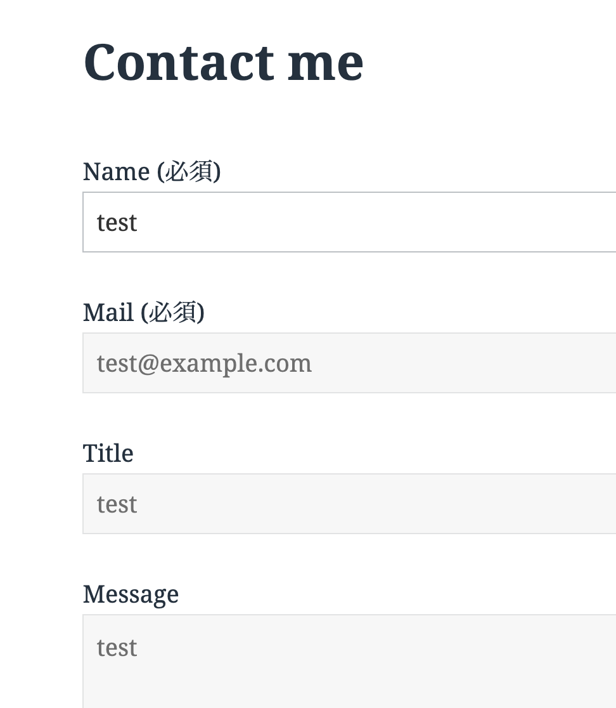
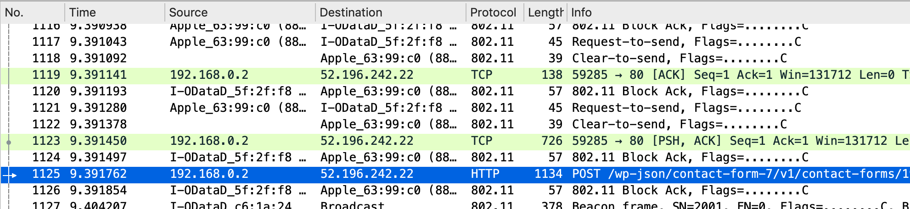
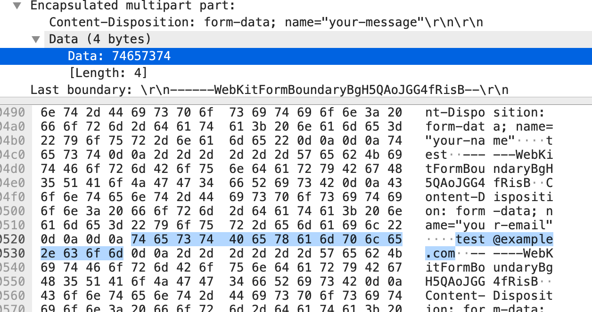
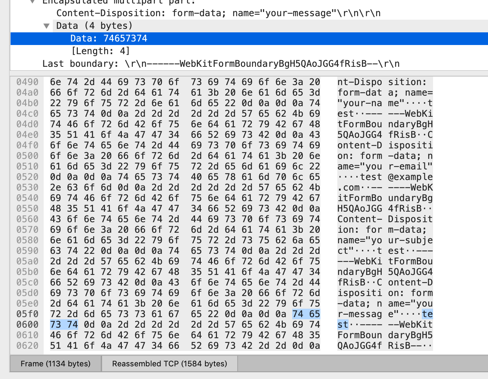

_暗号化されていないWi-Fi通信下では  
httpでのフォーム入力は外から見ることができてしまう_

というのは知識として知ってはいたのですが

それらが『どういった仕組みで見ることが可能なのか』というのを  
説明するのは難しいなぁと感じたので  
実際に試してみることにしました。

流れとしては、見る側と見られる側のデバイス機器を用意して  
PCから他デバイスの入力情報を盗聴してみます。

まずは、下記の条件を満たす環境を用意します。

- PC 2台 (1台はスマホでも可)
- PCに[WireShark](https://www.wireshark.org/download.html)をインストール
- httpでフォーム入力ができるサイト
- 暗号化を解除したWi-Fi

注意事項: スタバなどの公衆Wi-Fi (無線LAN) 下で、WireSharkなどを用いたパケット解析ツールでの盗聴行為は違法になります。必ず自宅などの自前のWi-Fi環境下で行ってください。

### PCにWireSharkをインストール

[https://www.wireshark.org/download.html](https://www.wireshark.org/download.html)  
こちらでインストールします。

1. `install ChmodBPF to fix this` をクリックして  
    ChmodBPFをインストールします。
2. `Wi-Fi: en0` をダブルクリックします。


### httpでフォーム入力ができるサイト

これは少し難易度が高いというか面倒な作業かもしれないです。  
かなり古いWebページの、サイト内検索フォームなどがtestしやすいかなぁと思いました。  
探すのが面倒だったため、自鯖にあるWordPressの設定を変更してhttp通信の環境を用意しました。

Apacheの設定で、80番Portへリクエストが来た場合に443番Portへリダイレクトする仕組みになっていたため  
httpd.confの内容を下記のように書き換えます。

`RewriteEngine On`  
`RewriteCond %{HTTPS} off`  
`RewriteRule ^(.*)$ https://%{HTTP_HOST}%{REQUEST_URI} [R=301,L]`  
を、コメントアウトです。

```
<VirtualHost wp.suwa3.me:80>
  DocumentRoot /var/www/html/
  ServerName wp.suwa3.me
#  RewriteEngine On
#  RewriteCond %{HTTPS} off
#  RewriteRule ^(.*)$ https://%{HTTP_HOST}%{REQUEST_URI} [R=301,L]
</VirtualHost>

<Virtualhost wp.suwa3.me:443>
  DocumentRoot /var/www/html/
  ServerName wp.suwa3.me

  SSLEngine On
  SSLProtocol all -SSLv2

  SSLCertificateFile /etc/letsencrypt/live/wp.suwa3.me/cert.pem
  SSLCertificateKeyFile /etc/letsencrypt/live/wp.suwa3.me/privkey.pem
  SSLCertificateChainFile /etc/letsencrypt/live/wp.suwa3.me/chain.pem

</VirtualHost>

Listen 80
Listen 443
```

confを書き換えたらApacheを再起動して適用させます。

```
# service httpd restart
```

※WordPressのダッシュボードの設定で、httpを表示するよう変更します。

### 暗号化を解除したWi-Fi

こちらは各々の自宅にあるWi-Fiルーターの設定画面で変更をお願いします。  
(未検証ですが、スマホのデザリング機能でも可能かもしれません。他人のタダ乗りに注意してください)  
暗号化を解除するとセキュリティ的に脆弱になるため、最後に行うことをお勧めします。

## 実践

ifconfigコマンドでネットワーク環境の確認を行います。  
現在は非推奨のコマンドなので、きちんと調べる場合はipコマンドを使って下さい。

`en0` 欄を確認します。  
`192.168.0.2` 部分を控えます。

```
$ ifconfig
~~~~~~~~略~~~~~~~~
en0: flags=8963<UP,BROADCAST,SMART,RUNNING,PROMISC,SIMPLEX,MULTICAST> mtu 1500
	ether **:**:**:**:**:** 
	inet6 fe80::87c:53db:cc21:9dea%en0 prefixlen 64 secured scopeid 0x6 
	inet 192.168.0.2 netmask 0xffffff00 broadcast 192.168.0.255
	inet6 2408:211:80e:8000:18c8:2146:f1b3:7899 prefixlen 64 autoconf secured 
	inet6 2408:211:80e:8000:a014:7674:afa1:df65 prefixlen 64 autoconf temporary 
	nd6 options=201<PERFORMNUD,DAD>
	media: autoselect
	status: active
~~~~~~~~略~~~~~~~~
```

探し当てたhttpでフォーム入力できるサイト(もしくは自前で用意したページ)に入力します。

httpの状態でフォームに入力をします。  
HelloWorldなど、好きなワードで構いません。  
ただ、ひらがなだと文字化けして分かりづらいかもしれません。



入力と同時にWireSharkを確認します。

`Source` 欄に自分のPCのIPアドレス  
なおかつ `Info` 欄が POSTから始まっているなど  
怪しそうなものを見つけてクリックし、詳細を確認します。



▼をクリックして詳細を確認していくと  
`test@example`を見つけました。



入力項目の`test` も発見しました。



以上のように、暗号化されていないWi−Fi環境下で  
httpでのフォーム入力を行うことで  
簡単に通信内容を見ることができるのが分かりました。

また、暗号化の種類によっては解析ツールなどを利用して解読し  
内容の閲覧が可能になるため、注意が必要だなと思いました。

個人的な感想として  
もし自分がハッキングする側だったら、どこを狙うか  
と考えた場合に  
パッと思いついたのがAWSLoft付近のスタバで  
特にLoftの開場時間前後を狙うかなぁと思いました。

そういった視点で、作業をする環境に注意を払わなければいけないなと感じました。
