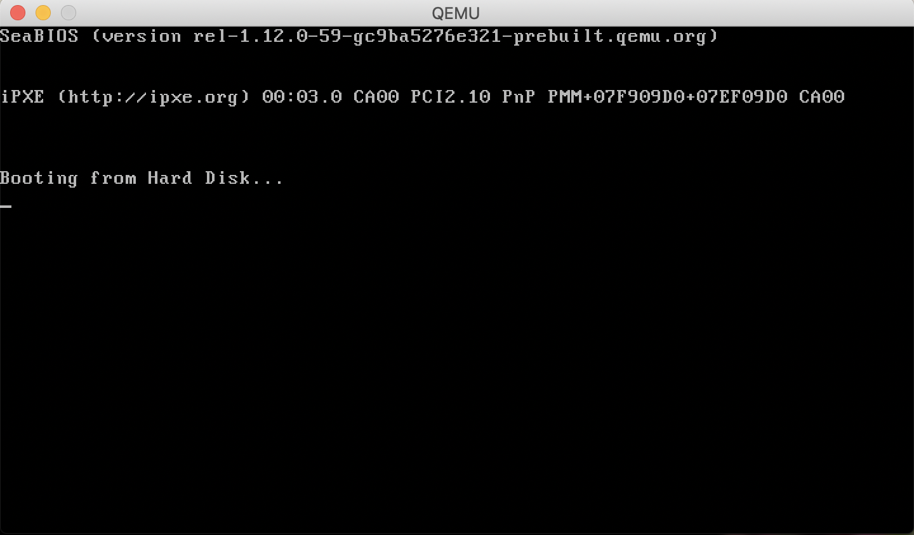
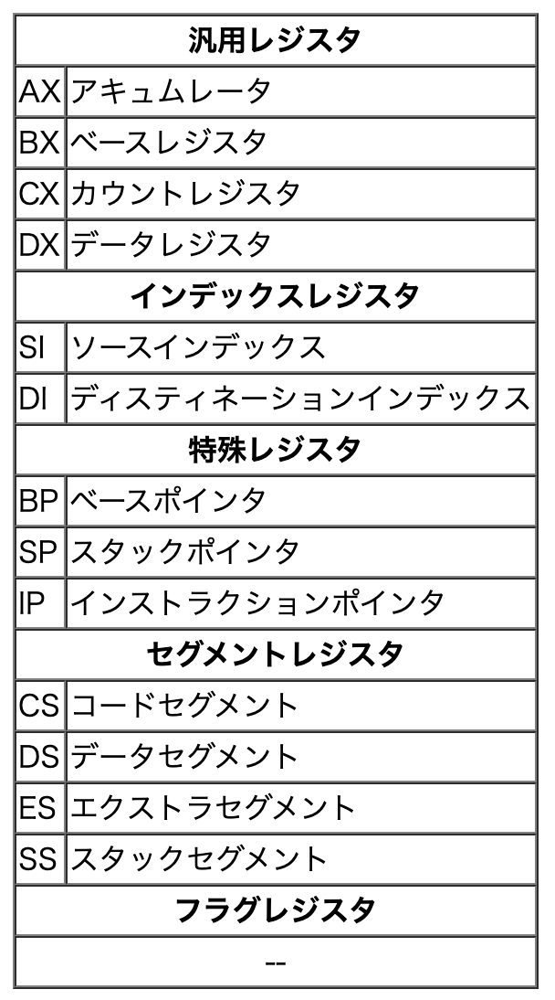
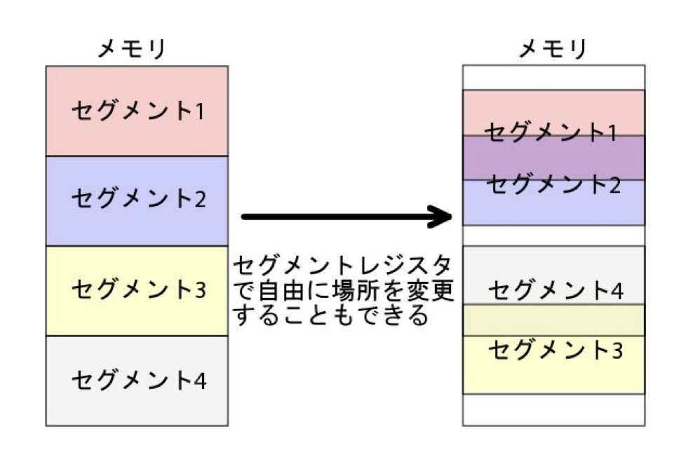
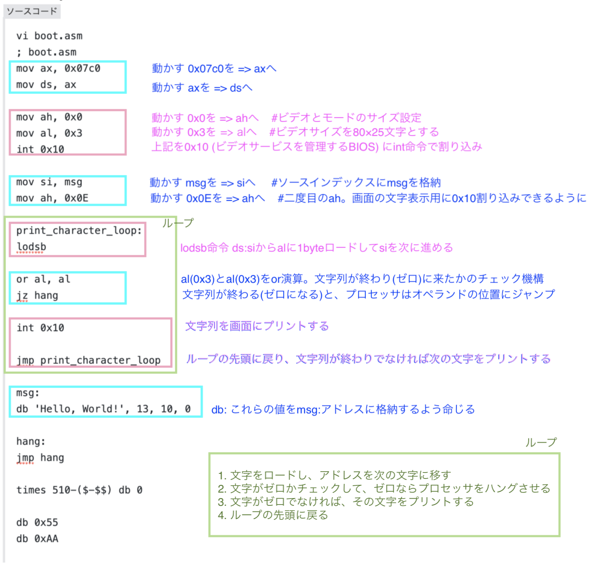
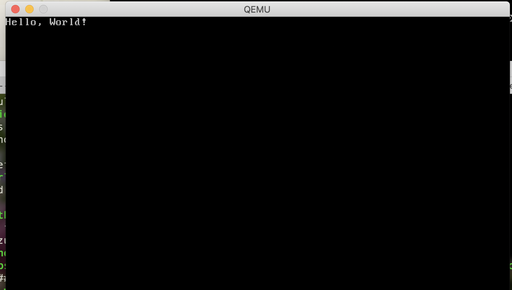

かねがねOSの自作をしてみたいなと思っていたので  
まずは簡易的なOSの実装にチャレンジしてみました。

OSを自作したいと感じたきっかけというか、経緯を簡単に書きたいと思います。

以前参加したOSCにて、サイボウズさんがブース出展をされていて  
そのブースには何冊か本が並べてあったのですが  
たまたま手にとった本が川合秀実さんの[OS自作入門](https://www.amazon.co.jp/dp/B00IR1HYI0/ref=dp-kindle-redirect?_encoding=UTF8&btkr=1)でした。  
「うちの社員が書いた本です。初見でそれを手に取るのですねぇ」  
と、話しかけて頂いて  
OSについて知りたいというよりは  
(表紙デザインの猫が可愛らしいな)  
と思って手にとったので  
その感想をそのまま正直に伝えつつ、本の中身をしばらく見ているうちに  
コンピューターの内部について知るためにも  
いつかOSを書いてみたいなぁ  
と、ふんわり考えるようになりました。

今回の内容は、書籍を参考にOS自作を始める前段階として  
取っ掛かりになるような、もっとハードルの低いものから徐々に機能を追加していきたいなぁという気持ちがあり  
ちょうど手頃なチュートリアルを見つけたので、試してみたものを簡単な解説とともに作業ログ的にまとめました。

主に参考にした記事です  
[OSを書く：初歩から一歩ずつ | POSTD](https://postd.cc/writing-an-os-baby-steps/)

### 実行環境を整える

まず、実行環境ですが  
Macbookに`nasm`と`make`と`qemu` をインストールします。  
※DockerやVMなどを用いてローカル環境を汚さずに行うことも可能です。  
ただ今回の内容程度であれば、特に問題ないと判断しました。  
今後、自作OSを続けたい場合はgit管理などで仮想マシンへの移動をスムーズにすると良いかもしれません。

```
$ brew install nasm
```

```
$ brew install make
```

```
$ brew install qemu
```

nasm: アセンブラです。機械が理解できる命令プログラム(アセンブリコード)を機械が理解できる命令(バイナリコード)に置き換えてコンピューターが実行できるようにします。

make: コンパイルを自動化するツールです。

qemu: キューエミューと読みます。自作したOSは、このエミュレーターを介して実行されます。いわゆる仮想マシンです。

### コンピューターの起動

コンピューターが起動してからの処理について  
わかりやすい概要を見つけたので記載します。  
[0から作るOS開発](https://www.amazon.co.jp/%EF%BC%90%E3%81%8B%E3%82%89%E4%BD%9C%E3%82%8BOS%E9%96%8B%E7%99%BA-Vol-0-%E7%92%B0%E5%A2%83%E6%BA%96%E5%82%99%E7%B7%A8-OS%E3%82%92%E4%BD%9C%E3%82%8B%E7%92%B0%E5%A2%83%E3%81%AE%E6%BA%96%E5%82%99%E3%81%A8%E8%A8%AD%E5%AE%9A-yabusame2001-ebook/dp/B00F1XPCMM/ref=pd_sbs_351_2/358-3245007-9082007?_encoding=UTF8&pd_rd_i=B00F1XPCMM&pd_rd_r=e9e7c108-280a-4b4a-8b1f-43765ebb3151&pd_rd_w=0bwiO&pd_rd_wg=ESKOo&pf_rd_p=1585d594-d9d0-474b-8a4e-69eca1566911&pf_rd_r=KQ935D32D1DE8GWXXGXS&psc=1&refRID=KQ935D32D1DE8GWXXGXS)

> 電源ボタンをONするとまずBIOS（BasicInputOutputSystem）が動き出します。BIOSはその名の通り基本的な（Basic）入力（Input）と出力（Output）を制御するハードウェアとソフトウェアのシステム（System）です。（このあたりは別に読み飛ばしても問題ありません）。BIOSが動き出すとPOST（PowerOnSelfTest）と呼ばれている処理を行います。POST処理では接続されたデバイスのチェック・初期設定、メモリーのチェックを行って正常にシステムが起動できるかどうかをチェックします。起動できると判断すると次にブートローダーまたはOSをメモリーにロードします。ブートローダーまたはプログラムがロードされた後にそのプログラムが様々な処理を簡単に行えるように、BIOSは入出力デバイスの操作をプログラムから利用できるインターフェースを用意しています。
> 
> 0から作るOS開発 vol.0

MBR(マスターブートレコード)の容量には上限があり、それを解決するためにブートローダーが用いられます。今回作成するOSはとてもシンプルなため、ブートローダを使用してさらにコードをロードすることはありません。

### アセンブリコードを書いてみる

実際にアセンブリコードを書いてみます。

```
$ vi boot.asm
; boot.asm
hang:
jmp hang
 
times 510-($-$$) db 0
 
; This is a comment
 
db 0x55
db 0xAA
```

`hang:` コード内の名前つきマーカーです。  
`jmp hang` : マーカーhangにジャンプします。これで無限ループになります。  
`times 510-($-$$) db 0` : 残りのバイトを0で埋めるためのnasm構文です。  
`$` : 現在の行の先頭  
`$$` : ファイルやセクションの先頭  
`($-$$)` : ファイルの先頭から現在の位置を引く  
2つのdbコマンドが最後に2バイト分で格納するため、MBRの残りの512バイトを埋めるのに512という数を使いません。  
`;` : コロン以降はコメントアウトになります。  
`0x55`と`0xAA` : BIOSに「はい、これは実行可能なMBRです」というふうに知らせます。  
作成したファイルをバイナリファイルに変換して、コンピューターが実行できるようにします。

```
$ nasm -f bin boot.asm -o boot.bin
```

`-f bin` : nasmがバイナリフォーマットにアセンブルします。  
`boot.asm` : nasmがアセンブルしようとしているアセンブリファイルです。  
`boot.bin` : は出力ファイル名です。

エミュレーターで実行してみます。

```
$ qemu-system-x86_64 boot.bin
```



アセンブリファイルをコンパイルして実行することができました👏

### Makefileをの作成

次に、Makefileを作成してコンパイルを自動化します。

```
vi Makefile
boot.bin: boot.asm
nasm -f bin boot.asm -o boot.bin
 
qemu: boot.bin
qemu-system-x86_64 boot.bin
 
clean:
rm *.bin
```

Makefileの文法を解説します。

ターゲット名: 依存ファイル名 1 依存ファイル名 2 依存ファイル名 3
    コマンド行 1
    コマンド行 2
    コマンド行 3

ターゲット名は、のちに登場するコマンドのリストに使用する名前です。  
ex. `make clean`と`make`をタイプすると、`rm *.bin`が実行され、すべてのアセンブルされたファイルを削除します。  
コロンの後の値は、依存ファイルです。

ターゲット名から始まる行の次の行から実行するコマンドを記述します。  
**コマンドを記述する場合は、必ず先頭にタブ文字を入れてください。**

ターゲット名を指定してmakeを実行する場合は  
`$ make ターゲット名`  
とします。  
※ターゲットを省略するとMakefileの中で先頭のターゲットが実行されます。  
ex. `make qemu`とタイプすれば、`make`は`boot.bin`のコマンド（`nasm -f bin boot.asm -o boot.bin`）を実行したあと、`qemu-system-x86_64 boot.bin`を実行します。

### 文字を表示してみる

`boot.asm`アセンブリファイルを書き換えて、スクリーンに文字を表示させてみます。

```
vi boot.asm
; boot.asm
mov ax, 0x07c0
mov ds, ax
 
mov ah, 0x0
mov al, 0x3
int 0x10
 
mov si, msg
mov ah, 0x0E
 
print_character_loop:
lodsb
 
or al, al
jz hang
 
int 0x10
 
jmp print_character_loop
 
msg:
db 'Hello, World!', 13, 10, 0
 
hang:
jmp hang
 
times 510-($-$$) db 0
 
db 0x55
db 0xAA
```

ファイルを編集したら実行してみます。

```
$ make clean
$ make qemu
```

### 内容の解説

```
mov ax, 0x07c0
mov ds, ax
```

`mov` はデータを動かす命令です。  
ここでは`0x07c0`を汎用レジスタ`ax` (アキュムレータ)へ移動したあとに `ax` を `ds`(データセグメント)にロードします。  
BIOSは毎回 `0x07c0:0x0000`の位置にMBRをロードするため、このように設定します。  
`ds` はレジスタから移動してきたデータのみを受け取る仕様のため、このように段階を踏んでデータの受け渡しを行います。

**レジスタ**: CPU内の記憶装置です。それぞれに役割があり、例えば今回のケースではセグメントレジスタに値を入れることでセグメントの開始位置が変わります。0x07C0を`ds`レジスターに格納することで、セグメントの開始位置が0x7C00になります。



**セグメント**: メモリーをセグメントと呼ばれるある程度の大きさに区切ったものをいいます。全容量の上限は決まっていますが、一つ一つの大きさやメモリー上の場所を自分で変更することが可能です。また、セグメント同士の領域はお互い重複するようにすることもできます。



参照: 0から作るOS開発

ファイルの中身についてざっくりと解説をします。



Hello, Worldが表示された画面がこちらです👏


