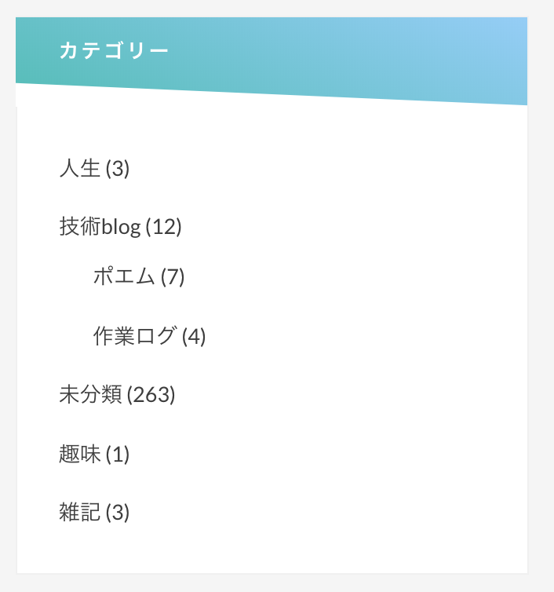

CSS色々いじって微調整してみました。  
カテゴリーを追加してみたよ  
個人的にお気に入りの分類は「人生」です。  
自分の生き方だとか考え込んだ日のblogは、人生カテゴリーに分類しようと思います。  
技術blogのポエムは  
「技術をテーマに考えたことを雑に書く」  
作業ログはその名前の通り作業ログです。

趣味は、技術系以外の趣味について。  
雑記は技術の話でも趣味の話でもなく、かといって人生についてでもなく、日常の浅い話を雑に書いた日のblogです。

まだ分類していない記事が263件もあるので  
少しずつ分類作業したいです。

* * *

今日の夜は祖父母、叔母と一緒に  
従兄弟のMAX ON THE STAGEという  
チアリーディングのステージを観に行きました。

開演前に機材トラブルがあって  
背景のプロジェクターに「EPSON」と表示されていたの。  
祖父は何か意味があるものと思ったらしく  
「あれはどういう意味だ？」  
と聞いてきたので  
「PCのメーカー名」  
と答えたら、理解したようで笑っていた。

その後は無事開演して  
とても迫力があって格好良い演目でした。  
演技というよりは、ダンスに近いのかなぁ。  
人がバンバン飛ばされていて凄いなぁと思った。

行く途中で祖父と少し話して  
親戚の話になったのだけれども  
死を身近に感じさせる話題で  
わたしにとっては遠いものだけれども、祖父にとってはすぐそばにあるもので  
周りの環境的にも、どうしても意識せざる得ないものなのだろうかと考えた。

祖父に感情移入して、その感情に飲まれることが怖かったです。  
意識して引き剥がさないと数日間は鬱々とした気持ちになってしまいそう。

わたしにとって祖父は尊敬の対象で  
何かごまかそうとしても通用しないし  
口数は少ないけれども、お酒を飲むと色々と話してくれるの。

何かについて表層的な捉え方をしない人間だと感じるので  
そういった人の、死が近いことを意識させるような言葉は  
日常のどこかで突然降ってくる話題にしては  
重すぎて耐えられないと感じました。
