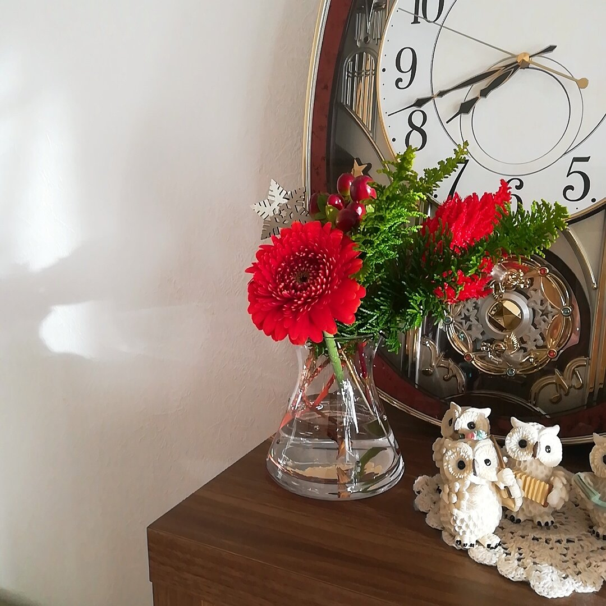

今日も今日とてアホな遊びをしていました。  
名付けて、  
「モノ ジ トリ テトラ ペンタ ヘキサミノパズル」（長い）  
絶妙な難易度でそこそこハマる。  
Lua以外の言語でもテトリス書いてみたいなぁ。

コードに対する苦手意識をなくすために  
年末年始は頑張ろうと思いました。

- shell script: きちんと書けるようにする。
- Python: Djangoの中でもう少し書く。
- Lua: せっかくなので組み込み言語としてNginxのログ取得などやってみたい。
- アセンブリ: OS自作もくもく会、年明けに参加することになったので少し書くことになりそう。でも、これはお楽しみ程度で良いかなぁ。

冬はあまり生花を飾らないのだけれども  
クリスマスなので飾ってみました🎄

