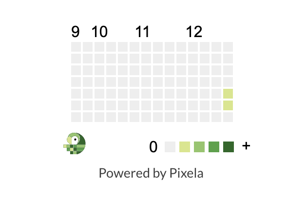
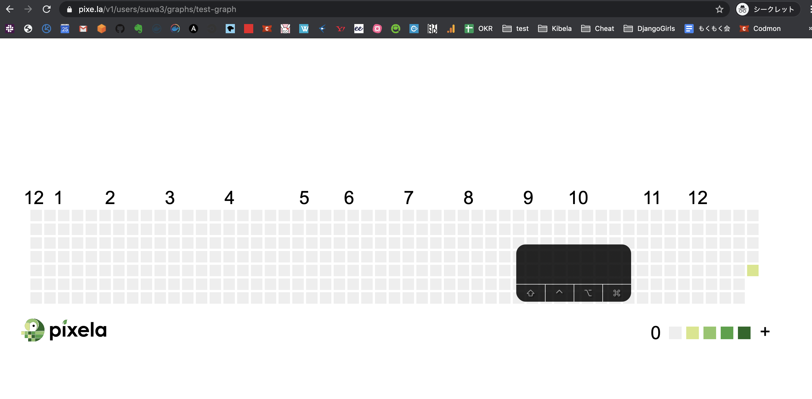
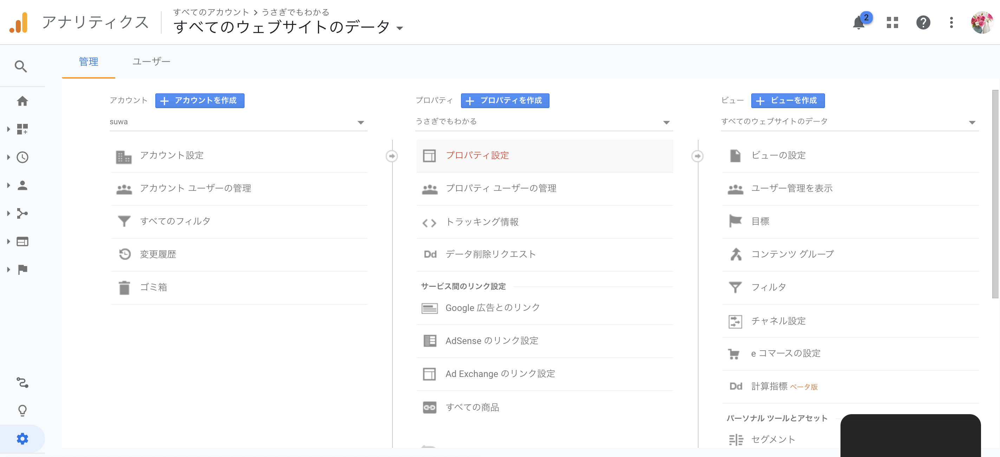
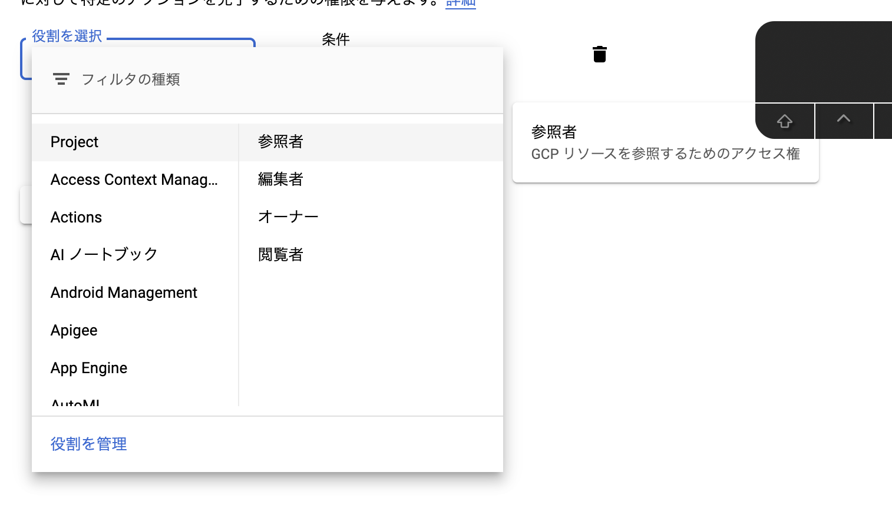
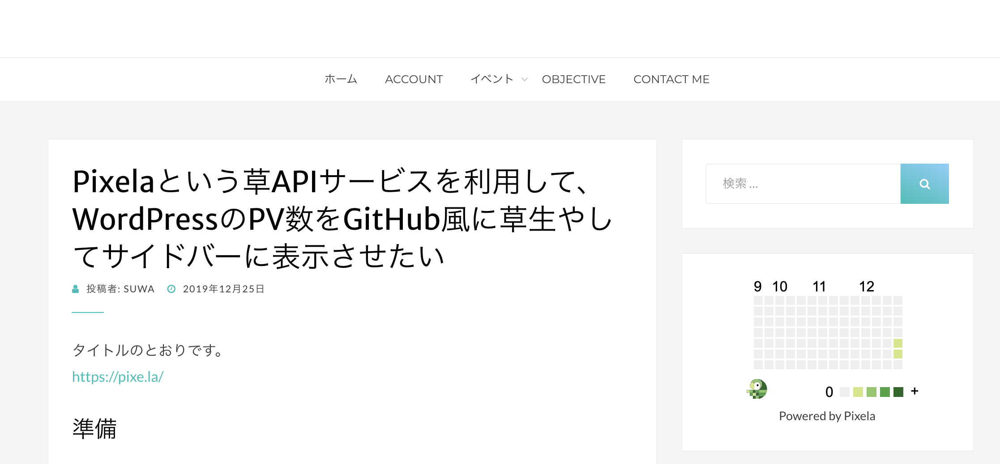

https://wp.suwa3.me/2019/12/25/pixela%e3%81%a8%e3%81%84%e3%81%86%e8%8d%89api%e3%82%b5%e3%83%bc%e3%83%93%e3%82%b9%e3%82%92%e5%88%a9%e7%94%a8%e3%81%97%e3%81%a6%e3%80%81wordpress%e3%81%aepv%e6%95%b0%e3%82%92github%e9%a2%a8%e3%81%ab/

こちらのblog内容の続きです。  
準備内容だとか箇条書きな感じになっているので  
もう少し丁寧に書きます。

まず、GitHub風に草を生やすことができる[Pixela](https://pixe.la/)



超かわいい！！と、見た瞬間一目惚れして  
ぜひこれでblogのPV数をサイドバーなどに表示させたいと思いました。  
(スマホの場合は下にスクロールしてもらうと記事＆検索窓の下に表示されます)

順序としては以下のとおりです。

1. PixelaでユーザーとIDを作成してグラフを表示させてみる
2. PV数を調べるため、対象blogにGoogleAnalyticsを導入する
3. GoogleAnalytics APIを利用してjsonファイルをDLする
4. PythonでjsonファイルからPixelaの求める出力ができるように整形する
5. ディレクトリをサーバーなどに置いてcron実行させる
6. htmlに<iframe>で埋め込む

## PixelaでユーザーとIDを作成してグラフを表示させてみる

[https://pixe.la/](https://pixe.la/)  
こちらのサービスですが  
基本的にすべてWeb APIで構成されるサービスになるため  
ユーザーやIDの登録など、設定もAPIで行います。  
初めはユーザー登録からAPIで設定することにハードルの高さを感じたのですが  
使ううちに、無駄がなくて洗練されているなぁと感じるようになりました。

以下の  
`a-know` には自分の希望ユーザー名  
`thisissecret` にはパスワードを入力します。

```
$ curl -X POST https://pixe.la/v1/users -d '{"token":"thisissecret", "username":"a-know", "agreeTermsOfService":"yes", "notMinor":"yes"}'
```

成功すると以下が表示されます。

```
{"message":"Success.","isSuccess":true}
```

`test-graph` には希望するID(URLに使われます)  
`graph-name` には希望する名前  
`commit` には希望する単位(kgやｍなどでもOK)  
`int` は、今回はPV数ということで整数を扱うのでそのままです。  
`shibafu` には色を入力します。  
green,red,blue,yellow,purple,blackから選べます。

```
$ curl -X POST https://pixe.la/v1/users/a-know/graphs -H 'X-USER-TOKEN:thisissecret' -d '{"id":"test-graph","name":"graph-name","unit":"commit","type":"int","color":"shibafu"}'
```

成功すると以下が表示されます。

```
{"message":"Success.","isSuccess":true}
```

ブラウザで以下にアクセスします。  
`a-know` にはユーザー名 `test-graph` にはIDを指定してください。

[https://pixe.la/v1/users/a-know/graphs/test-graph](https://pixe.la/v1/users/a-know/graphs/test-graph)


(ユーザー名にsuwa3/IDにtest-graphを指定した例)

試しに草を生やしてみます。  
`a-know` にはユーザー名  
`test-graph` にはIDを入力します。  
`thisissecret` にはパスワードを指定して  
`{"date":"201９1227","quantity":"5"}` には日付と、入力したい数字を指定します。

```
$ curl -X POST https://pixe.la/v1/users/a-know/graphs/test-graph -H 'X-USER-TOKEN:thisissecret' -d '{"date":"201９1227","quantity":"5"}'
```

成功すると以下が表示されます。

```
{"message":"Success.","isSuccess":true}
```



草を生やすことに成功しました👏  
次はPV数を取得するために準備をします。

## PV数を調べるため、対象blogにGoogleAnalyticsを導入する

GoogleAnalyticsの導入方法について詳細は割愛します。  
左下の歯車マークから、プロパティ設定を選択して行います。



## GoogleAnalytics APIを利用してjsonファイルをDLする

GoogleAnalyticsへの登録が済んだら  
GoogleAnalytics APIの設定を行います。  
[【PV数取得 ・ランキング作成】Google Analytics API 設定手順](https://tan-taka.com/diver-demo/powered/6725)  
基本的に↑の記事通りに進めることで設定できます。  
一点のみ注意が必要なのが  
サービスアカウントキーの設定時



これ、閲覧者では権限が足りずに実行できなかったため  
わたしは「オーナー」で登録しました。  
ただセキュリティ面で考えるとダメなやつなので  
各々自己責任でお願いします！

## PythonでjsonファイルからPixelaの求める出力ができるように整形する

まず環境を用意します。  
適当にディレクトリを掘って

```
$ mkdir wp-pixela
```

.pyファイルを作成します。

```
$ vim google_analytics_access.py
```

先程DLしたjsonファイルをDownloadsから移動してきます。

```
$ mv ~/Downloads/wordpress-pixela-a7b704b80f96.json ~/Ishizuka427/wp-pixela/
```

こんな感じです。

```
/wp-pixela
$ ls
google_analytics_access.py    wordpress-pixela-a7b704b80f96.json
```

まず、叩き台として使用したサンプルコードがこちらです。

[https://developers.google.com/analytics/devguides/reporting/core/v4/quickstart/service-py?hl=j](https://developers.google.com/analytics/devguides/reporting/core/v4/quickstart/service-py?hl=ja)

Pythonのバージョンです。2では正常に動作しません。

```
$ python3 -V
Python 3.8.1
```

以下の依存パッケージをインストールしておきます。

- google-api-python-client
- oauth2client
- requests

```
pip3 install google-api-python-client oauth2client requests
```

実際に使用したコードがこちらです。  
各々編集が必要な箇所を挙げます。

7行目: `KEY_FILE_LOCATION` にはjsonファイル名  
8行目: `VIEW_ID` はGoogleAnalyticsの左下歯車をクリックすると  
右上に「ビューの設定」と出るので、そこから確認します。  
84行目: `https://pixe.la/v1/users/<ユーザー名>/graphs/<グラフID>` は、先程設定したpixelaのユーザー名とIDを指定します。  
87行目: `*******` にはpixelaのパスワードを指定します。

```
$ cat google_analytics_access.py

"""Hello Analytics Reporting API V4."""

from apiclient.discovery import build
from oauth2client.service_account import ServiceAccountCredentials

SCOPES = ['https://www.googleapis.com/auth/analytics.readonly']
KEY_FILE_LOCATION = 'wordpress-pixela-d9da7c759cf1.json'
VIEW_ID = '*******'

def initialize_analyticsreporting():
  """Initializes an Analytics Reporting API V4 service object.

  Returns:
    An authorized Analytics Reporting API V4 service object.
  """
  credentials = ServiceAccountCredentials.from_json_keyfile_name(
      KEY_FILE_LOCATION, SCOPES)

  # Build the service object.
  analytics = build('analyticsreporting', 'v4', credentials=credentials)

  return analytics

def get_report(analytics):
  """Queries the Analytics Reporting API V4.

  Args:
    analytics: An authorized Analytics Reporting API V4 service object.
  Returns:
    The Analytics Reporting API V4 response.
  """
  return analytics.reports().batchGet(
      body={
        'reportRequests': [
        {
          'viewId': VIEW_ID,
          'dateRanges': [{'startDate': 'yesterday', 'endDate': 'yesterday'}],
          'metrics': [{'expression': 'ga:sessions'}],
          'dimensions': [{'name': 'ga:country'}]
        }]
      }
  ).execute()


def print_response(response):
  """Parses and prints the Analytics Reporting API V4 response.


  Args:
    response: An Analytics Reporting API V4 response.
  """
  for report in response.get('reports', []):
    columnHeader = report.get('columnHeader', {})
    dimensionHeaders = columnHeader.get('dimensions', [])
    metricHeaders = columnHeader.get('metricHeader', {}).get('metricHeaderEntries', [])


    for row in report.get('data', {}).get('rows', []):
      dimensions = row.get('dimensions', [])
      dateRangeValues = row.get('metrics', [])


      for header, dimension in zip(dimensionHeaders, dimensions):
        print(header + ': ' + dimension)


      for i, values in enumerate(dateRangeValues):
        print('Date range: ' + str(i))
        for metricHeader, value in zip(metricHeaders, values.get('values')):
          print(metricHeader.get('name') + ': ' + value)


def main():
  analytics = initialize_analyticsreporting()
  response = get_report(analytics)
  import json
  import datetime
  import requests
  data = {
      "date": (datetime.date.today() - datetime.timedelta(days=1)).strftime("%Y%m%d"),
      "quantity": response["reports"][0]["data"]["totals"][0]["values"][0],
  }
  requests.post(
    "https://pixe.la/v1/users/<ユーザー名>/graphs/<グラフID>",
    headers={
      "Content-Type":"application/json",
      "X-USER-TOKEN":"*******",
    },
    data=json.dumps(data)
  )
  print(json.dumps(data))

if __name__ == '__main__':
  main()
```

## ディレクトリをサーバーなどに置いてcron実行させる

ちなみに先ほど作成した  
`wp-pixela` ディレクトリですが  
jsonファイル内に秘密鍵が書いてあるので  
**絶対に、GitHubなどに公開でupしてしまわないように注意してください。  
**もしupするのであればプライベートリポジトリか  
公開するのであれば丁寧に環境変数などで隠すか  
雑に消すなどで対応してください。

ディレクトリをサーバーなどに置いてcron実行させます。  
管理が煩雑にならなければローカルホストでもOKです。  
わたしは自鯖に置きました。

```
mkdir /opt/ｗｐ−pixela
```

```
/wp-pixela
$ ls
google_analytics_access.py    wordpress-pixela-a7b704b80f96.json
```

```
$ python3 -V
Python 3.6.8
```

ローカルとPythonのバージョン違いますが、テストしたら動いたのでOKです。

```
pip3 install google-api-python-client oauth2client requests
```

crontabの設定です。  
皆さんはきちんとユーザー整備してください。

```
$ sudo su -
# crontab -e
0 2 * * * cd /opt/wp-pixela && python3 google_analytics_access.py
```

## htmlに<iframe>で埋め込む

WordPressではウィジェットにカスタムHTMLがあるのですが  
基本的にはHTMLに以下を貼り付けることで表示されます。  
ショートサイズなのでサイドバー向けです。

```
<iframe src="https://pixe.la/v1/users/<ユーザー名>/graphs/<グラフID>?mode=short"></iframe>
```

ロングサイズ用もついでに貼ります。

```
<iframe src="https://pixe.la/v1/users/<ユーザー名>/graphs/<グラフID>.html?mode=simple" height="155" width="720" frameborder="0"></iframe>
```



サイドバーに表示させることができました👏
