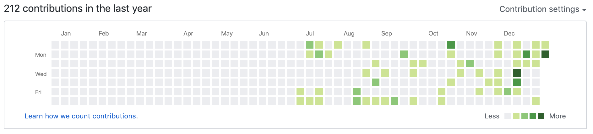

## GitHub

🎉**GitHubデビュー**🎉  
だいたい6月の終わり頃だったので  
それはもう、最初の頃に比べたらgitコマンドにだいぶ慣れたな感があります。  
初めてのリポジトリは、Docker上でOSSのSNSを構築したものだったので  
実はプライベードで管理されているので表には出ていません！  
※年末、急に草が増えているのはLuaでテトリスを書くのにハマったのが大きいと思います。

## 技術系イベント

頻度としては6月頃から参加し始めたため、毎週何かしらのイベントには参加しているペースです。もくもく会、LT、ハンズオン、モブプロ、カンファレンス、セミナーなど様々な形式のものに参加しました。

#### 参加

- [第53回【フリースタイル】PORTもくもく会【学生歓迎！】 - connpass  
    ](https://freestyle-mokumoku.connpass.com/event/131929/)初めての勉強会参加でした。初参加のときには「いつかLTやってみたいなぁ」という感想。ちなみにこの勉強会は毎月開催されていて、その後はほぼ皆勤です。9月と11月には、念願のLTにも挑戦しました。
- [オープンソースカンファレンス2019 Nagoya - オープンソースの文化祭！](https://www.ospn.jp/osc2019-nagoya/)  
    こちらもOSC初参戦。直近が名古屋開催だったので東京から名古屋まで新幹線に乗って向かいました。ラズパイやgitのセミナーに参加して、こういった形式のものをカンファレンスというのか〜といった印象でした。
- [Japan Tour in Summer: Java & k8s on Azure まつり@女子部 - connpass](https://jazug.connpass.com/event/137077/)  
    Java女子部が主催で、Microsoftが会場のKubernetesハンズオンに参加しました。まだDokcerをツールとしてなんとか扱えるかなレベルだったのに🐳。ゴツい感じでしたが、モブプロ形式を経験ができたのが収穫でした。女性インフラエンジニアのターミナルは半透明率が高くて、(可愛い..！)と思ったので早速マネしました。
- [オープンデベロッパーズカンファレンス2019 - オープンソースの文化祭！](https://www.ospn.jp/odc2019/)  
    東京での開催だったので参加しました。サイボウズさんのブースで自作OSの緑本と出会いました。
- [PythonでWebアプリを作ろう \[女性対象/男女コーチ◎\] 2019.9 - connpass](https://djangogirls-org.connpass.com/event/140288/)  
    DjangoGirls主催のDjangoチュートリアルをつかったハンズオンです。初めてプログラミングに「触れた」という感覚がありました。その後も数回参加して、現在はスタッフ側でコーチ役として参加しています。
- [ProLabo(プロラボ)渋谷もくもく会（#駆け出しエンジニア or 初心者歓迎）#9 - connpass](https://itpropartners.connpass.com/event/142392/)  
    こちらもPORT同様「もくもく会 + LT」形式です。いつかプロラボでもLTしたい！
- [AWSome Day 2019 東京 | AWS](https://pages.awscloud.com/AWSomeDayTokyo20190722.html?trk=event_awsome_page)  
    AWS主催のセミナーに参加しました。知っている内容も多かったけれども、全体像を把握するのに役立ちました。最後にAWS認定資格の例題がいくつか出され、分かるものが多かったので試験を受けてみたいなと思いました。
- [平成生まれのためのUNIX&IT歴史講座 〜jus黎明期編/UNIX Fair編〜 - connpass](https://jus.connpass.com/event/146395/)  
    参加者の7割が昭和生まry。シグマ作戦初代リーダーである岸田孝一さんの講演を聞きたくて行きました。社会科って苦手だったのですが、『興味がある事柄の歴史を学ぶのは楽しい』という発見がありました。
- [\[秋葉原\] 初心者向けPython入門会 スクレイピング編 (初心者大歓迎！) - connpass](https://weeyble-beginner.connpass.com/event/150386/)  
    どういった仕組みでスクレイピングしているのかというのを、手を動かしながら学べました。事前知識ほぼゼロでしたが、レベル感的に丁度良かったです。
- [PHP Conference Japan 2019 - #phpcon](https://phpcon.php.gr.jp/2019/)  
    初めて言語系カンファレンスに参加しました。セミナーへの参加はもちろん、ブースでの名刺交換などイベントを通して人と交流することが出来るのが良いなぁと感じました。
- [AWS Re:Invent 2019 Containers Re:Cap](https://awsreinvent2019containersrecap.splashthat.com/)  
    AWS主催のRe:Inventで発表されたコンテナ技術についてのセミナーでした。 実際にECSやEKSを使ってみたいと感じました。基礎が出来ていないと便利ツールの有り難みがわからないなと思ったので、EKSにしろ使う前に基礎固めできちんと素のk8sを理解したいなぁと思いました。
- [Blueqat Summit Tokyo 2019 a/w 量子コンピュータ総集編（MDR株式会社） - connpass](https://qnn.connpass.com/event/141250/)  
    量子コンピューターについて知りたい気持ちで参加しました。今後も知りたいと思った分野にはどんどん飛び込んでいきたいです。
- [PyLadies Tokyo Meetup #46 コードリファクタリング討論会 - connpass](https://pyladies-tokyo.connpass.com/event/156710/)  
    PyLadiesが主催で、ソフトバンク会場のリファクタリング討論会に参加しました。各チームに別れて「コードリファクタリングとは何か」といったところから学び、最後に成果発表を行いました。

#### 主催

- [AWSハンズオン - connpass  
    ](https://connpass.com/event/153569/)初めてのハンズオン主催です。AWSの[チュートリアル](https://aws.amazon.com/jp/getting-started/projects/build-wordpress-website/?c_4)を使って冗長化したWordPressサイトをデプロイするといった内容でした。主催する側は準備を含め、参加側の何倍も勉強になると感じたため、今後も試行錯誤を重ねて継続して行いたいと感じました。

## 技術blog

- [centOSにLAMP環境の構築をしてWordPressの引越し on AWS](https://wp.suwa3.me/2019/11/30/centos%e3%81%ablamp%e7%92%b0%e5%a2%83%e3%81%ae%e6%a7%8b%e7%af%89%e3%82%92%e3%81%97%e3%81%a6wordpress%e3%81%ae%e5%bc%95%e8%b6%8a%e3%81%97-on-aws/)  
    LAMP環境の構築をしてWordPressのデータを引っ越ししました。
- [Django GirlsチュートリアルでつくったものでDockerfile作成](https://wp.suwa3.me/2019/10/20/django-girls%e3%83%81%e3%83%a5%e3%83%bc%e3%83%88%e3%83%aa%e3%82%a2%e3%83%ab%e3%81%a7%e3%81%a4%e3%81%8f%e3%81%a3%e3%81%9f%e3%82%82%e3%81%ae%e3%81%a7dockerfile%e4%bd%9c%e6%88%90/)  
    Djangoで書いたWebアプリケーションをDocker上にデプロイしました。
- [機械学習でタイタニック乗客の生存予測してみる](https://wp.suwa3.me/2019/10/13/%e6%a9%9f%e6%a2%b0%e5%ad%a6%e7%bf%92%e3%81%a7%e3%82%bf%e3%82%a4%e3%82%bf%e3%83%8b%e3%83%83%e3%82%af%e4%b9%97%e5%ae%a2%e3%81%ae%e7%94%9f%e5%ad%98%e4%ba%88%e6%b8%ac%e3%81%97%e3%81%a6%e3%81%bf%e3%82%8b/)  
    機械学習について知るためにkaggleに挑戦してみました。
- [Nginxの設定をAnsibleで展開](https://wp.suwa3.me/2019/10/20/nginx%e3%81%ae%e8%a8%ad%e5%ae%9a%e3%82%92ansible%e3%81%a7%e5%b1%95%e9%96%8b/)  
    自動化できそうな作業を見つけ次第Ansibleに書くのを習慣化したいです。
- [セルフ盗聴](https://wp.suwa3.me/2019/12/13/%e3%82%bb%e3%83%ab%e3%83%95%e7%9b%97%e8%81%b4/)  
    WireSharkで暗号化されていないWi-Fi通信下でhttpでのフォーム入力を外から見るのやりました。
- [OS自作](https://wp.suwa3.me/2019/12/14/os%e8%87%aa%e4%bd%9c/)  
    簡易的なOSの自作に挑戦しました。コンピューターについてより深く知りたいと思うようになりまた。
- [DB接続確立error](https://wp.suwa3.me/2019/12/17/db%e6%8e%a5%e7%b6%9a%e7%a2%ba%e7%ab%8berror/)  
    このblogがDB接続エラーで見られなくなってしまったため、原因の特定調査と解決、対策まで行いログとして残しました。
- [Pixelaという草APIサービスを利用して、WordPressのPV数をGitHub風に草生やしてサイドバーに表示させたい(丁寧に)](https://wp.suwa3.me/2019/12/28/pixela%e3%81%a8%e3%81%84%e3%81%86%e8%8d%89api%e3%82%b5%e3%83%bc%e3%83%93%e3%82%b9%e3%82%92%e5%88%a9%e7%94%a8%e3%81%97%e3%81%a6%e3%80%81wordpress%e3%81%aepv%e6%95%b0%e3%82%92github%e9%a2%a8%e3%81%ab-2/)  
    APIとPythonについて学べた上に、とても素敵で一目惚れしたサービスの開発者の方に記事を拾って頂けて冥利に尽きるなぁと感じました。

## 転機となったできごと

- AWS上にオープンソースSNSの構築をしてWebサービス運用デビューしました。  
    それがキッカケとなり(趣味は趣味で割り切っていた人生でしたが)転職を意識するようになりました。  
    
- 花屋から転職してインフラエンジニアとして働き始めました。

* * *

## まとめ

一年の締めくくりとして  
技術者として何をしたのか、何を考えたのか  
まとめたいなぁと考えたので、丁寧にまとめてみました。  
ひたすら学ぶことが楽しくて仕方ない一年でした。  
正直、学んだと言うよりは知識として入ってきたというか  
「夢中になっていたら結果こうなった」  
に、近い気がします。  
来年も楽しむ気持ちを忘れずに、少しずつ自身のキャリアや方向性などを  
考えていくような内省を意識した一年にしたいです。  
来年の抱負は、年明けに考えます！
