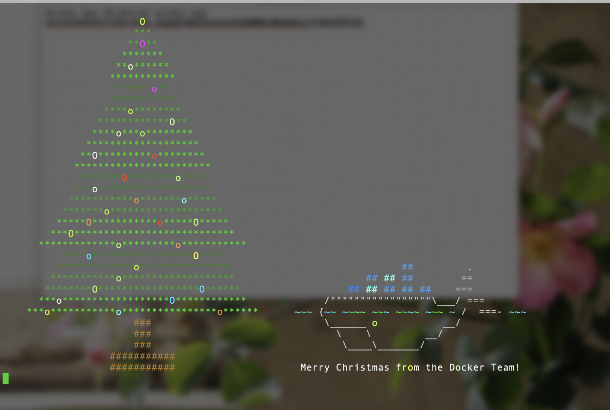

DockerとKubernetesの女性限定ハンズオンに行ってきました。  
コンテナ技術系のハンズオンや勉強会などは有料なことが多いなか  
こちらは無料で技術や知識のある方々に教わることができて良かったです。  
資料も丁寧に作り込まれているなぁと感じました。

[初心者向けDocker/Kubernetesハンズオン\[女性限定\] - connpass](https://tatsunoko.connpass.com/event/159292/)

タツノコハイツさんのGitHub上に資料が上がっていて  
[tatsunoko-heights/docker-kubernetes-handson](https://github.com/tatsunoko-heights/docker-kubernetes-handson)  
この資料をもくもくと進めつつ  
わからないところなどを自由に質問する形式でした。

Dockerは今まで

1. docker-compose.ymlを書く
2. シンプルに動くDockerfileを書く
3. イメージをbuildする
4. イメージをもとに必要な機能をdocker execしつつ実装していく

というフローで作成していくことが多くて  
今回のハンズオンのように、シンプルなUbuntuをrunさせて  
初っ端から、そのコンテナ内に入りプログラムを動作させて  
それらをイメージとして固めると行った手順での作業は初めてだったの。

色々な方法があるのだろうけれども  
普段自分が見ているDockerを、別の角度から見ることができた気分です。

後半はk8sの概要解説とハンズオンでした。  
k8sに関しては、個人的に知りたいことがあったので  
コーチ役の方に質問たくさんできたのが嬉しかったです。  
むしろせっかく聞ける人がいるのだから  
聞かないと損だな！根性で聞きまくりました😃  
初歩的な質問にも、親切丁寧に答えて頂けて良かったです。

deployment.ymlの自動修復機能が  
k8sのsystem系にも適用されていると思い込んでいたのと  
あとは以前、デプロイしたk8sダッシュボードの処理に困っていたの。  
諸々の困りごとや不安が解消されたので助かりました。

正直まだまだ分からないと感じることが山ほどあって  
調べたり手を動かしたり、こういった勉強会に参加しつつ  
少しずつ地盤を安定させて  
「わからない怖さ」  
から脱却したいなぁと感じます。

個人的に感動したのが  
`$ docker run lukaszlach/merry-christmas` で、出たこれ。

かわいい🐳
