## 経緯

今週の水曜日に[JAWS-UG 初心者支部#23 次回のハンズオン勉強会向けのチューター向け予習会](https://jawsug-bgnr.connpass.com/event/163557/)へ参加することになりました。

Lambdaは、花屋時代にローカル環境でテスト実行してみてQiitaに上げたきりだったので  
その時の記事 => [Pythonでaws-sam-cliをローカル実行するまで](https://qiita.com/suwa3/items/505d137d7073c7a5243f)

もうすこし踏み込んで  
(実用性を意識しながらLambdaを触ってみたいなぁ)  
と、思った＆予習も兼ねて  
『API GatewayをエンドポイントにしてLambdaを起動しSlackに何かを流す』  
というのをやってみました。

API Gatewayをエンドポイントにした実行を試したいと考えた理由として  
外部から連携したい場合、HTTPリクエストを受けて発火させる場面が多くあるので  
これから効率化を考える際に、よく使いそうな手法として要領を掴んで慣れておきたかったからです。

逆にAPI Gatewayを使わないパターンとして  
AWS内のサービスを使うときは、わざわざエンドポイントを外に置かなくても  
AWSのサービス同士はだいたいIAMロールを使えばAWS内でセキュアに連携できます。

## 流れ

流れとしては  
SlackでIncoming Webhookの設定をしてWebhook URLを控えます。

Lambdaのコンソール上で関数を作成して  
Webhook URLをその関数内で使用し、連携させます。

API Gatewayのコンソール上でLambda関数を紐付けて  
エンドポイントをデプロイすると、発火用のURLが発行されます。

そのURLにアクセスする(HTTPリクエストが届く)と  
それを合図にしてLambdaが起動して  
SlackのBotが起動する、という仕組みです。

* * *

- Slack  
    1\. Incoming Webhookの設定  
    2\. Webhook URLを控える
- Lambda  
    1\. 関数の作成  
    2\. 関数内にWebhook URLを仕込む
- API Gateway  
    1\. Lambda関数の紐付け  
    2\. エンドポイントをデプロイして発火用URLを控える
- (例えば)ブラウザなど  
    エンドポイントURLにアクセスしてみる
- Slack  
    Botが起動する

## Slack

### Incoming Webhookの設定

まずはSlackの設定です。  
『Slackをカスタマイズ』を選択します。


左上の『MENU』から  
『App 管理』を選択します。


『 Incoming Webhook』を検索し、アプリを『Slackに追加』します。

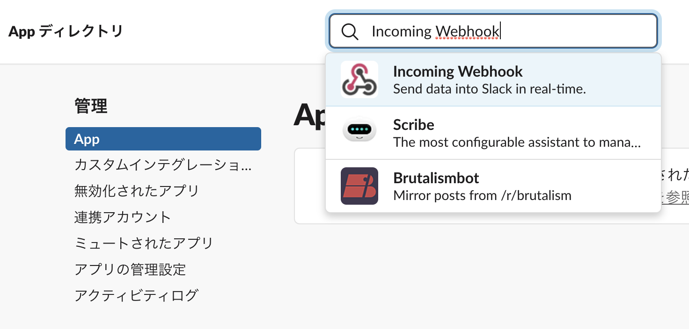

### Webhook URLを控える

Botを動かしたいチャンネルを選択したら、『Incoming Webhookインテグレーションの追加』をします。  
発行されたWebhook URLを控えます。  
セットアップの手順も、ザックリと参考にします。


ここでBotのアイコンや名前の設定なども行えます。

## Lambda

### 関数の作成

関数名を入力します。  
myfunctionでもtestでも、わかりやすい名前でOKです。  
関数を記述する言語(ランタイム)はPythonを使用します。  
実行ロールの選択は、今回特にAWS内のリソースには触らないので『基本的な Lambda アクセス権限で新しいロールを作成』でOKです。  
RDSやAWS内の何かと連携する場合は、必要な権限を付与してください。

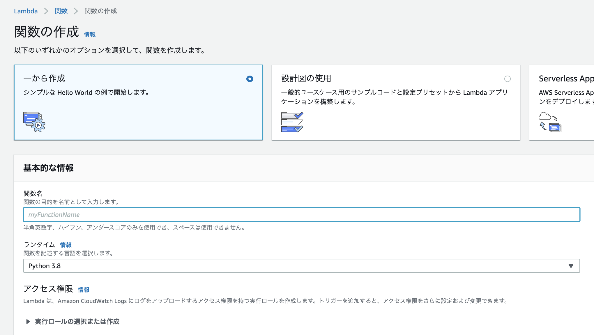

### 関数内にWebhook URLを仕込む

Slackに表示させるプログラムを作成します。

```
import json
import urllib.request

def lambda_handler(event, context):
    # TODO implement
    post_slack()
    return {
        'statusCode': 200,
        'body': json.dumps('pong')
    }

def post_slack():
    message = """
    本日のランチを提案するクマー
    1. 学食
    2. スパニッシュ
    3. 喫茶店
    """

    send_data = {
        "text": message,
    }
    send_text = "payload=" + json.dumps(send_data)
    # URLには自分のWebhook URLを入力してください
    request = urllib.request.Request(
        "https://hooks.slack.com/services/********************", 
        data=send_text.encode('utf-8'), 
        method="POST"
    )
    with urllib.request.urlopen(request) as response:
        response_body = response.read().decode('utf-8')
```

## API Gateway

### Lambda関数の紐付け

API Gatewayのコンソール画面から  
『APIを作成』を選択して、PrivateではないREST APIの『構築』を選びます。


プロトコルの選択、諸々の設定を行います。

☑REST  
☑新しいAPI  
API名: My API  
エンドポイントタイプ: リージョン

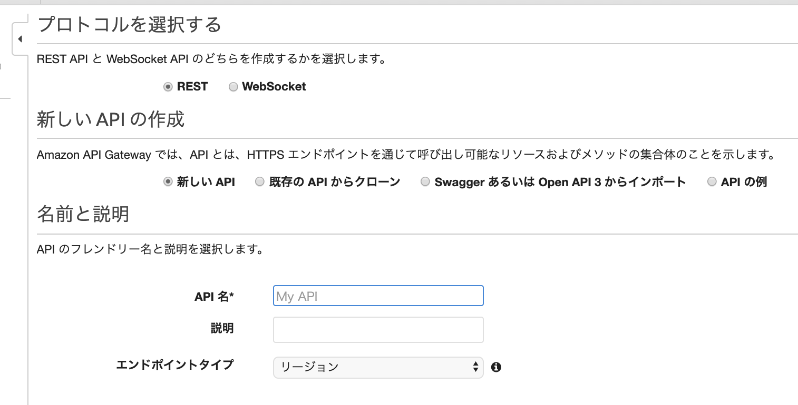

『アクション』を選択して、リソースを作成します。

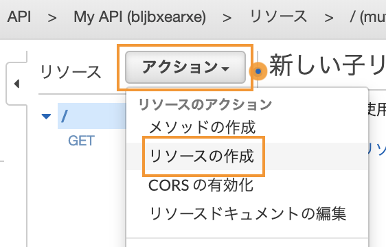

リソース名を設定します。  
今回はSlackとしました。

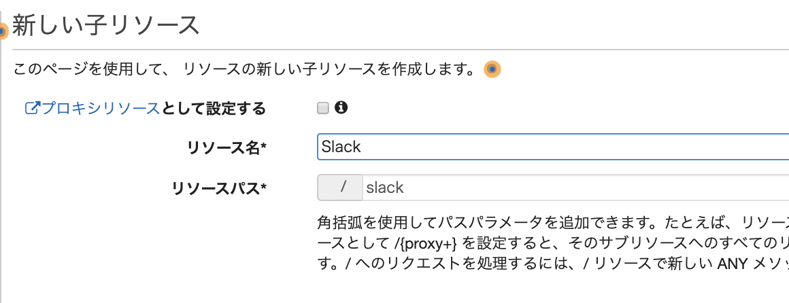

次にメソッドを作成します。  
『アクション』から、『メソッドの作成』を選びます。

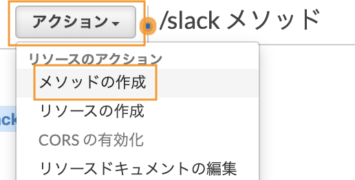

Slackリソースのプルダウンをクリックして

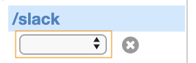

『GET』を選択します。

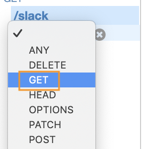

チェックをクリックします。

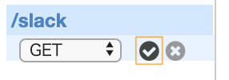

セットアップをします。

☑Lambda関数  
☑Lambdaプロキシ統合の使用  
Lambda関数: myfunction  
クリックすると候補が表示されるので、使用したいLambda関数を選択します。

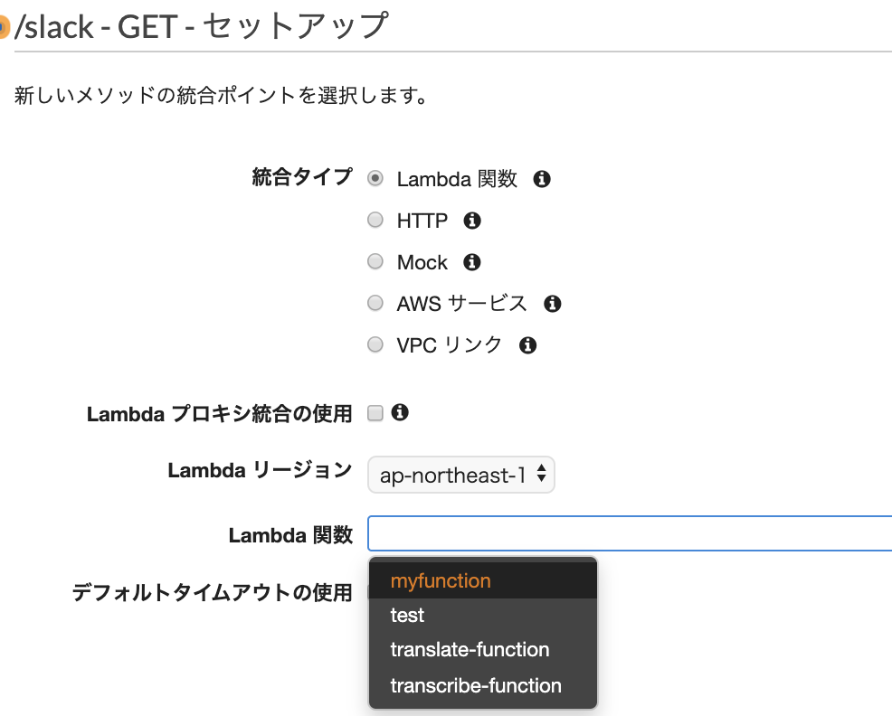

API Gatewayに、Lambda関数を呼び出す権限を与えます。

作成したAPIをデプロイします。

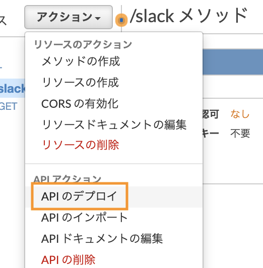

デプロイのステージ名を決めます。

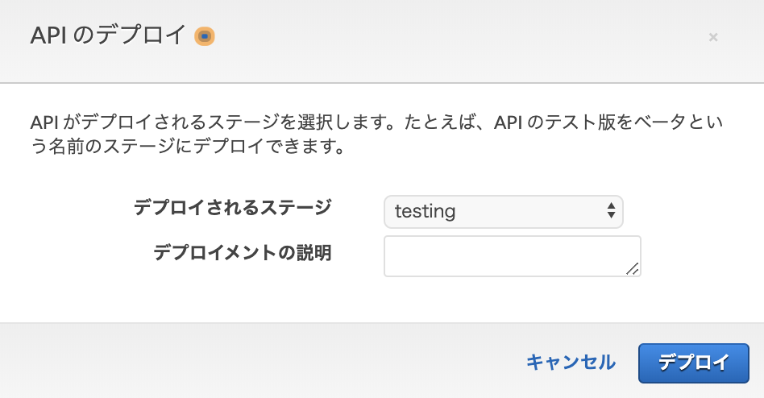

URLが作成されるので、こちらにアクセスしてみます。

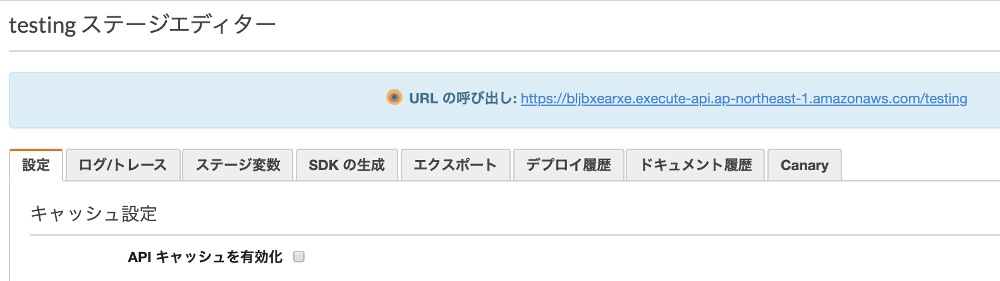

早速Slackの通知が来ました。

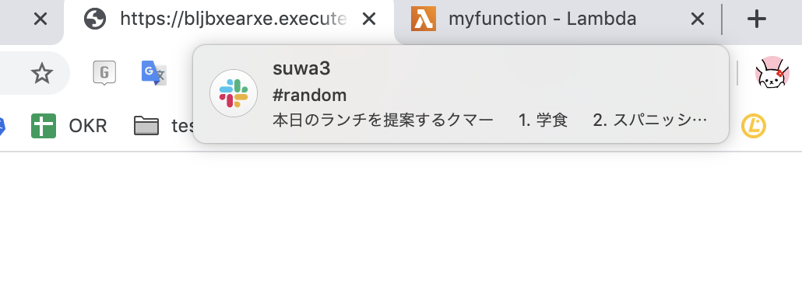

Slackを確認したところ  
無事、届いていました👏

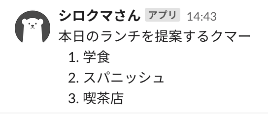

(参照)[AWS Lambdaで作るSlack bot (Incoming Webhook) - Qiita](https://qiita.com/yokoc1322/items/553ad147b82277b2beca)  
(参照)[初めてのAPI Gateway ｜ Developers.IO](https://dev.classmethod.jp/cloud/aws/sugano-009-api-gateway/)
