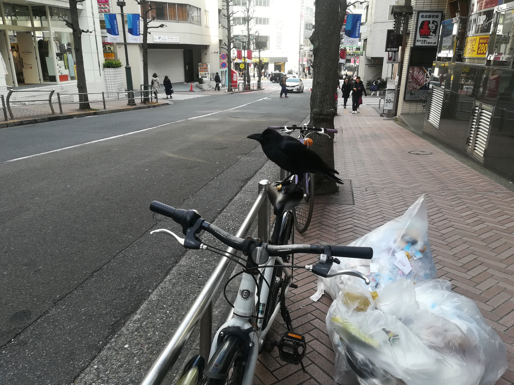
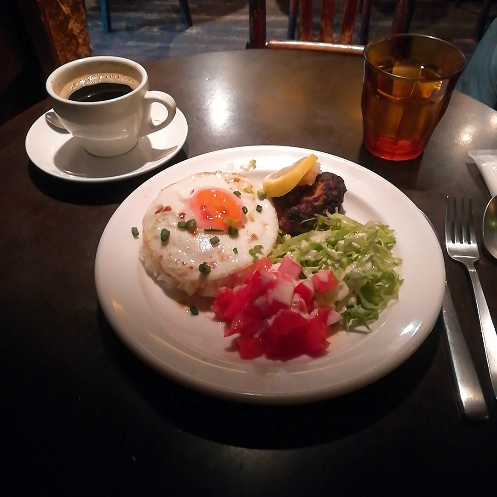

今日撮ったカラス

足でパンをおさえながら啄いていた。

ミッドサマーを観ようと映画館に行ったら満席だったので  
仕方なく人間関係で時間を潰しました。

ロコモコだよ。美味しかった。  
PARCOに寄って、ポケセンとNintendoショップも覗いた。

ミッドサマーは、theスプラッター系でした。  
観た直後は  
「マストドン民が好きそうな映画だなぁ」  
なんて思ったけれども  
いま考えると、ある意味とても糞映画だったなといった感じ。(褒めてる)

普通の映画に飽きてきて  
たまにはゲテモノにも触れたい人向けなのかなぁと思いました。

悪趣味ではあると思うけれども  
個人的には好きかもしれない。

不気味で自身が不安定になるのを楽しみながら観ることができるのは  
物理的ではないジェットコースターのようで面白いなぁと思った。

