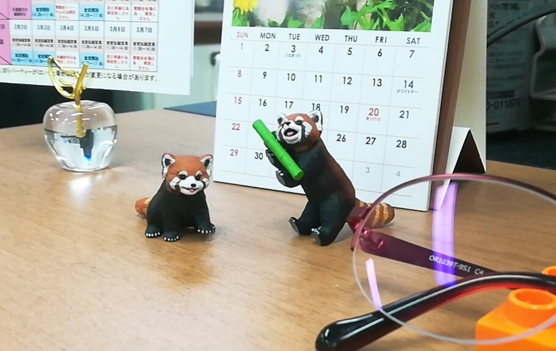

GitHubの管理が雑すぎる。  
個人用アカウント(リポジトリ)の話です。

特にいま運用しているSNSに関しては、設定ファイルやcronなど  
とりあえず適当にpushされているだけで、いつのものかわからないものもある。

そもそも直近のバージョン追従できていないので  
本番で使っていたDocker絡みの情報を残しておいても  
今後バージョン上がるごとに検証が必要になってしまうからキツイのだけれども。

いったん脱Dockerしたので、プレーンな状態でチューニングを一通り済ませたら  
k8s化させるにあたってもう一度コンテナ化は必須なんやろな。

念の為どこかに使っていたDocker絡みの情報は残しておくけれども  
せいぜい参考程度にしかならない。仕方ない。

そして、マストドンの開発コミュニティ衰退に伴って  
参考にできるソースが減りつつあるので  
自分の実力を磨かねばと思います！

* * *

最近は[アニア動物シリーズ](https://www.takaratomy.co.jp/products/ania/products/animal.html)にハマっているの。

作業中はアニマルプラネットをBGMで流すのが好きで  
フィギュアを眺めていると心がぴょんぴょんするので  
小動物などから、少しずつ集めたいです。

職場のデスクにいるレッサーパンダ
