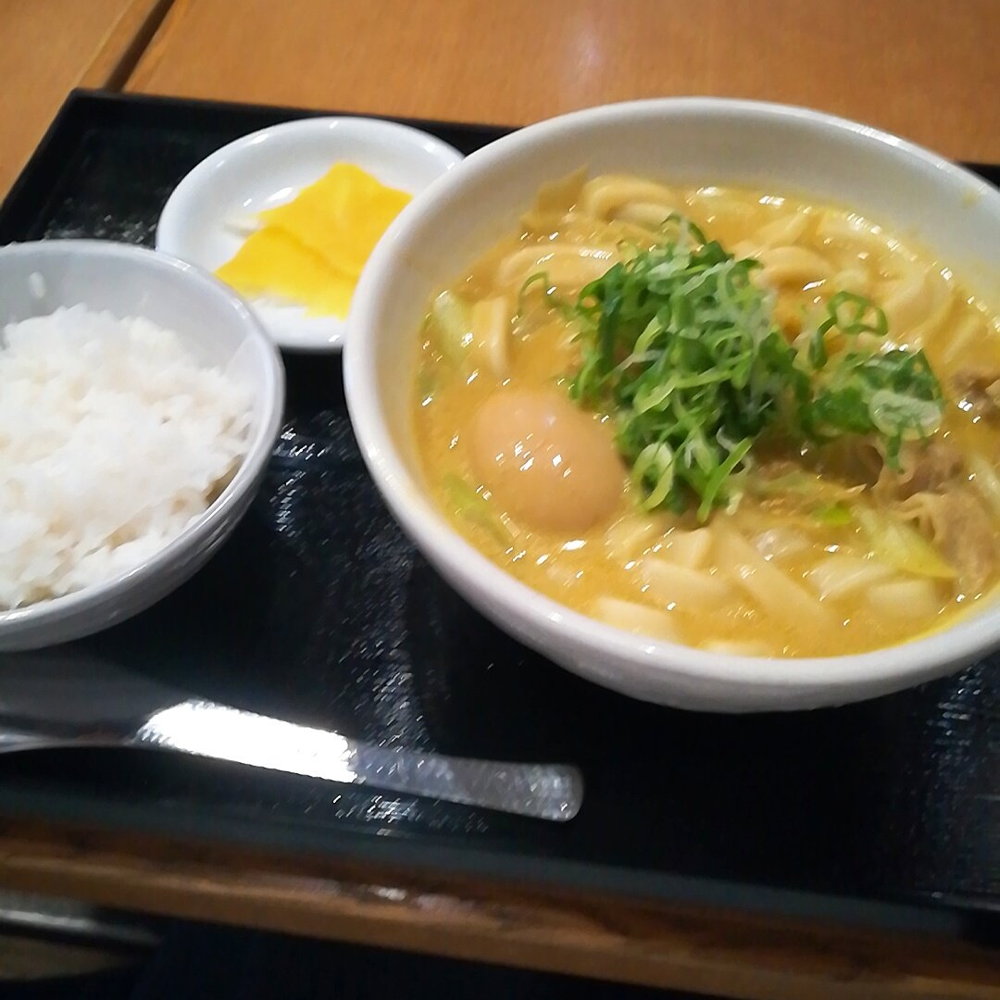
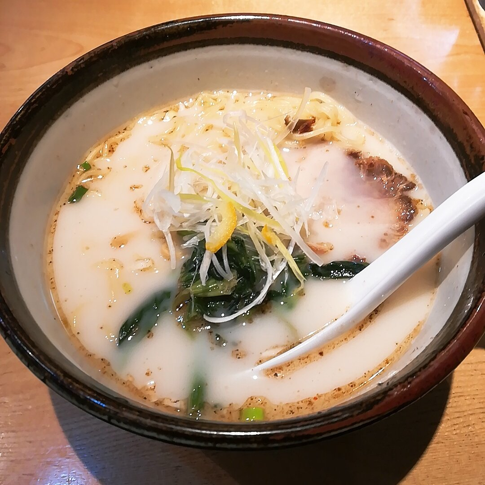

たまには、作業ログ以外の内容でblog書こうかなぁと思いました。

自由が丘にある、カレーうどん専門店で食べたカレーうどんです。  
普通に美味しかった。

* * *

こちらも、自由が丘での写真。  
いい感じの作業カフェを見つけました。

<iframe src="https://www.google.com/maps/embed?pb=!1m18!1m12!1m3!1d3243.8626344888044!2d139.66289721525675!3d35.6064548802118!2m3!1f0!2f0!3f0!3m2!1i1024!2i768!4f13.1!3m3!1m2!1s0x6018f51dd2bcb499%3A0x23ade5a23f7fd8e0!2sRadio%20Plant!5e0!3m2!1sja!2sjp!4v1584201296481!5m2!1sja!2sjp" width="400" height="300" frameborder="0" style="border:0;" allowfullscreen aria-hidden="false" tabindex="0"></iframe>

* * *

これは俺流塩ラーメンです。  
大好きで潰れてほしくないので、とりあえず食べに行ってきた。

* * *

お気に入りの飴専門店で、キャンディを買った。  
また写真を撮ったら載せます。

リリーオイルを買った。  
百合油です。はっか油のように万能。  
以前の職場で大好きだった上司が使っているのを見て  
それ以来、わたしも愛用＆布教している。

* * *

最近は前に比べて細かいことを気にしなくなったなぁと感じる。  
「いや、知らんがな」  
で、済ませられるようになった。

ゆっくり読書したい気持ちです。
