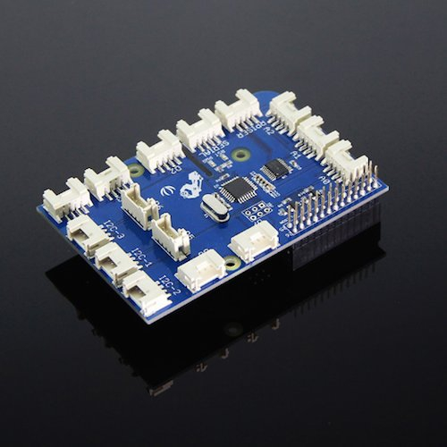

**Kubernetes**やっておきたいことList

- cronjob  
    [https://kubernetes.io/docs/tasks/job/automated-tasks-with-cron-jobs/#creating-a-cron-jobhttps://kubernetes.io/docs/tasks/job/automated-tasks-with-cron-jobs/#creating-a-cron-job](https://kubernetes.io/docs/tasks/job/automated-tasks-with-cron-jobs/#creating-a-cron-jobhttps://kubernetes.io/docs/tasks/job/automated-tasks-with-cron-jobs/#creating-a-cron-job)
- kustomize  
    [https://qiita.com/os1ma/items/076a57b25e74e54476ba](https://qiita.com/os1ma/items/076a57b25e74e54476ba)  
    環境ごとにportを変えてみたり、namespaceを変えてみたりしてみる
- Secrets  
    [https://kubernetes.io/docs/concepts/configuration/secret/](https://kubernetes.io/docs/concepts/configuration/secret/)
- ConfigMaps  
    [https://kubernetes.io/docs/concepts/configuration/configmap/](https://kubernetes.io/docs/concepts/configuration/configmap/)

* * *

新しいスマホ欲しくて  
面白そうなものを見つけたの。

PINE64社製Linuxスマホ

[https://store.pine64.org/?product=pinephone-community-edition-ubports-limited-edition-linux-smartphone](https://store.pine64.org/?product=pinephone-community-edition-ubports-limited-edition-linux-smartphone)

> [wiki.pine64.org](https://wiki.pine64.org/index.php/PinePhone)

※PINE64社はLinux対応のPINEシリーズのコミュニティ運営・開発販売するスタートアップ企業

$149.99なら欲しい♡

* * *

GrovePi+をポチりました。

**[https://www.switch-science.com/catalog/2129/](https://www.switch-science.com/catalog/2129/)**

RasPiのハンダ付けが不要になる！  
モジュール入りのOSをインストールして対応パーツを組み合わせれば  
プログラムのみで簡単に実装できるらしい。

https://www.dexterindustries.com/GrovePi/get-started-with-the-grovepi/

届くの楽しみだなぁ  
楽しみいっぱいあって楽しい
