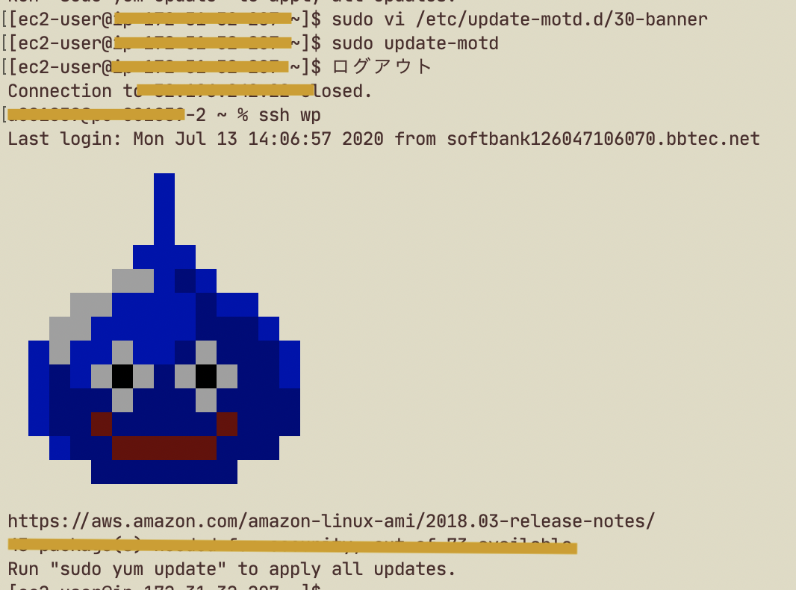

最近ぜんぜんblog更新できていなかった

* * *

何か大きな力に引っ張り上げられて  
なんかすごい！な状態になっているうさぎです。


  

楽しかったので  
またエモい絵日記を書きたい。

* * *

土曜日は、Ubuntu Serverの初期設定をスクショして写経する作業した。  
[https://www.evernote.com/l/AcPiO03PyYdKHIg4saKWXjll-SLD71f2GWE  
](https://www.evernote.com/l/AcPiO03PyYdKHIg4saKWXjll-SLD71f2GWE)まだまだ途中なの。

翻訳して、ドキュメントや仕様書を原文で読みつつ  
イディオムや単語に慣れるのが狙いです。  
英語の勉強がてら、何をしているのかキチンと把握したい。

* * *

日曜日は、前職の先輩とラズパイもくもく会しました。  
まずは秋葉原の電気街巡りしました。

これ800円で購入したの  
LCD電子メモタブレットだよ✎


衝動買いデバイス、これは当たりだった  
書き心地がすごく良い。  
アキバの電気街は、格安デバイスの掘り出し物があるから楽しい🙌  
1000円のスマートウォッチとかカードリーダーとか  
ラズパイZEROとか、買いたくなっちゃうよねえ

* * *

コワーキングスペース綺麗だったよ。  
[https://grinspace.jp/facility/](https://grinspace.jp/facility/)  
グリンエリアが空いていたので  
モニターとキーボードとマウスなどを借りて  
ラズパイを接続して、GrovePiという拡張ボードで  
センサー系いろいろ試せたの楽しかった😊

がんばってSDカードに専用イメージをインストールしていたんだけど  
なんか時間かかるし上手くいかなかったので  
先輩が前職の同僚から貰ったという、お下がりラズパイを起動させたら  
スムーズにいったので、それに色々インストールしてセットアップ済ませた。笑

* * *

ラズパイにログインすると  
ドラクエのキャラクターが出現する設定になっていた！  
このWordPressのサーバーもsshログインしたらスライムが出現するように  
設定してみました。



**かわいいいい**

macのターミナルを開いたときにメタルスライムを出現させる方法を書きます

環境:  
macOS  
zsh

[https://github.com/dot-motd/dragon-quest](https://github.com/dot-motd/dragon-quest)  
👆ここからgistのURLを調達してくる

```
% sudo vi ~/.zprofile
curl -s "https://gist.githubusercontent.com/makocchi-git/9775443/raw/6747aa4a65e4293201289899931fe04472c5cfcf/metal-slime.txt" # 調達したスライムのURLを設定する。
cat << EOF
EOF
```

```
% source  ~/.zprofile
```

* * *

火事で焼けてしまったけど、再開したというお蕎麦屋さんに行ってきたよ。  
先輩はかなり久しぶりだったらしく、喜んでいたので良かった🙌
