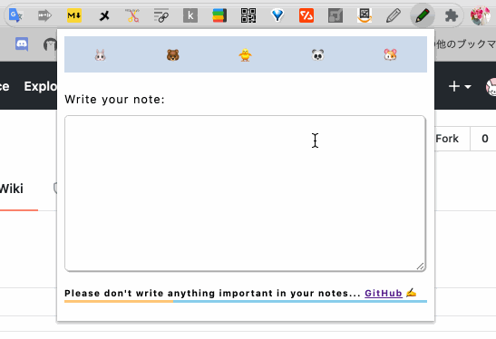

👆つくりました  
[https://codepen.io/ishizuka427/pen/NWxEvpo](https://codepen.io/ishizuka427/pen/NWxEvpo)

まずわたしのjsスキルがどのくらいかというと  
10年以上むかしhtmlファイル内にscriptタグを仕込んだな〜  
程度です。

このblogをホスティングするようになって  
サイドバーを改造するときはjQueryのドキュメントからサッとコピペ職人していました。

Chrome拡張機能をつくるにあたって  
jQueryで書こうかなと思ったのですが、謎の懐古主義に陥って  
MDNを読みながら生jsで書いてみることにしました。  
処理が進めば進むほどに苦しくて発狂するかと思った。

途中で、やりたい処理にはライブラリが必要になることが判明して  
「Javascriptにライブラリとかめちゃくちゃ言語っぽい！」  
と感動しました。  
高校時代のjsの印象って.htmlに書くタグの一つって感じだったのに進化したんだなぁと思った。

申請までしたあとに、そういえば最近cookie規制のニュース見たけれども  
この機能は大丈夫だろうか？と気になって調べたら若干抵触しそう。  
ダメだったとしても腐らずまた元気にJavascript書きましょう🙌
