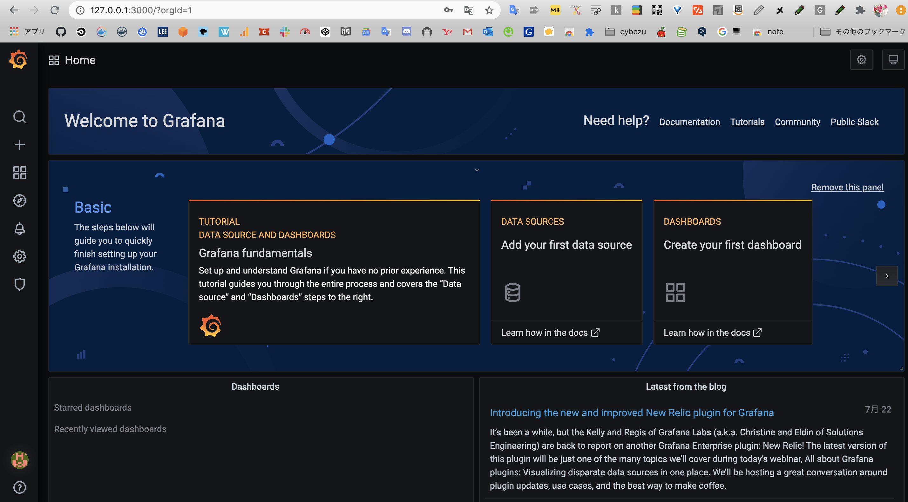

入社してそろそろ3週間経つんだなぁ  
と、しみじみしていたの。

転職早々フルリモートでどうなるんだろうって不安だったけれども  
少しずつ慣れてきたかもしれない。

印象的だったのが働き方宣言で

今までもわりと自由に働いていたけれども  
働き方を「宣言」することで  
自分で決めたことなのだから、責任を持たねば  
という気持ちになるなと思った。

自分で決めたことを、自分の責任でやり遂げるのは  
大変だけれども、やらされている感があるよりずっと良い。  
宣言をするだけなのに、意識が変わるのは面白いなと思ったよ。

仕事を見てもらえている安心感ある。  
サポート体制が整っているし  
技術習得へのストイックさを感じる。

あと驚いたのが、社内勉強会の質や量もそうだけれど  
社外の勉強会やイベント、  
テックカンファレンスなどの参加がまあまあ当たり前みたいな雰囲気で  
じゃあ、わたしはそれ以上の何が出来るんだろうと考えてしまった。

入社を決める前の話

年始に開催されたハンズオンに参加して  
主催している方たちの雰囲気が良いと直感的に思ったの。  
入社が決まった頃に代表の著書を片っ端から読んで  
働き方の哲学を知って、ユニークな会社だなぁと驚いた。

正直、わたしは内向的な方だし  
普通にしていても人からマイペースと言われるし  
協調性に自信ないなぁ  
と、感じながらだったけれども

環境や周囲の人が変わると  
それに影響されて、少しずつ自分自身の変化は感じるので  
うまく馴染みつつ良い方に転がっていくと良いなぁと思います。

* * *

Chrome拡張機能のバージョンを上げることができました🎉  
[どうぶつさんnote  
](https://chrome.google.com/webstore/detail/%E3%81%A9%E3%81%86%E3%81%B6%E3%81%A4%E3%81%95%E3%82%93note/hfijdjgjnmpaffofiiifobemmajohlda?hl=ja&authuser=0)cookieにテキストを保存していると  
いつ飛ぶかもわからないのでローカルストレージを使おうと思っていたのだけれども  
Chromeのstorage API使ってみようと思いました。  
[https://developer.chrome.com/extensions/storage](https://developer.chrome.com/extensions/storage)

* * *

docker-composeでGrafanaも立ち上げてみたよ。

Docker上にたてたGrafana

とりあえず、ひたすらPrometheusについて調べて  
資料をかき集めていました。

- Prometheusの概要
- なぜPrometheusなのか (Kubernetesの監視にPrometheusが選ばれる理由)  
    [https://prometheus.io/docs/introduction/overview/  
    ](https://prometheus.io/docs/introduction/overview/)以下はPrometheusとKubernetesがマッチする3つの理由  
    [https://www.weave.works/blog/prometheus-kubernetes-perfect-match/](https://www.weave.works/blog/prometheus-kubernetes-perfect-match/)
- PrometheusでKubernetesを監視するさいのアーキテクチャ図  
    [https://www.scsk.jp/sp/sysdig/blog/prometheus/prometheus.html  
    ](https://www.scsk.jp/sp/sysdig/blog/prometheus/prometheus.html)\> Kubernetesクラスタアーキテクチャの概要
- 実際にさわってみる系  
    [Prometheusでkubernetesのノードを監視する  
    ](https://ytsuboi.jp/archives/400)Node exporterのpodをたてることで、監視塔として機能するっぽい
- [prometheus/node\_exporter: Exporter for machine metrics](https://github.com/prometheus/node_exporter)

なんとなく構成は見えてきたけれども、思っていたよりも重そう・・  
そしてSampleとして使えるコードが少ない。  
PrometheusやKubernetesのドキュメントにblogとかないかな〜  
と探したけれども、なかなか無い〜〜

いったん保険としてEKS on Fargateで発表資料をつくって  
Monitoring Kubernetes with Prometheus on Dockerは  
検証がうまくいったらLTする作戦に切り替えます！
