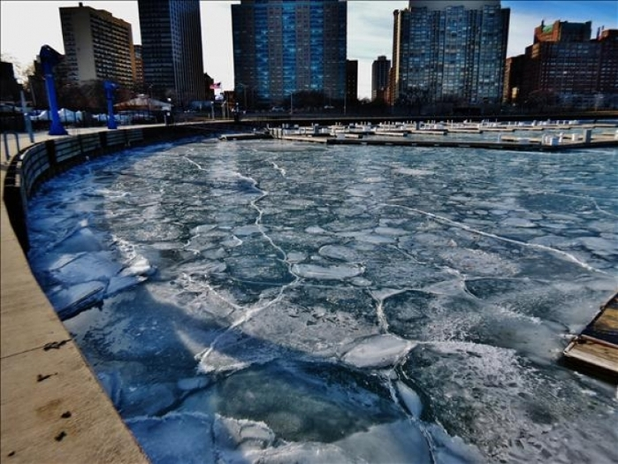

お昼、机の隅にあるヒツジを眺めながら

**ジオラマ作りたいな〜  
**と思ってyoutube見ていたの

https://www.youtube.com/watch?v=J8wiWwV7f8g&t=173s

これSeriaでジオラマの材料が揃うのでは？？  
と思い、早速お仕事終わりにSeriaへ寄って  
材料を揃えてみた

アクリル絵の具以外はすべて100均で揃ったよ。

完成したのがこれ👇

一時間半くらいで出来上がった。  
切り株が一番苦戦したの。写真を見ながら色を塗った。  
小石は玄関の前に転がっているのを拾ってきました。

水底は、昼間たまたま見かけた五大湖の写真を参考にしたよ。

湖の底が石畳になっているのかと思ったら  
氷の板がくっつきながら凍ってこんな模様になったらしい。  
綺麗だねえ
