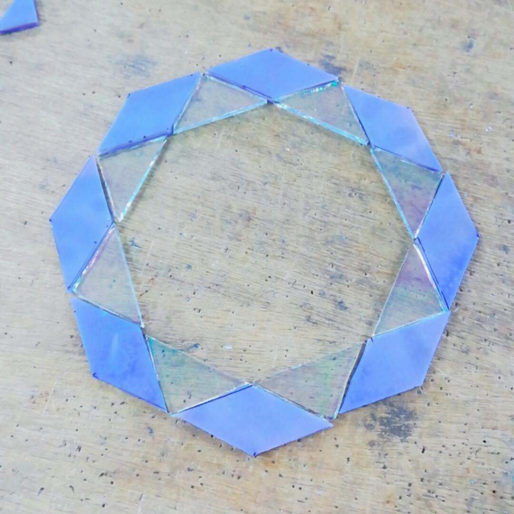

初オンライン英会話しました。zoomを繋いでお話したよ。  
最初だったので自己紹介からでした。  
少し離れたところに住むフランス出身の女性で  
ときどき猫の声が聞こえた。

もっと自然に話せるようになりたいので  
英会話で使えるフレーズ動画なんかをyoutubeで観てみようと思いました。  
TOEICの勉強もレッスン内で扱うので予習復習やります。  
あと、ふだん字幕で観ているアニマルプラネットを聴き取れるように  
視聴中にリスニングを意識したいなぁと思ったよ。

* * *

信楽焼の狸がとても可愛いことに気づいてしまった。  
本当に可愛いので少し見てほしい。

https://www.amazon.co.jp/5%E5%8F%B7%E3%81%8A%E9%A1%98%E3%81%84%E7%8B%B8-%E3%81%97%E3%81%8C%E3%82%89%E3%81%8D%E3%83%8F%E3%83%B3%E3%82%AB%E3%83%81%E3%83%91%E3%83%83%E3%82%B1%E3%83%BC%E3%82%B8-%E3%81%97%E3%81%8C%E3%82%89%E3%81%8D%E3%82%84%E3%81%8D-ta-0186-%E5%B9%85160%C3%97%E5%A5%A5%E8%A1%8C120%C3%97%E9%AB%98%E3%81%95175mm/dp/B01N5C6CWY

身につけているもの一つ一つが縁起物で、きちんと意味があるの。  
たぬき(他抜き)ということで、他を出し抜いて成功する商売繁盛の意味もあるとのこと。  
こんなに可愛らしくて愛くるしい見た目で実は貪欲なの？と思ったけれども、腹黒かろうがこの可愛さなら許せると思いました。表情がとっても可愛いね。

滋賀に旅行へいくことがあったら信楽焼の狸を見に行きたいなぁと思いました。  
我慢できなくなったら通販で買うかもしれません。

* * *

ステンドグラス教室へ行ってきました。

ガラスを選ぶのに時間がかかって、今日はカットで終わってしまった。  
模様に波のある偏光ガラスで、とても綺麗なものを見つけられたので満足です。  
カットしながら(綺麗だな〜)と定期的に癒やされるのは大きい。

真ん中の鏡をカットして、周囲を磨いてテープを留めたら  
はんだで貼り合わせていくよ。来週も楽しみ。

ステンドグラスは光や電球と相性が良くて、ランプを作ることも多いのだけれど  
光や電球といえばラズパイの十八番なので  
RaspberryPiとステンドグラスのランプで  
スマート・ステンドグラス・ランプとか面白そうだなぁと思いました。
