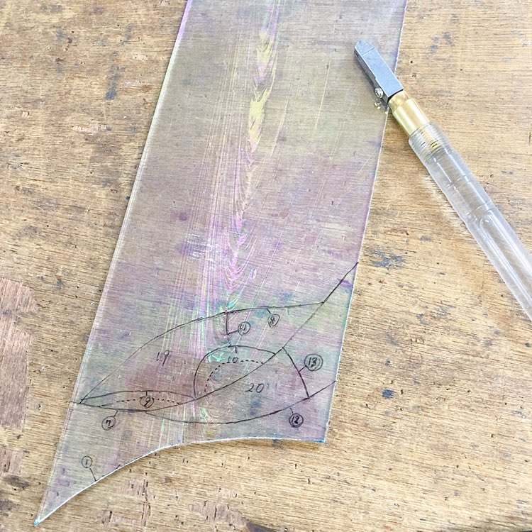
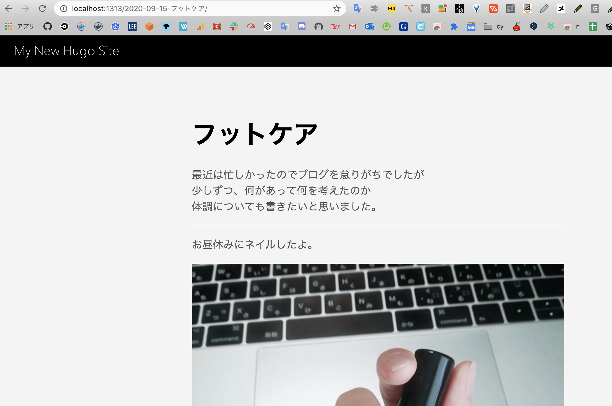

久しぶりです。  
近況をトピックごとに書きます。

## 歯医者

歯医者さんの麻酔注射がとても苦手で  
手汗をかくし震えが止まらず意識が遠のくので  
このまま気絶できればラクなのに・・とか思うのですが

歯医者で麻酔を伴う治療をした翌日には  
顔をナイフでざっくり切られて  
歯を粉々にされる夢をみるくらいストレスなの。

ここのところ右の歯を治療したら左の歯が欠けて  
左の歯を治療したら右の歯が欠けて・・  
というのを繰り返していて  
歯の治療のストレスで気がおかしくなりそうです(;\_;)

歯並びも良くないし、歯も柔らかいかららしい。  
甘いもの断ちして、骨を丈夫にするため小魚食べようかなぁ。

* * *

## オンライン英会話

毎週木曜日にオンライン英会話を始めて、一ヶ月ちょっと経つけれども  
先週まであまり効果が実感できなかったのに  
今回は「以前より喋れるようになったかも」と、思えたよ。  
予習復習が大事かもしれない。毎日、少しずつでも英語の学習を進めたい。

* * *

## ステンドグラス

ステンドグラス工房では、ガラス切りの工程に入りました。

油性ペンで切る部分に印を付けて  
ガラスを切る用のカッターで、体重をかけながらキリキリと切っていくんだよ。  
このガラスは綺麗でお気に入りなので、切っていて楽しい。

* * *

## HUGO

土曜日は WordPress の静的サイト (Markdown) 化を進めたよ。  
静的サイトジェネレーターは Hugo を採用することにしました。

[https://gohugo.io/getting-started/quick-start/](https://gohugo.io/getting-started/quick-start/)

Quick Start を参考にインストールから記事の生成まで行った。  
そして先日、[wordpress-export-to-markdown](https://github.com/lonekorean/wordpress-export-to-markdown) ツールでつくった.mdファイルの中から  
適当に記事を選んで **`/quickstart/content`** 配下に置いたよ。

ローカルでの記事表示に成功しました👏  
次回はホスティングサービスの選定と、移行までやれたらいいなあ。

* * *

## SHISHA

前職の先輩とシーシャに行こうとお店に行ったら、不定休でお休みだったの。  
なので、近所のカフェでコーヒーを飲みながら近況について話しました。

その後は線路沿いにある屋台のような居酒屋さんで飲んだよ。  
明るい時間から外で飲むの、なんだか良いねえ。  
学生時代の話や、使ってみたい言語の話などをしました。

* * *

## DjangoGirls

DjangoGirls というPython のフレームワークを題材にハンズオンなどをする  
女性コミュニティのスタッフをしていて、その打ち合わせ zoom に参加しました。  
今年はなかなか活動が難しかったけれど、メンバー皆で模索しながら今後の活動について考えてブラッシュアップしていけたらなぁと思ったよ。
