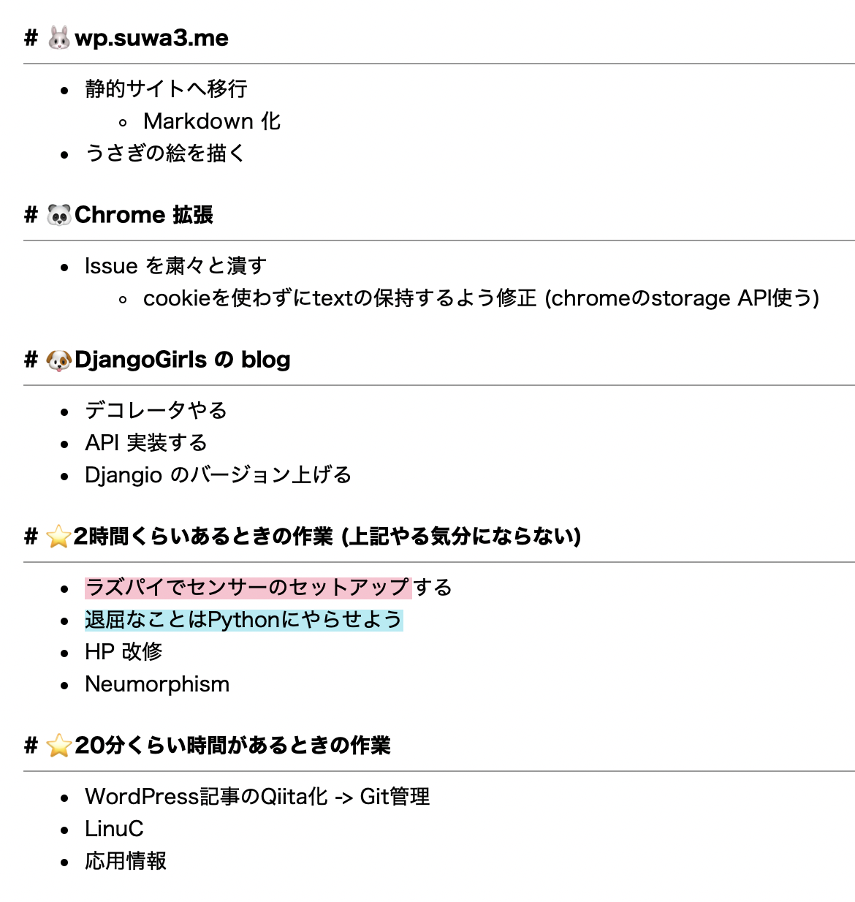

## 目標

ここ数ヶ月で新しいことをどんどん始めていて  
色々と発散しそうだなーと思ったので  
特にプライベートにおける技術面にしぼって目標を整理しようと思いました！

**短期目標\_2020/10**  
💖平日夕方＆土日に集中する  
💙英語学習を習慣化する  
💙DjangoGirls の活動がんばる  
  
**中期目標\_2020/秋**  
🍁英語学習を通して技術の情報量・情報の質を高める  
🍁Python への抵抗感をなくす  
  
**長期目標\_2020/~数年**  
しばらくは技術ファーストで一点突破  
🌏1. Kubernetes  
💫2. IoT 分野 (サブ)  
👩女性のための開発コミュニティ活動を継続

何を優先するのか、逆に何をやらないのか  
整理しないと何でもかんでもやろうとしてしまう性格なので気をつけたい😩

ついでに具体的な積み作業タスクも貼る。  
これ Evernote で毎月管理しているのだけれども  
GitHub で issue などにして git 管理してしまったほうがログも残るし良い気がする。  
Project 機能をつかってカンバン形式で視覚化するのもありかなぁ。  
直感的に管理しやすそう。色々と試して模索していきたい。

* * *

## 動画編集部

職場の動画編集部に入部しました。

- チーム外の人とも交流をしたい
- 表現の幅を広げたい

といった理由で参加したため、まだ具体的に作りたいものも決まっていないのですが・・。  
自分のもっている技術について、今はこうやってblogに備忘録として残しているので  
そういったものを動画で発信できたらなぁとぼんやり考えています。

最近めちゃ真面目では？  
一日ダラダラDayを設けよう。
